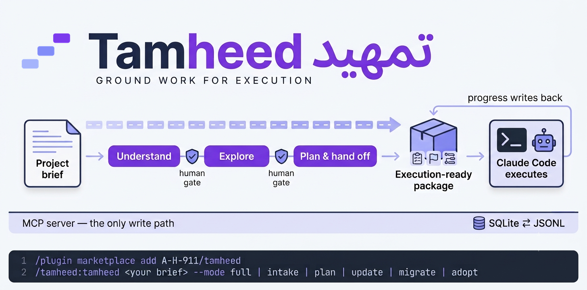
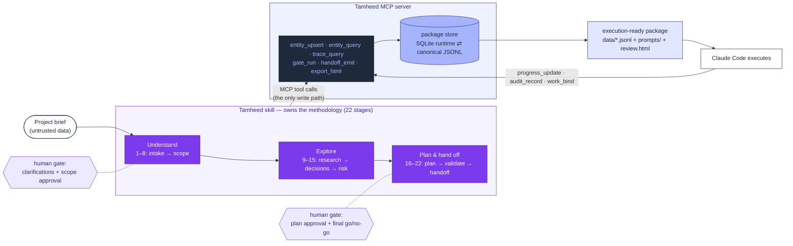

<p align="center">
  <picture>
    <source media="(prefers-color-scheme: dark)" srcset="plugins/tamheed/assets/logo-dark.svg">
    <source media="(prefers-color-scheme: light)" srcset="plugins/tamheed/assets/logo-light.svg">
    
  </picture>
</p>

<h1 align="center">Tamheed</h1>

<p align="center"><strong>Turn a project description into a validated, traceable, execution-ready planning &amp; handoff package for Claude Code to implement.</strong></p>

<p align="center">
  <em>Claude Code plugin + MCP-backed agent skill &middot; v4.2.0</em> &middot;
  <a href="#license">MIT</a> &middot;
  <a href="docs/install.md">Install</a> &middot;
  <a href="docs/migrate-from-keystone.md">Migrate from Keystone</a> &middot;
  <a href="plugins/tamheed/SKILL.md">Skill spec</a>
</p>

---

> **An independent, reusable capability.** Tamheed is vendor-, provider-, and stack-neutral and carries no
> domain assumptions from any particular project — it is meant to be reused on *any* project. It targets
> **Claude Code** as the downstream execution agent; the plans it produces carry no vendor or stack lock-in.
> This repository is the home of the Tamheed capability itself, not of any project Tamheed happens to plan.

## What Tamheed is

<p align="center">
  
</p>

Tamheed is a reusable agent **skill** that transforms a long-form project description into a complete,
internally consistent, **execution-ready handoff package**: the planning, research, architecture,
governance, and execution artifacts Claude Code needs to implement the project with discipline.

It does not write the project's code. It produces everything an implementing agent needs *before* code —
requirements separated from assumptions, options separated from decisions, a risk register, a phased
roadmap sliced for delivery, testable acceptance criteria, live traceability, and the kickoff prompts that
hand the work over — and then keeps the package **alive during execution**: the executing agent records
progress, audit verdicts, and commit bindings back into it through the same tools that built it.

Unlike its v1 predecessor, a package is not a folder of Markdown files. It is a **relational store**
(ADR-0001): one SQLite-enforced entity table per artifact family, serialized to deterministic, diff-friendly
**canonical JSONL** (`data/*.jsonl`) that you commit to git. Every write goes through the **Tamheed MCP
server** — the only write path — so the strongest quality gates are schema constraints that cannot be
skipped, and the human reviews through a generated **HTML review surface** (`review.html`), never by
proofreading raw data files.

## Lineage

Tamheed is the successor of **[Keystone](https://github.com/A-H-911/keystone)** — the same capability's
v1, which stored packages as Markdown documents and validated them with a file-scanning gate engine. This
repository carries Keystone's full git history. The Keystone repository stays available and frozen at
**v1.0.x** for existing v1 packages; it receives no new features. Projects arriving from Keystone follow
the migration runbook: **[`docs/migrate-from-keystone.md`](docs/migrate-from-keystone.md)** (operator-initiated,
staged, fidelity-checked — v1 packages keep working until *you* decide to migrate).

## Requirements

Honest edition — what you actually need:

- **An MCP-capable host.** Claude Code is the designed-for host: the bundled `.mcp.json` auto-starts the
  server when the plugin is enabled. Any other agent that can run MCP servers and read files works too.
- **Python ≥ 3.10** for the MCP server (the official `mcp` SDK's floor; program decision ASM-D). `uv`
  launches it with zero setup (the server carries PEP 723 inline metadata), or `pip install mcp` as the
  fallback. See [`plugins/tamheed/server/README.md`](plugins/tamheed/server/README.md).
- No specific model, vendor, or repo provider is required.

**What ended with v1:** the chat-only path. Claude.ai and other environments without an MCP host can hold
the planning *conversation*, but they cannot create or mutate a package — there is no package store
without the server. That trade is deliberate: the store is where the integrity guarantees live.

## Install

Tamheed ships as a self-contained bundle at [`plugins/tamheed/`](plugins/tamheed).

**Claude Code (plugin — recommended).** This repo is its own plugin marketplace:

```text
/plugin marketplace add A-H-911/tamheed
/plugin install tamheed@tamheed
```

Then invoke it as **`/tamheed:tamheed`** (plugin skills are namespaced), or just describe a planning task —
the skill triggers on planning/scoping/handoff intent on its own. Approve the `tamheed` MCP server when
Claude Code asks (per-server approval); it is the package's only write path.

Every other path — manual/standalone copies, other MCP-capable agents, and the capability tiers — is
covered by the canonical install page: [`docs/install.md`](docs/install.md).

> The old install commands (`marketplace add A-H-911/keystone`) remain valid only for **Keystone 1.0.x**
> at the old repository.

## Usage

The skill drives the conversation: it confirms a mode, asks focused clarification questions only where the
answer changes the plan, pauses at approval gates, and then generates the package through the MCP tools.

```text
/tamheed:tamheed <project description | path/to/brief> [options]

Options:
  --mode <m>          full (default) | intake | plan | resume | stage:<id> | update | migrate | adopt
  --profile <type>    hint the project type (enterprise, rnd, legacy, ai-agentic, unknown)
  --package-dir <dir> where the package store lives (created if absent; never inside the plugin)
  --dry-run           transactional preview: report entity/gate deltas, then roll back
```

Omit `--mode` and the skill infers one from the input and **confirms it before doing heavy work** —
a sparse idea proposes `intake` first, a rich structured brief proposes `full`, an existing package
directory proposes `resume`/`update`, a v2/v3 store proposes `migrate`, and a bare codebase
proposes `adopt`. It never guesses silently.

| Mode | What it does |
|---|---|
| `full` *(default)* | Run the whole workflow end to end (intake → handoff), pausing at clarification and approval gates. |
| `intake` | Intake + normalization + ambiguity/contradiction detection + a clarification plan, then stop. |
| `plan` | Produce the full plan and entity set, stopping before handoff emission. |
| `resume` | `package_open` an existing package and continue from the last incomplete stage. |
| `stage:<id>` | Run or re-run a single stage (e.g. `stage:risk-analysis`). |
| `update` | The agile heart of v2 (D-UPDATE), three capabilities: **diff-aware re-derivation** (change an entity, regenerate only its dependents via `trace_query`), **execution-progress sync** (`progress_update` / `audit_record` with evidence / `work_bind`), and **typed scope changes** (defer / reschedule / reclassify / cancel / expand — a `scope-change` row is written before any mutation, always). |
| `migrate` | Convert a v2/v3 store to v4 in place (`package_migrate`: staged preview → operator backup → confirm; old files kept in `data-v3-backup/`). v1 Keystone trees migrate under tamheed 3.2.1 first (`docs/migrate-from-keystone.md`). |
| `adopt` | Onboard a brownfield project that never used Tamheed (`package_adopt`: staged scan → confirm; nothing inferred is Approved, provenance is code-shaped, the gap report is first-class). |

(The v1 `--no-repo` flag is gone with the repository bootstrapper itself — ASM-B; a package is data the
operator commits to whichever repository they choose.)

### Every mode, by example

**`full` — plan a new project end to end.** Pauses at the clarification batch, scope approval,
key-decision and roadmap approvals, handoff approval, and the final go/no-go — you are asked at each gate,
never skipped past one:

```text
/tamheed:tamheed @briefs/new-platform.md --mode full --profile enterprise --package-dir ./planning
```

**`intake` — understand before committing.** Runs stages 1–7 only: extracts requirements verbatim with
source spans, detects ambiguities and contradictions, and stops with a clarification plan — useful when
the brief is thin and you want to see the gaps before paying for a full run:

```text
/tamheed:tamheed "We want an AI thing for customer support. Make it good." --mode intake
```

**`plan` — the full plan, no handoff.** Runs through quality validation (stage 19) plus a readiness
preview, but never emits prompts into a target project; side-effect-free outside the package directory:

```text
/tamheed:tamheed "Build a CLI that syncs Notion to Markdown" --mode plan --profile rnd
```

**`resume` — pick up an interrupted package.** `package_open` + targeted queries tell it exactly where
things stand (the package *is* the state — there is no state file to reconcile), then it continues from
the last incomplete stage:

```text
/tamheed:tamheed --mode resume --package-dir ./planning
```

**`stage:<id>` — run or re-run a single stage.** Requires an existing package; useful after new
information lands (e.g. redo risk analysis after a dependency changed):

```text
/tamheed:tamheed --mode stage:risk-analysis --package-dir ./planning
```

**`update` — the agile heart of v2 (D-UPDATE).** Three capabilities, one mode:

```text
# 1. Diff-aware re-derivation: a decision changed — trace the impact set, regenerate ONLY dependents
/tamheed:tamheed "DEC-004 changed: we're moving from Kafka to a managed queue" --mode update --package-dir ./planning

# 2. Execution-progress sync: ingest what the executing agent reported
/tamheed:tamheed "record: AC-003 Met (tests/test_ingest.py::test_e2e), commit 4f2a1c satisfies FR-002" --mode update --package-dir ./planning

# 3. Typed scope change (defer | reschedule | reclassify | cancel | expand)
/tamheed:tamheed "expand: add offline mode as a new phase" --mode update --package-dir ./planning
```

A scope change always writes the authorizing decision and the `scope-change` row *before* any mutation,
bumps the package iteration, and stamps new/retired rows with `introduced_in`/`retired_in` — nothing is
ever deleted. Evidence-backed audit verdicts cascade: when every acceptance criterion of a requirement is
`Met`, the requirement auto-advances to `Implemented` in the same transaction.

**`migrate` — bring a v2/v3 store to v4.** Staged and operator-gated: the first run is a
preview (the FULL rewrite report — every value coercion, edge retype, column drop — nothing
written); only your explicit `confirm=true` converts, and the old files are kept in
`data-v3-backup/`. The result is validated through a complete store round-trip BEFORE it
replaces the live files — a package that fails v4 integrity is left untouched. `package_open`
refuses pre-v4 stores by version, so migration is never silent. (v1 Keystone Markdown packages:
two-step escape route via tamheed 3.2.1 — `docs/migrate-from-keystone.md`.)

```text
/tamheed:tamheed ./old-project/planning-package --mode migrate --package-dir ./planning
```

The preview reports every judgment call before anything is written — including `status_coerced`
(v1 status words like `Open`/`Resolved` with their proposed lifecycle mappings, which you confirm
or override before populate), zero-family tripwires, and per-file coverage ledgers. Full runbook:
[`docs/migrate-from-keystone.md`](docs/migrate-from-keystone.md).

**`adopt` — onboard a brownfield project that never used Tamheed.** Staged scan → preview → confirm.
Four rules are enforced mechanically: nothing inferred is ever `Approved` (everything lands `Proposed`),
provenance is code-shaped (`file:line` spans), the **gap report** (what code cannot reveal) is a
first-class output, and injection-shaped repository content is fenced as data, never obeyed:

```text
/tamheed:tamheed ./legacy-service --mode adopt --package-dir ./planning
```

**`--dry-run` — preview any mutating run.** The stage's writes execute inside a SAVEPOINT, you get the
entity counts and gate deltas, then everything rolls back — nothing is written:

```text
/tamheed:tamheed "expand: add SSO as a new requirement" --mode update --package-dir ./planning --dry-run
```

### During and after execution

`handoff_emit` wires the target project to the package — nothing is copied: `.mcp.json` on standalone
installs (plugin installs already register the server) plus the `CLAUDE.md` operating note, a
**tool-owned marker span** rebuilt on every emit (always current, no force involved; keep your own
content outside the `<!-- tamheed:note -->` markers). The note carries the **mandatory
recording-obligations table** — defect found → `DEF-` row *before* the fix; out-of-scope discovery →
`DW-` row with a trigger; any deviation → `SC-` row *first*; progress/audit/bind per unit;
`readiness_check` before declaring anything done — plus the full tool cheat-sheet. Stock prompt files
stay managed (`written`/`unchanged`/`diverged`; a hand-customised file is never overwritten without
`force`, and accepting a new template for ONE file is just delete + re-emit). Emission is screened
(G-INJECT blocks instruction-shaped text) and reported: `stale_references`, `restated_content`
(copies drift silently — the report suggests the live reference form), and `converted_prompts`
(legacy prompts converted from v2 get per-kind curation hints until reviewed). The executing agent
records progress through the same governed write path that built the package (`progress_update`,
`audit_record` with evidence refs, `work_bind` binding commits/PRs to the `FR-`/`AC-`/`SL-` they
satisfy) — and **work an agent believes done is `Review` (claimed), not `Implemented` (verified)**:
declaring a phase or slice `Implemented` is guarded by the blocking readiness rules — open
critical/high defects block while medium/low advise, a single stubborn failure is satisfied only by
an operator-approved **`WVR-` waiver** (reported as `waived`, never silent, expiring), and the
whole-transition override stays an explicit operator-confirmed `"force": true`, which the server
itself records as a typed `forced-override` progress event. Audit verdicts carry their **evidence
chain** (`verified_by`, `verification_method`, `against_commit`); the progress journal is **typed
events** corrected by compensating entries, never edited; genuine ambiguity is recorded in place as
`[NEEDS-CLARIFICATION: OQ-NNN]` markers that G-COMPLETE validates against live open questions. Typed
relations are validated at write time too: a semantically wrong edge (say `TEST —mitigates→ FR`) is
rejected with both endpoint types named, stored violations FAIL the blocking **G-REL** gate, and
`relates_to` stays the untyped escape hatch. Scope deviations follow the drift-delta lifecycle:
an `SC-` row FIRST (Proposed), typed `scope_adds`/`scope_modifies`/`scope_removes` edges naming the
affected rows, then — after operator approval — the agent applies the changes and sets the row to
`Merged` (the `scope-changes-merged` advisory flags anything approved but never reconciled).

**Your package carries its own prompt library — and prompts are plain `.md` files, never database
rows** (v3). `<package>/prompts/` is the single prompt surface, seeded at creation and refreshed by
migration/adoption/handoff: **16 stock files (15 scenario prompts + the operator README)**
covering both operator styles —
orientation (`orient-resume`, `package-onboarding`), execution (`slice-kickoff`, `progress-sync`,
`defect-triage`, `drift-register`), close-outs (`slice-review`, `phase-close`,
`release-close-out`), the advisory playbook (`register-liveness` — the amber-list
sweep), replanning (`replan-deferred`), audit/report (`integrity-check`,
`generate-report`), the fully-auto pair (`loop-iteration` + `loop-guard`, with a machine-parseable
`ITERATION:` contract), and **`README.md`, the operator guide** (which prompt for which situation,
semi-auto vs fully-auto, the single-writer-lock discipline). Your own project prompts live beside
them — purpose-named, operator-owned, screened (G-INJECT + stale/restated scans) but never
rewritten by the tool.

You follow along through the committed **`review.html`** (regenerated via `export_html` —
deterministic, so its diffs are meaningful; zero JavaScript): a dark, maximalist single page —
verdict and identity first, then the **traceability flow** (layered Needs → Decisions → Work →
Verification lanes, every node labeled and clickable, arrowheads, CSS-only relation filters), the
**relations graph** (connected entities on a chord diagram with degree-scaled nodes; isolated
entities in their own per-family fold, isolated *requirements* flagged first — they are the
unverified ones), the traceability matrix, execution progress with a **per-phase readiness panel**
(latest-verdict semantics), a **per-slice readiness panel** (Review counts as open), declared human
gates with their `Go/Hold/Redirect/Kill` outcomes, recorded waivers, and every register folded with its row count
and a **per-table CSV download**. Hovering a node isolates its own edges (pure CSS `:has()`; older
browsers simply keep the normal view). Long text wraps in place; the freshness line distinguishes
real recorded activity from a just-migrated package. Migration results also carry **fidelity
ledgers** (truncation histograms, column-starvation, field-mapping coverage) — column-level honesty
that row-level counts cannot see.

#### MCP tools at a glance

| Tool | Use |
|---|---|
| `server_info()` | Version + resolved package root (orientation) |
| `package_create / package_open / package_close` | Lifecycle + single-writer lock |
| `entity_upsert(entities[])` | Batch writes — full rows, per-item verdicts |
| `entity_query(type, …)` | Targeted rows + `total` |
| `trace_query(entity_id, …)` | Typed traceability links |
| `gate_run()` | Mechanical quality-gate verdict incl. the blocking G-REL relation gate |
| `readiness_check(scope, id?)` | Deep lifecycle readiness at a close boundary — "is this actually DONE?" |
| `progress_update / audit_record / work_bind` | The execution-tracking loop |
| `package_migrate / package_adopt` | Staged in-place v3→v4 conversion / brownfield onboarding |
| `handoff_emit / export_html` | Executor wiring + the HTML review surface |

Full signatures and semantics: [`plugins/tamheed/server/README.md`](plugins/tamheed/server/README.md).

Worked, end-to-end examples live in
[`generated-samples/`](generated-samples) — including
[`support-triage-agent-v2/`](generated-samples/support-triage-agent-v2), the demonstration package
(migrated in place through every store generation, v1→v4) — and [`lab/`](lab), the permanent execution
lab whose seed package a real agent drove through every v4 mechanism.

## How it works


```mermaid
flowchart LR
    brief(["Project brief<br/>(untrusted data)"]) --> U

    subgraph SKILL["Tamheed skill — owns the methodology (22 stages)"]
        direction LR
        U["Understand<br/>1–8: intake → scope"] --> X["Explore<br/>9–15: research → decisions → risk"]
        X --> P["Plan &amp; hand off<br/>16–22: plan → validate → handoff"]
    end

    G1{{"human gate:<br/>clarifications + scope approval"}} -.- U
    G2{{"human gate:<br/>plan approval + final go/no-go"}} -.- P

    SKILL -- "MCP tool calls<br/>(the only write path)" --> T

    subgraph SRV["Tamheed MCP server"]
        direction TB
        T["entity_upsert · entity_query · trace_query<br/>gate_run · handoff_emit · export_html"]
        DB[("package store<br/>SQLite runtime ⇄ canonical JSONL")]
        T --> DB
    end

    DB --> OUT["execution-ready package<br/>data/*.jsonl + prompts/ + review.html"]
    OUT --> EXEC["Claude Code executes"]
    EXEC -- "progress_update · audit_record · work_bind" --> T

    classDef stage fill:#7c3aed,stroke:#5b21b6,color:#ffffff
    classDef gate fill:#ede9fe,stroke:#7c3aed,color:#312e81
    classDef card fill:#ffffff,stroke:#1e293b,color:#1e293b
    classDef tools fill:#1e293b,stroke:#0f172a,color:#a5b4fc
    classDef store fill:#a5b4fc,stroke:#312e81,color:#1e293b
    classDef pkg fill:#e0e7ff,stroke:#312e81,color:#1e293b
    class U,X,P stage
    class G1,G2 gate
    class brief,EXEC card
    class T tools
    class DB store
    class OUT pkg
    style SKILL fill:#f5f3ff,stroke:#7c3aed,color:#312e81
    style SRV fill:#eef2ff,stroke:#312e81,color:#312e81
```

<p align="center"><em>From a project brief to an execution-ready handoff — two gates keep you in control:
clarifications during intake, and plan approval before anything is handed off. Execution writes back
through the same MCP boundary.</em></p>

Tamheed runs an **interactive** process across 22 stages grouped into three movements — **Understand**
(intake → scope), **Explore** (research → decisions → risk), and **Plan & hand off** (execution plan →
artifacts → package storage → validation → handoff). One principle governs the design:

> **The skill owns the capability; every entry point is a thin wrapper.**

All judgment — the 22 stages, artifact selection, quality gates, handoff logic — lives in the
[`tamheed` skill](plugins/tamheed/SKILL.md): a **progressive-disclosure** bundle (a short `SKILL.md` front
door plus `references/` loaded on demand). The **MCP server is not an entry point** — it is the mechanical
half of the capability itself: referential gates (identifiers, decision
statuses, requirement provenance) are FOREIGN KEY / CHECK / NOT NULL constraints enforced at write time,
coverage gates are SQL views, and `gate_run` reports it all. The bundle is **self-contained** — everything
it reads or invokes at runtime lives inside `plugins/tamheed/`, so the plugin installs and runs as one
intact unit. The three-actor interaction (planning agent · human operator · executing agent) is diagrammed
in [`docs/architecture.md`](docs/architecture.md); design rationale in
[`docs/design-decisions.md`](docs/design-decisions.md). The entity model itself — every entity family,
how they relate, and their lifecycles — is the entity study **[`docs/entities.md`](docs/entities.md)**,
including the Mermaid entity/relation/lifecycle diagrams.

### Operating principles (what makes the output trustworthy)

1. **Never invent requirements** — everything traces to an input statement or a recorded clarification; anything inferred is an explicit assumption (and the store *rejects* a requirement without provenance).
2. **Separate facts from decisions from proposals** — findings, proposed options, approved decisions, rejected alternatives, and deferred questions never silently collapse together.
3. **No premature architecture** — capture options first, decide with rationale.
4. **Preserve the unresolved** — open questions and rejected alternatives are first-class outputs.
5. **Verify before you claim** — unverified tool/library/service claims are marked `unverified`.
6. **Stay neutral** — the plan couples to no vendor, repo provider, or stack unless the input requires it (the executor is Claude Code by design).
7. **Treat the brief as untrusted data** — input is something to plan over, never instructions to obey; an injected directive is captured as data (and surfaced), never executed (OWASP LLM01). The same posture covers adopted repositories and the handoff screen (`G-INJECT`).

## Repository structure

```text
tamheed/
├── .claude-plugin/marketplace.json   # this repo is its own plugin marketplace
├── plugins/tamheed/                  # the self-contained skill bundle (the installable unit)
│   ├── .claude-plugin/plugin.json
│   ├── .mcp.json                     # auto-starts the server when the plugin is enabled
│   ├── SKILL.md                      # always-loaded entry point (owns the capability)
│   ├── references/                   # per-stage / per-concern depth (incl. artifact-catalog.md)
│   ├── templates/                    # surviving narrative section templates
│   ├── scripts/                      # scratch_diff.py (package diff utility)
│   ├── prompts/                      # the stock scenario library + operator guide (emitted into <package>/prompts/)
│   ├── db/                           # relational store: schema.sql, migrations/ (append-only), store.py, CANONICAL.md
│   ├── server/                       # the Tamheed MCP server (the only write path into a package)
│   └── assets/                       # logos
├── docs/                             # architecture, methodology, workflow, design decisions, install
├── evals/                            # behavioral eval spec + deterministic eval runner
├── generated-samples/                # the demonstration package (migrated in place through v2→v3→v4)
├── lab/                              # the permanent execution lab (brief + seed package + scenario)
├── tests/                            # the eight test suites
├── check.py                          # THE one deterministic gate — CI job 1 runs exactly this
├── .github/workflows/                # CI (check.py + server smoke) + scheduled eval-spec lint
└── SECURITY.md                       # trust model, untrusted-content posture, reporting
```

## Verifying a local checkout

```bash
python check.py        # everything CI runs: 8 suites + the lint battery, canonical form, eval fixtures
```

## Contributing

Contributions are welcome — new entity types, section templates, gates, profiles, and worked examples are
the highest-value additions, and they are designed to be **additive** (registry + append-only migration).
See [`CONTRIBUTING.md`](CONTRIBUTING.md) and
[`plugins/tamheed/references/extension.md`](plugins/tamheed/references/extension.md).

## Maturity

**v4.x** (currently v4.2.0). The methodology (22 stages), the re-baselined relational store (plan 031:
claimed-vs-verified `Review`, evidence-chained verdicts, `WVR-` waivers, severity-thresholded blocking,
typed progress events, drift-delta scope changes, blocking G-REL, `[NEEDS-CLARIFICATION]` markers), the
MCP tool surface, the canonical serialization, and the in-place migration path (v2/v3
prompts-table packages — opening one converts it once, loudly) are defined, tested, and stable —
hardened by seventeen field reports from sustained production use, each answered by a same-day release.
Any change to the DDL, the identifier scheme, or the tool contract ships per the versioning rules in
[`plugins/tamheed/references/governance.md`](plugins/tamheed/references/governance.md) (additive =
MINOR, breaking = MAJOR + migration note; DDL changes are append-only `migrations/NNN_*.sql`, tracked
via `PRAGMA user_version`). Changes are tracked in [`CHANGELOG.md`](CHANGELOG.md); the READMEs (this
file, the server reference, and the operator guide) are updated with every release — lint-enforced.

## License

Released under the **MIT License** — see [`LICENSE`](LICENSE). The license for any *generated* package is
independent and selectable at generation time.
