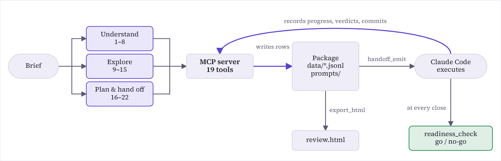
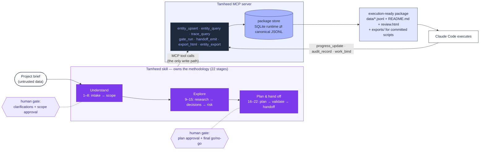

<p align="center">
  <picture>
    <source media="(prefers-color-scheme: dark)" srcset="plugins/tamheed/assets/logo-dark.svg">
    <source media="(prefers-color-scheme: light)" srcset="plugins/tamheed/assets/logo-light.svg">
    
  </picture>
</p>

<h1 align="center">Tamheed</h1>

<p align="center"><strong>Turn a project description into a validated, traceable, execution-ready planning and handoff package for Claude Code to implement. Then keep it the record of the build while execution runs.</strong></p>

<p align="center"><a href="index.html"><strong>User guide</strong> (English · العربية)</a> — every workflow, skill, family, column, tool, gate and readiness rule, generated from the engine.</p>

<!-- ste:allow long-sentence: a link bar, not a sentence -->
<p align="center">
  <em>Claude Code plugin + MCP-backed agent skill · v6.0.0</em> ·
  <a href="#license">MIT</a> ·
  <a href="docs/install.md">Install</a> ·
  <a href="docs/migrate-from-keystone.md">Migrate from Keystone</a> ·
  <a href="plugins/tamheed/skills/tamheed/SKILL.md">Skill spec</a>
</p>

---

> **An independent, reusable capability.** Tamheed is vendor-, provider-, and stack-neutral and carries no
> domain assumptions from any particular project. It is meant to be reused on *any* project. It targets
> **Claude Code** as the downstream execution agent, and the plans it writes carry no vendor or stack lock-in.
> This repository is the home of the Tamheed capability itself, not of any project Tamheed happens to plan.

## What Tamheed is

<p align="center">
  
</p>

Tamheed is a reusable agent **skill** that transforms a long-form project description into a complete,
internally consistent, **execution-ready handoff package**. The package holds the planning, research,
architecture, governance, and execution artifacts Claude Code needs to implement the project with discipline.

It does not write the project's code. It writes everything an implementing agent needs *before* code.
That is requirements separated from assumptions, options separated from decisions, a risk register,
and a phased roadmap sliced for delivery. It is also testable acceptance criteria, live traceability,
and the prompt rows that hand the work over. Then it keeps the package **alive during execution**. In the execution half the agent records
progress, audit verdicts, and commit bindings back into it through the same tools that built it.

Unlike its v1 predecessor, a package is not a folder of Markdown files. It is a **relational store**
(ADR-0001): one SQLite-enforced entity table per artifact family. The tables are serialized to
deterministic, diff-friendly **canonical JSONL** (`data/*.jsonl`) that you commit to git. Every write
goes through the **Tamheed MCP server**, the only write path. So the strongest quality gates are schema
constraints that cannot be skipped. The human reviews through a generated **HTML review surface**
(`review.html`), never by proofreading raw data files.

## Lineage

Tamheed is the successor of **[Keystone](https://github.com/A-H-911/keystone)**, the same capability's
v1, which stored packages as Markdown documents and validated them with a file-scanning gate engine. This
repository carries Keystone's full git history. The Keystone repository stays available and frozen at
**v1.0.x** for existing v1 packages. It receives no new features. Projects arriving from Keystone follow
the migration runbook: **[`docs/migrate-from-keystone.md`](docs/migrate-from-keystone.md)**. It is
operator-initiated, staged and fidelity-checked, and v1 packages keep working until *you* decide to migrate.

## Requirements

Honest edition, what you actually need:

- **An MCP-capable host.** Claude Code is the designed-for host: the bundled `.mcp.json` auto-starts the
  server when the plugin is enabled. Any other agent that can run MCP servers and read files works too.
- **Python ≥ 3.10** for the MCP server (the official `mcp` SDK's floor, program decision ASM-D). `uv`
  starts it with zero setup (the server carries PEP 723 inline metadata), or `pip install "mcp<2"` as the
  fallback. See [`plugins/tamheed/server/README.md`](plugins/tamheed/server/README.md).
- No specific model, vendor, or repo provider is required.

**What ended with v1:** the chat-only path. Claude.ai and other environments without an MCP host can hold
the planning *conversation*, but they cannot create or mutate a package. There is no package store
without the server. That trade is deliberate: the store is where the integrity guarantees live.

## Install

Tamheed ships as a self-contained bundle at [`plugins/tamheed/`](plugins/tamheed).

**Claude Code (plugin, recommended).** This repo is its own plugin marketplace:

```text
/plugin marketplace add A-H-911/tamheed
/plugin install tamheed@tamheed
```

Then invoke it as **`/tamheed:tamheed`** (plugin skills are namespaced), or just describe a planning task.
The skill triggers on planning/scoping/handoff intent on its own. Approve the `tamheed` MCP server when
Claude Code asks (per-server approval). It is the package's only write path.

Every other path (manual/standalone copies, other MCP-capable agents, and the capability tiers) is
covered by the canonical install page: [`docs/install.md`](docs/install.md).

> The old install commands (`marketplace add A-H-911/keystone`) remain valid only for **Keystone 1.0.x**
> at the old repository.

## Usage

The skill drives the conversation. It confirms a mode, and asks focused clarification questions only where
the answer changes the plan. It pauses at approval gates, and then generates the package through the MCP
tools.

```text
/tamheed:tamheed <project description | path/to/brief> [options]

Options:
  --mode <m>          full (default) | intake | plan | resume | stage:<id> | update | migrate | adopt
  --profile <type>    hint the project type (enterprise, rnd, legacy, ai-agentic, unknown)
  --package-dir <dir> where the package store lives (created if absent; never inside the plugin)
```

Omit `--mode` and the skill infers one from the input and **confirms it before doing heavy work**.
A sparse idea proposes `intake` first, and a rich structured brief proposes `full`. An existing package
directory proposes `resume`/`update`. A v2/v3 store proposes `migrate`, and a bare codebase
proposes `adopt`. It never guesses silently.

| Mode | What it does |
|---|---|
| `full` *(default)* | Run the whole workflow end to end (intake → handoff), pausing at clarification and approval gates. |
| `intake` | Intake + normalization + ambiguity/contradiction detection + a clarification plan, then stop. |
| `plan` | Write the full plan and entity set, stopping before handoff emission. |
| `resume` | `package_open` an existing package and continue from the last incomplete stage. |
| `stage:<id>` | Run or re-run a single stage (for example `stage:risk-analysis`). |
| `update` | The agile heart of v2 (D-UPDATE), three capabilities. **Diff-aware re-derivation**: change an entity, regenerate only its dependents via `trace_query`. **Execution-progress sync**: `progress_update` / `audit_record` with evidence / `work_bind`. **Typed scope changes** (defer / reschedule / reclassify / cancel / expand): a `scope-change` row is written before any mutation, always. |
| `migrate` | Convert a v2/v3 store to v4 in place (`package_migrate`: staged preview → operator backup → confirm, old files kept in `data-v3-backup/`). A v4 store whose registry predates a newer entity family takes the staged **registry-sync** instead. Its preview reports `entity_types_added` + `columns_added` for files that re-serialize, and confirm appends the registry rows (a pure registry append, no backup taken). An up-to-date v4 store still refuses. v1 Keystone trees migrate under tamheed 3.2.1 first (`docs/migrate-from-keystone.md`). |
| `adopt` | Onboard a brownfield project that never used Tamheed (`package_adopt`: staged scan → confirm). Nothing inferred is Approved, provenance is code-shaped, the gap report is first-class. |

(The v1 `--no-repo` flag is gone with the repository bootstrapper itself, ASM-B. A package is data the
operator commits to whichever repository they choose.)

### Every mode, by example

**`full`: plan a new project end to end.** It pauses at the clarification batch, scope approval,
key-decision and roadmap approvals, handoff approval, and the final go/no-go. You are asked at each gate,
never skipped past one:

```text
/tamheed:tamheed @briefs/new-platform.md --mode full --profile enterprise --package-dir ./planning
```

**`intake`: understand before committing.** It runs stages 1–7 only. It extracts requirements verbatim
with source spans, detects ambiguities and contradictions, and stops with a clarification plan. That is
useful when the brief is thin and you want to see the gaps before paying for a full run:

```text
/tamheed:tamheed "We want an AI thing for customer support. Make it good." --mode intake
```

**`plan`: the full plan, no handoff.** It runs through quality validation (stage 19) plus a readiness
preview, but never emits prompts into a target project. It is side-effect-free outside the package
directory:

```text
/tamheed:tamheed "Build a CLI that syncs Notion to Markdown" --mode plan --profile rnd
```

**`resume`: pick up an interrupted package.** `package_open` + targeted queries tell it exactly where
things stand (the package *is* the state, so there is no state file to reconcile). Then it continues from
the last incomplete stage:

```text
/tamheed:tamheed --mode resume --package-dir ./planning
```

**`stage:<id>`: run or re-run a single stage.** It requires an existing package. It is useful after new
information lands (for example redo risk analysis after a dependency changed):

```text
/tamheed:tamheed --mode stage:risk-analysis --package-dir ./planning
```

**`update`: the agile heart of v2 (D-UPDATE).** Three capabilities, one mode:

```text
# 1. Diff-aware re-derivation: a decision changed — trace the impact set, regenerate ONLY dependents
/tamheed:tamheed "DEC-004 changed: we're moving from Kafka to a managed queue" --mode update --package-dir ./planning

# 2. Execution-progress sync: ingest what the agent reported from the build
/tamheed:tamheed "record: AC-003 Met (tests/test_ingest.py::test_e2e), commit 4f2a1c satisfies FR-002" --mode update --package-dir ./planning

# 3. Typed scope change (defer | reschedule | reclassify | cancel | expand)
/tamheed:tamheed "expand: add offline mode as a new phase" --mode update --package-dir ./planning
```

A scope change always writes the authorizing decision and the `scope-change` row *before* any mutation.
It bumps the package iteration, and stamps new/retired rows with `introduced_in`/`retired_in`. No entity
row is ever removed. The one removal a caller can make is a wrongly typed trace edge, via an explicit,
journaled `retire` (v4.6). Evidence-backed audit verdicts cascade: when every acceptance criterion of a
requirement is `Met`, the requirement auto-advances to `Implemented` in the same transaction.

**`migrate`: bring a v2/v3 store to v4.** Staged and operator-gated. The first run is a preview (the
FULL rewrite report, every value coercion, edge retype, column drop, nothing written). Only your explicit
`confirm=true` converts, and the old files are kept in `data-v3-backup/`. The result is checked through a
complete store round-trip BEFORE it replaces the live files. A package that fails v4 integrity is left
untouched. `package_open` refuses pre-v4 stores by version, so migration is never silent. (v1 Keystone
Markdown packages: two-step escape route via tamheed 3.2.1, `docs/migrate-from-keystone.md`.)

```text
/tamheed:tamheed ./planning/my-package --mode migrate --package-dir ./planning
```

`package_open` refuses a pre-v4 store by version and names the tool. `package_migrate(name)` previews
every transform (value coercions, edge retypes, dropped columns) and writes nothing.
`package_migrate(name, confirm=true)` converts in place with the old files kept in `data-v3-backup/`.
v1 Keystone Markdown packages take the two-step route: migrate under tamheed 3.2.1 first, then v3→v4
here, [`docs/migrate-from-keystone.md`](docs/migrate-from-keystone.md).

**`adopt`: onboard a brownfield project that never used Tamheed.** Staged scan → preview → confirm.
Four rules are enforced mechanically. Nothing inferred is ever `Approved` (everything lands `Proposed`).
Provenance is code-shaped (`file:line` spans). The **gap report** (what code cannot reveal) is a
first-class output. Injection-shaped repository content is fenced as data, never obeyed:

```text
/tamheed:tamheed ./legacy-service --mode adopt --package-dir ./planning
```

### During and after execution

`handoff_emit` wires the target project to the package, and nothing is copied. It writes `.mcp.json` on
standalone installs (plugin installs already register the server) plus the `CLAUDE.md` operating note. The
note is a **tool-owned marker span** rebuilt on every emit (always current, no force involved). You keep
your own content outside the `<!-- tamheed:note -->` markers. The note carries the **mandatory
recording-obligations table**. Defect found → `DEF-` row *before* the fix. Out-of-scope discovery →
`DW-` row with a trigger. Any deviation → `SC-` row *first*. Progress/audit/bind per unit.
`readiness_check` before declaring anything done. Since v5 the HOW lives in the plugin's skills the note
names, and the note carries no cheat-sheet. Those are `tamheed:package-writes` before any write,
`tamheed:reading-the-record` before citing a row, and `tamheed:operator-interview` at every STOP. Since
v5.4 every option set it puts to the operator carries one recommendation, marked as the agent's. And
since v5.1 `tamheed:session-handoff` before a compaction. There are nine discipline skills, out of the `/`
menu, named by the tool results as well as the note. The scenarios are the operator-invoked
`/tamheed:<name>` slash skills. The plugin's SessionStart hook prints the package's resume block (the
latest handoff) into every new session, clear and compaction.

The one stock file is the operator guide, at `<package>/README.md` since v6, managed as before
(`written`/`unchanged`/`diverged`). A hand-customised copy is never overwritten without `force`. A
retired 4.x scenario file left under `prompts/` is named and, when byte-equal to a shipped release,
removed by `refresh_stock=true`. Emission requires the Approved kickoff row the header's `entry_point`
names. It is screened (G-INJECT blocks instruction-shaped text in an Approved row) and reported. The
report names `stale_references`, and `restated_content` (copies drift silently, and the report suggests
the live reference form). It names `converted_prompts` (rows converted from files, or from v2, carry
curation hints until reviewed).

In the execution half the agent records progress through the same governed write path that built the package.
The path is `progress_update`, `audit_record` with evidence refs, and `work_bind` binding commits/PRs
to the `FR-`/`AC-`/`SL-` they satisfy. **Work an agent believes done is `Review` (claimed), not `Implemented`
(verified).** Declaring a phase or slice `Implemented` is guarded by the blocking readiness rules. Open
critical/high defects block while medium/low advise. A single stubborn failure is satisfied only by an
operator-approved **`WVR-` waiver** (reported as `waived`, never silent, expiring). The whole-transition
override stays an explicit operator-confirmed `"force": true`, which the server itself records as a typed
`forced-override` progress event. Audit verdicts carry their **evidence chain** (`verified_by`,
`verification_method`, `against_commit`). The progress journal is **typed events** corrected by
compensating entries, never edited.

Since v5.1 a `handoff` entry says where a session stopped. The latest one comes back as the **resume
block** of `package_open` / `server_info` and through the plugin's SessionStart hook after every clear or
compaction. Its lock line says what the store observed about the holder, and an opt-in `TAMHEED_HOOK_LOG`
traces each run in counts (v5.3). Each line names the session that wrote it since v5.4 and the hook's
release since v5.6, written by every session that loaded the plugin. A plugin reload runs no hook, so
after one the block comes from `package_open`. The `handoff-current` advisory names a handoff the journal
has moved past. Since v5.8 `handoff-repeated` names the lines of the latest handoff carried word for word
through three handoffs. Since v5.2 every `entity_query` result and any `handoff_emit` finding name the
discipline skill to invoke, and a skill row's retirement is journalled by `system:skill-guard`. Genuine
ambiguity is recorded in place as `[NEEDS-CLARIFICATION: OQ-NNN]` markers that G-COMPLETE checks against
live open questions.

Typed relations are checked at write time too. A semantically wrong edge (say `TEST —mitigates→ FR`) is
rejected with both endpoint types named. Stored violations FAIL the blocking **G-REL** gate, and
`relates_to` stays the untyped escape hatch. Scope deviations follow the drift-delta lifecycle. An `SC-`
row FIRST (Proposed), with typed `scope_adds`/`scope_modifies`/`scope_removes` edges naming the affected
rows. Add an `amends` edge to any ruling it carves an exception out of (a `DEC-` merges by full-row
upsert, an `ADR-` by supersession). Then, after operator approval, the agent applies the changes, re-reads
every target, and only then sets the row to `Merged`. The `scope-changes-merged` advisory flags anything
approved but never reconciled. Registers are read through the tool whatever their size. `entity_query`
cuts rows never fields, `total` is exact, and `after_id` pages. `ids` quotes a known set verbatim, and
`search` sweeps by keyword. `package_verify` proves the on-disk store canonical, per file, with a citable digest. It
is journaled as a server-appended `integrity-verified` event on the operator's words, and the four
server-witnessed journal kinds are refused from `progress_update`.

Execution also feeds a **lessons-learned register**: `LL-` rows (both polarities, *improve* and
*sustain*) born `Proposed` by the agent during execution and confirmed by the operator. **Only Approved lessons
bind.** The always-loaded `CLAUDE.md` note renders the pinned ones and the 10 highest-numbered unpinned ones, and the rest bind too, one `entity_query` away. Since v5.5 the note's footer says so and
`review.html` marks which rows the next emit renders. A statement opens with its rule, because the note
prints its opening only. Past the note's curation ceiling the `lessons-note-budget` advisory names the
promotion candidates. A lesson can never confirm itself. The write that lands one in Approved or Promoted
is mechanically refused unless it carries the operator's explicit `operator_confirm`. That is the `force`
doctrine applied to memory. Lessons that keep earning their keep graduate into **skills** via the
operator's `skill-promote` interview. The result is a written `SKILL.md` (project-level by default, or
user-level) the executing harness auto-loads, with an `SKL-` metadata row recording the promotion.

**Your package's prompts are rows again** (v6). A `prompt` row (`PRT-`) is a kickoff, a phase or a
situational prompt. The operator approves it, `entity_query` reads it, the emit screens it. The header's
`entry_point` names the kickoff, and a situational row names the scenario skill that reads it. Plan 027
(v3) made them plain `.md` files, and the field showed what a file escapes: lifecycle, approval, the
review page, the scans. `package_migrate` converts a 5.x package's files on the operator's word, the
files kept in `prompts-v5-backup/`. The one stock file is the operator guide at `<package>/README.md`.
Since v5.0.0 the seventeen scenarios are the plugin's `/tamheed:<name>` skills, not files. They cover both operator styles.
Orientation (`orient-resume`, `package-onboarding`) and execution (`slice-kickoff`, `progress-sync`,
`defect-triage`, `drift-register`). Close-outs (`slice-review`, `phase-close`, `release-close-out`).
Also the advisory playbook (`register-liveness`, the amber-list sweep) and replanning (`replan-deferred`).
The promotion interview (`skill-promote`, lessons distilled into a skill), and audit/report
(`integrity-check`, `generate-report`). And the fully-auto pair (`loop-iteration` + `loop-guard`, with a
machine-parseable `ITERATION:` contract). **`README.md`, the operator guide**, says which prompt for which
situation, semi-auto vs fully-auto, and the single-writer-lock discipline. Your own project prompts live
beside it: purpose-named, operator-owned, screened (G-INJECT + stale/restated scans) but never rewritten
by the tool.

You follow along through the committed **`review.html`** (regenerated via `export_html`, deterministic,
so its diffs are meaningful, zero JavaScript). It is a dark, maximalist single page. Verdict and identity
come first, then the **traceability flow**. The flow has layered Needs → Decisions → Work →
Verification lanes, every node labeled and clickable, arrowheads, CSS-only relation filters. Then the
**relations graph** (connected entities on a chord diagram with degree-scaled nodes). Isolated entities
sit in their own per-family fold, with isolated *requirements* flagged first, because they are the
unverified ones. Then the
traceability matrix, and execution progress with a **per-phase readiness panel** (latest-verdict
semantics) and a **per-slice readiness panel** (Review counts as open). Then the declared human gates with
their `Go/Hold/Redirect/Kill` outcomes, recorded waivers, and every register folded with its row count and
a **per-table CSV download**. Hovering a node isolates its own edges (pure CSS `:has()`, and older browsers
simply keep the normal view). Long text wraps in place. The freshness line distinguishes real recorded
activity from a just-migrated package. Migration results also carry **fidelity ledgers** (truncation
histograms, column-starvation, field-mapping coverage), column-level honesty that row-level counts cannot
see.

#### MCP tools at a glance

| Tool | Use |
|---|---|
| `server_info(detail?)` | Version, resolved package root, the stored package row. `detail=true` adds the entity types + relation rules |
| `package_create / package_open / package_close` | Lifecycle + single-writer lock (a refusal reports what was observed about the holder) |
| `package_unlock(name, confirm?)` | Report a lock's holder. `confirm=true` (operator's words) removes a dead holder's lock, journaled |
| `entity_upsert(entities[])` | Batch writes: full rows (or the NOT NULL columns, because omitted columns of an existing row are preserved), per-item verdicts. `expect_unchanged` refuses transport drift on a sent column. `retire` removes a wrong edge. `substitute` changes one token without the row passing through the agent (refused when it would widen or compound). An update reports `changed_columns` with text lengths. A `feedback` row (`FB-`) exists on the operator's word and is journaled at every move. The header (`type: "package"`) names `go_no_go` only on the word |
| `entity_query(type, …)` | Targeted rows + `total`, in id order (prefix, then the id's first number, the review page's rule since v5.7). `limit` cuts from the lowest, never the newest rows. `after_id` returns the rows after an id, typed or taken from `next_after`. `ids` reads a known set, `search` sweeps by keyword. A projection reports `omitted_columns`, a search reports which column `matched` |
| `trace_query(entity_id, …)` | Typed traceability links |
| `gate_run()` | Mechanical quality-gate verdict including the blocking G-REL relation gate |
| `readiness_check(scope, id?)` | Deep lifecycle readiness at a close boundary: "is this actually DONE?" |
| `progress_update / audit_record / work_bind` | The execution-tracking loop. Since v5.7 the first two refuse an item key they do not take, by name, and their registered descriptions name the keys |
| `package_migrate / package_adopt` | Staged in-place v3→v4 conversion / brownfield onboarding |
| `package_verify(name?, record?, expect?)` | The canonical round-trip as a tool: per-file byte-equality, foreign files, a citable digest. `expect=` answers "is this slate still current", `review_current` whether `review.html` is, `review_exported_by` which release exported it (v5.6) |
| `entity_export(path, tool?, args?)` | A read tool's WHOLE result as a digest-stamped JSON file under `exports/`, the sanctioned read for committed scripts that quote the store |
| `handoff_emit / export_html` | Target-repository wiring + the HTML review surface |

Full signatures and semantics: [`plugins/tamheed/server/README.md`](plugins/tamheed/server/README.md).

Worked, end-to-end examples live in [`generated-samples/`](generated-samples) and [`lab/`](lab).
[`support-triage-agent-v2/`](generated-samples/support-triage-agent-v2) is the demonstration package
(migrated in place through every store generation, v1→v4). The lab is the permanent execution lab whose
seed package a real agent drove through every v4 mechanism.

## How it works


```mermaid
flowchart LR
    brief(["Project brief<br/>(untrusted data)"]) --> U

    subgraph SKILL["Tamheed skill — owns the methodology (22 stages)"]
        direction LR
        U["Understand<br/>1–8: intake → scope"] --> X["Explore<br/>9–15: research → decisions → risk"]
        X --> P["Plan &amp; hand off<br/>16–22: plan → validate → handoff"]
    end

    G1{{"human gate:<br/>clarifications + scope approval"}} -.- U
    G2{{"human gate:<br/>plan approval + final go/no-go"}} -.- P

    SKILL -- "MCP tool calls<br/>(the only write path)" --> T

    subgraph SRV["Tamheed MCP server"]
        direction TB
        T["entity_upsert · entity_query · trace_query<br/>gate_run · handoff_emit · export_html · entity_export"]
        DB[("package store<br/>SQLite runtime ⇄ canonical JSONL")]
        T --> DB
    end

    DB --> OUT["execution-ready package<br/>data/*.jsonl + README.md + review.html<br/>+ exports/ for committed scripts"]
    OUT --> EXEC["Claude Code executes"]
    EXEC -- "progress_update · audit_record · work_bind" --> T

    classDef stage fill:#7c3aed,stroke:#5b21b6,color:#ffffff
    classDef gate fill:#ede9fe,stroke:#7c3aed,color:#312e81
    classDef card fill:#ffffff,stroke:#1e293b,color:#1e293b
    classDef tools fill:#1e293b,stroke:#0f172a,color:#a5b4fc
    classDef store fill:#a5b4fc,stroke:#312e81,color:#1e293b
    classDef pkg fill:#e0e7ff,stroke:#312e81,color:#1e293b
    class U,X,P stage
    class G1,G2 gate
    class brief,EXEC card
    class T tools
    class DB store
    class OUT pkg
    style SKILL fill:#f5f3ff,stroke:#7c3aed,color:#312e81
    style SRV fill:#eef2ff,stroke:#312e81,color:#312e81
```

<p align="center"><em>From a project brief to an execution-ready handoff. Two gates keep you in control:
clarifications during intake, and plan approval before anything is handed off. Execution writes back
through the same MCP boundary.</em></p>

Tamheed runs an **interactive** process across 22 stages grouped into three movements. The movements are
**Understand** (intake → scope) and **Explore** (research → decisions → risk). The third is **Plan & hand
off** (execution plan → artifacts → package storage → validation → handoff). One principle governs the
design:

> **The skill owns the capability. Every entry point is a thin wrapper.**

All judgment (the 22 stages, artifact selection, quality gates, handoff logic) lives in the
[`tamheed` skill](plugins/tamheed/skills/tamheed/SKILL.md). It is a **progressive-disclosure** bundle: a
short front door at `skills/tamheed/SKILL.md` plus `references/` loaded on demand. The **MCP server is
not an entry point**. It is the mechanical half of the capability itself. Referential gates (identifiers,
decision statuses, requirement provenance) are FOREIGN KEY / CHECK / NOT NULL constraints enforced at write time. Coverage gates are SQL views, and `gate_run` reports it all. The bundle is
**self-contained**. Everything it reads or invokes at runtime lives inside `plugins/tamheed/`, so the
plugin installs and runs as one intact unit. The interaction of the operator and the agent's two halves (planning,
execution) is diagrammed in [`docs/architecture.md`](docs/architecture.md), and the design
rationale is in [`docs/design-decisions.md`](docs/design-decisions.md). The entity model itself (every
entity family, how they relate, and their lifecycles) is the entity study
**[`docs/entities.md`](docs/entities.md)**, including the Mermaid entity/relation/lifecycle diagrams.

### Operating principles (what makes the output trustworthy)

1. **Never invent requirements.** Everything traces to an input statement or a recorded clarification. Anything inferred is an explicit assumption, and the store *rejects* a requirement without provenance.
2. **Separate facts from decisions from proposals.** Findings, proposed options, approved decisions, rejected alternatives, and deferred questions never silently collapse together.
3. **No premature architecture.** Capture options first, decide with rationale.
4. **Preserve the unresolved.** Open questions and rejected alternatives are first-class outputs.
5. **Verify before you claim.** Unverified tool/library/service claims are marked `unverified`.
6. **Stay neutral.** The plan couples to no vendor, repo provider, or stack unless the input requires it (the agent is Claude Code by design, in both halves).
7. **Treat the brief as untrusted data.** Input is something to plan over, never instructions to obey. An injected directive is captured as data (and surfaced), never executed (OWASP LLM01). The same posture covers adopted repositories and the handoff screen (`G-INJECT`).

## Repository structure

```text
tamheed/
├── .claude-plugin/marketplace.json   # this repo is its own plugin marketplace
├── plugins/tamheed/                  # the self-contained skill bundle (the installable unit)
│   ├── .claude-plugin/plugin.json
│   ├── .mcp.json                     # auto-starts the server when the plugin is enabled
│   ├── skills/tamheed/SKILL.md       # the front door (owns the capability), beside the plugin's other skills (v5)
│   ├── references/                   # per-stage / per-concern depth (incl. artifact-catalog.md)
│   ├── templates/                    # surviving narrative section templates
│   ├── scripts/                      # scratch_diff.py (package diff utility)
│   ├── skills/                       # the plugin's skills: the front door + 9 discipline + 17 operator-invoked scenarios (v5)
│   ├── prompts/                      # the stock operator guide (emitted to <package>/README.md) + the stock history
│   ├── db/                           # relational store: schema.sql, migrations/ (append-only), store.py, CANONICAL.md
│   ├── server/                       # the Tamheed MCP server (the only write path into a package)
│   └── assets/                       # logos
├── docs/                             # architecture, methodology, workflow, design decisions, install
├── evals/                            # behavioral eval spec + deterministic eval runner
├── generated-samples/                # the demonstration package (migrated in place through v2→v3→v4)
├── lab/                              # the permanent execution lab (brief + seed package + scenario)
├── tests/                            # the twelve test suites
├── check.py                          # THE one deterministic gate — CI job 1 runs exactly this
├── .github/workflows/                # CI (check.py + server smoke) + scheduled eval-spec lint
└── SECURITY.md                       # trust model, untrusted-content posture, reporting
```

## Verifying a local checkout

```bash
python check.py        # everything CI runs: 12 suites + the lint battery, canonical form, eval fixtures
```

## Contributing

Contributions are welcome. New entity types, section templates, gates, profiles, and worked examples are
the highest-value additions, and they are designed to be **additive** (registry + append-only migration).
See [`CONTRIBUTING.md`](CONTRIBUTING.md) and
[`plugins/tamheed/references/extension.md`](plugins/tamheed/references/extension.md).

## Maturity

**v6.x** (currently v6.0.0). The methodology (22 stages), the re-baselined relational store, the MCP tool
surface, the canonical serialization, and the in-place migration path are defined, tested, and stable. The
store (plan 031) has claimed-vs-verified `Review`, evidence-chained verdicts, `WVR-` waivers,
severity-thresholded blocking, typed progress events, drift-delta scope changes, blocking G-REL, and
`[NEEDS-CLARIFICATION]` markers. The migration path covers v2/v3 prompts-table packages (opening one
converts it once, loudly). It is hardened by twenty-two field reports from sustained production use, each
answered by a same-day release. Any change to the DDL, the identifier scheme, or the tool contract ships
per the versioning rules in [`plugins/tamheed/references/governance.md`](plugins/tamheed/references/governance.md).
Additive = MINOR, breaking = MAJOR + migration note, and DDL changes are append-only
`migrations/NNN_*.sql`, tracked via `PRAGMA user_version`. Changes are tracked in
[`CHANGELOG.md`](CHANGELOG.md). The READMEs (this file, the server reference, and the operator guide) are
updated with every release, lint-enforced.

## License

Released under the **MIT License**, see [`LICENSE`](LICENSE). The license for any *generated* package is
independent and selectable at generation time.
