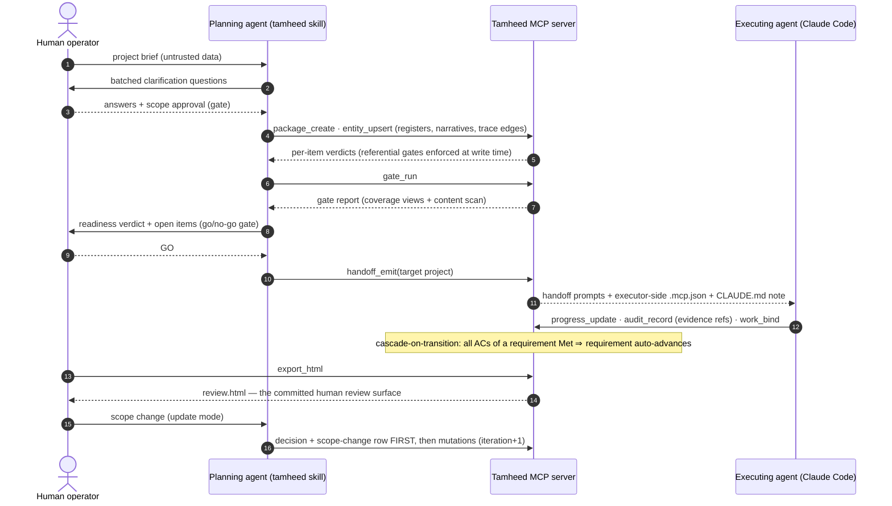

# Tamheed architecture

How Tamheed is *structured* so it can be invoked many ways without ever duplicating its logic. One principle
governs everything:

> **The skill owns the capability; every entry point is a thin wrapper.**

A slash invocation, a CLI, an HTTP API, a UI — each only normalizes input and routes output; none
re-implements the methodology. This is enforceable (gate **G-CMD-THIN**); the contract lives in
[`../plugins/tamheed/references/extension.md`](../plugins/tamheed/references/extension.md). See also
[`design-decisions.md`](design-decisions.md), [`methodology.md`](methodology.md) (what the capability is),
[`workflow.md`](workflow.md) (the staged process), and the in-bundle artifact catalog at
[`../plugins/tamheed/references/artifact-catalog.md`](../plugins/tamheed/references/artifact-catalog.md).

## 1. Layering

```
   ENTRY POINTS   slash · CLI · HTTP API · UI               (thin wrappers, NO methodology)
                        │  normalize to the input contract + a mode
                        ▼
   SKILL          the tamheed skill — THE CAPABILITY'S JUDGMENT HALF (single source of truth)
                  SKILL.md + references/ (workflow, governance, gates, intake, clarification,
                  artifact-rules, traceability, handoff, prompt-templates, state, extension…)
                        │  every write is an MCP tool call:
                        ▼
   MCP SERVER     the capability's MECHANICAL HALF (successor of the v1 validator)
                  entity_upsert · entity_query · trace_query · gate_run · handoff_emit ·
                  progress_update · audit_record · work_bind · package_migrate · package_adopt ·
                  export_html — the ONLY write path into a package
                        │  loads / writes back
                        ▼
   PACKAGE STORE  SQLite runtime (schema-enforced) ⇄ canonical JSONL (data/*.jsonl, committed)
                        │
                        ▼
   OUTPUT         an execution-ready package + emitted handoff + review.html
```

The dependency arrow points one way: entry points depend on the skill; the skill depends only on the
server and templates bundled *with it*; nothing depends on a particular entry point. Add a wrapper and the
skill is untouched.

**The MCP server is not an entry point.** That distinction is doctrine (ADR-0001): the server is the
mechanical half of the capability itself — where the referential quality gates live as schema constraints —
exactly as `validate_package.py` was the mechanical half of v1. G-CMD-THIN governs *wrappers*; the server
is inside the capability boundary.

## 2. The three-tier gate mapping (ADR-0001)

v1 ran seven file-scanning gates after generation. v2 moves each gate to the earliest layer that can own
it (full table: [`../plugins/tamheed/references/quality-gates.md`](../plugins/tamheed/references/quality-gates.md)):

| Tier | Gates | Mechanism | When it fires |
|---|---|---|---|
| **Referential** | G-IDS, G-DEC-STATUS, G-REQ-SRC | FOREIGN KEYs + the `entity_index`; CHECK status enums; NOT NULL provenance | **At write time** — a violating `entity_upsert` fails with the constraint named; these defects are unrepresentable in a stored package |
| **Coverage** | G-TRACE, G-SET, G-PROGRESS | SQL views (`g_trace_failures`, `g_set_failures`, `g_progress_failures`) | On `gate_run` (stages 19/22, and any time) |
| **Content / judgment** | G-COMPLETE (mechanical scan), G-INJECT (emission screen), G-CONFLICT, G-EXEC, G-HANDOFF, G-OQ + the Warn gates | `gate_run`'s content scan; `handoff_emit`'s injection screen; recorded judgment | `gate_run` / `handoff_emit` / stages 19+22 |

The consequence: the strongest gates stopped being *checks* and became *properties*. There is no window
where a package can hold a dangling reference, a `Draft` decision, or an unsourced requirement — the write
that would create one fails, and the error message is the gate report.

## 3. The three actors

Three parties touch a package across its life, all through the same MCP boundary:



The operator never proofreads JSONL: human review happens through `review.html` (D-REVIEW — HTML is the
only human surface, deterministic and committed alongside the data). The executing agent never edits
package files: progress enters through `progress_update`/`audit_record`/`work_bind`, and status cascades
(AC verdicts → requirement lifecycle) fire inside the same transaction.

## 4. Distribution: a self-contained plugin

Tamheed is packaged as a **Claude Code plugin**, and the repository doubles as its own **marketplace**:

```
tamheed/
├── .claude-plugin/marketplace.json        # repo = marketplace; lists the one plugin
└── plugins/tamheed/                       # THE PLUGIN — the self-contained skill bundle
    ├── .claude-plugin/plugin.json
    ├── .mcp.json                           # auto-starts the server when the plugin is enabled
    ├── SKILL.md                            # always-loaded front door (owns the capability)
    ├── references/                         # on-demand depth + artifact-catalog.md
    ├── templates/                          # surviving narrative section templates
    ├── schemas/   scripts/                 # frozen v1 contract (migration inputs)
    ├── db/                                 # v2 store: schema.sql + store.py + CANONICAL.md
    ├── server/                             # Tamheed MCP server (only write path into a package)
    └── assets/                             # logos
```

**Self-containment is a hard requirement, not a preference.** Claude Code copies the plugin directory to a
cache on install, so anything the skill reads or invokes at runtime must live inside `plugins/tamheed/` with
zero outward references. The same bundle is therefore also usable as a manual copy into a skills directory
or with any MCP-capable agent. Human-facing docs (`docs/`, this file) are *not* part of the bundle and may
link into it, but the bundle never links out.

## 5. The entry-point ↔ skill interface

A normalized request in, a routed package out. An entry point validates only invocation *syntax*; **content**
validation (is this a real, coherent project?) is the skill's job.

**Input contract** — whatever the user gave is mapped to one shape the skill understands: a description (or
brief path), an optional mode (`full | intake | plan | resume | stage:<id> | update | migrate | adopt`), an
optional `--profile` hint, `--package-dir`, and `--dry-run`. If the mode is omitted, the skill infers and
**confirms** it — never guesses silently
([`../plugins/tamheed/references/modes.md`](../plugins/tamheed/references/modes.md)).

**Output contract** — the skill returns either a completed package (whose gates pass, with the readiness
verdict) or a pause at a gate (clarification batch, or an approval gate: scope, decisions, roadmap, handoff,
final go/no-go). There is no separate state file: **the package is the state** — `resume`/`update` are
`package_open` + `entity_query`
([`../plugins/tamheed/references/state.md`](../plugins/tamheed/references/state.md)).

## 6. Error handling

Errors are handled at the layer that owns them. A **wrapper** fails *fast and loud* on bad invocation
(unknown flag, empty input → print help and stop); it never interprets project content. The **server**
fails *closed and named*: a constraint-violating write is rejected with the constraint in the error, batch
mutations are all-or-nothing, and a second concurrent writer fails loud on the lockfile. The **skill** fails
*safe and recorded* on process problems, via the workflow's per-stage failure conditions rather than by
crashing: empty input → ask; too-thin input → proceed under an `unknown` profile + raise an `OQ-`; unsourced
requirement → demote to an `ASM-` or raise an `OQ-` (never a silent requirement — and the store would
reject it anyway); unresolved hard contradiction → blocked from scope lock; user unavailable → proceed under
explicit recorded assumptions and mark the package *provisional*; critical gate failure → loop back, never
report "ready".

## 7. Versioning

Semver `MAJOR.MINOR.PATCH`, with the boundary defined by contract compatibility:

- **MINOR (additive):** new entity types (an `entity_types` registry row + an append-only DDL migration),
  section templates, optional columns, quality gates, profiles, diagram kinds, entry points. Existing
  packages keep working.
- **MAJOR (breaking):** a change to the DDL's existing required columns, the identifier scheme, or the
  MCP tool contract — ships with a migration note (see
  [`../plugins/tamheed/references/governance.md`](../plugins/tamheed/references/governance.md)).
- **PATCH:** fixes that change neither contracts nor user-visible behavior.

Immutable-after-approval rows (ADRs, approved acceptance criteria) are superseded, never rewritten — and
the schema enforces it with triggers. The plugin's own version lives in
`plugins/tamheed/.claude-plugin/plugin.json` and the marketplace entry; notable changes are recorded in
[`../CHANGELOG.md`](../CHANGELOG.md).
