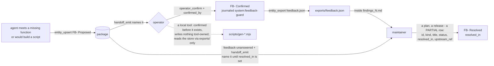
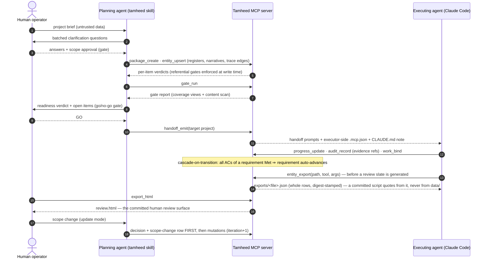
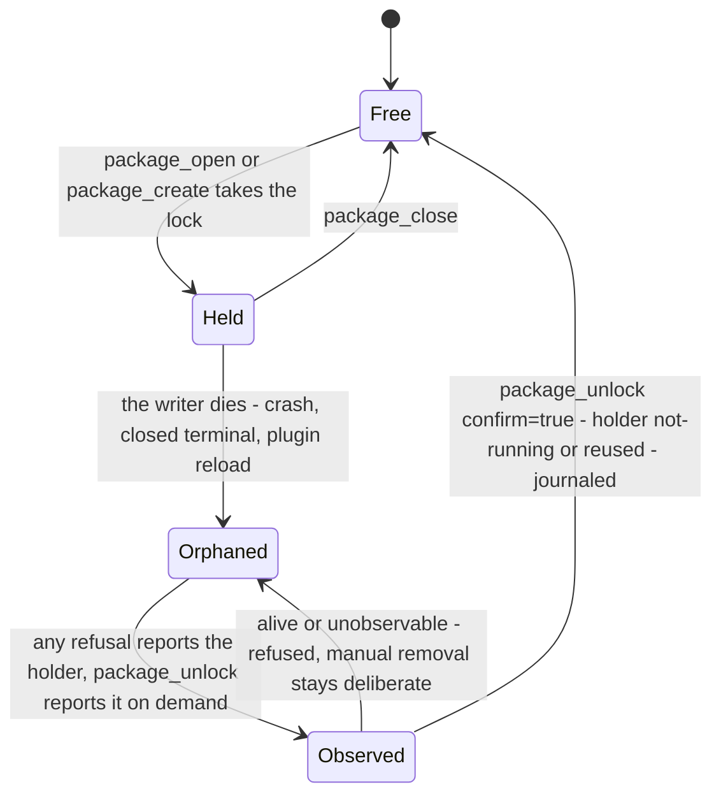

# Tamheed architecture

How Tamheed is *structured* so it can be invoked many ways without ever duplicating its logic. One principle
governs everything:

> **The skill owns the capability; every entry point is a thin wrapper.**

A slash invocation, a CLI, an HTTP API, a UI — each only normalizes input and routes output; none
re-implements the methodology. This is enforceable (gate **G-CMD-THIN**); the contract lives in
[`../plugins/tamheed/references/extension.md`](../plugins/tamheed/references/extension.md). See also
[`design-decisions.md`](design-decisions.md), [`methodology.md`](methodology.md) (what the capability is),
[`workflow.md`](workflow.md) (the staged process), and the in-bundle artifact catalog at
[`../plugins/tamheed/references/artifact-catalog.md`](../plugins/tamheed/references/artifact-catalog.md).

## 1. Layering

```
   ENTRY POINTS   slash · CLI · HTTP API · UI               (thin wrappers, NO methodology)
                        │  normalize to the input contract + a mode
                        ▼
   SKILL          the tamheed skill — THE CAPABILITY'S JUDGMENT HALF (single source of truth)
                  SKILL.md + references/ (workflow, governance, gates, intake, clarification,
                  artifact-rules, traceability, handoff, prompt-templates, state, extension…)
                        │  every write is an MCP tool call:
                        ▼
   MCP SERVER     the capability's MECHANICAL HALF (successor of the v1 validator)
                  entity_upsert · entity_query · trace_query · gate_run · handoff_emit ·
                  progress_update · audit_record · work_bind · package_migrate · package_adopt ·
                  export_html · package_verify · entity_export — the ONLY write path into a
                  package (and the read path: a committed script quotes an exports/ file)
                        │  loads / writes back
                        ▼
   PACKAGE STORE  SQLite runtime (schema-enforced) ⇄ canonical JSONL (data/*.jsonl, committed)
                        │
                        ▼
   OUTPUT         an execution-ready package + emitted handoff + review.html
```

The dependency arrow points one way: entry points depend on the skill; the skill depends only on the
server and templates bundled *with it*; nothing depends on a particular entry point. Add a wrapper and the
skill is untouched.

**The MCP server is not an entry point.** That distinction is doctrine (ADR-0001): the server is the
mechanical half of the capability itself — where the referential quality gates live as schema constraints —
exactly as `validate_package.py` was the mechanical half of v1. G-CMD-THIN governs *wrappers*; the server
is inside the capability boundary.

## 2. The three-tier gate mapping (ADR-0001)

v1 ran seven file-scanning gates after generation. v2 moves each gate to the earliest layer that can own
it (full table: [`../plugins/tamheed/references/quality-gates.md`](../plugins/tamheed/references/quality-gates.md)):

| Tier | Gates | Mechanism | When it fires |
|---|---|---|---|
| **Referential** | G-IDS, G-DEC-STATUS, G-REQ-SRC | FOREIGN KEYs + the `entity_index`; CHECK status enums; NOT NULL provenance | **At write time** — a violating `entity_upsert` fails with the constraint named; these defects are unrepresentable in a stored package |
| **Coverage** | G-TRACE, G-SET, G-PROGRESS, G-REL | SQL views (`g_trace_failures`, `g_set_failures`, `g_progress_failures`) + the `RELATION_RULES` edge-typing scan (G-REL — wrong edges are also rejected at write time) | On `gate_run` (stages 19/22, and any time) |
| **Content / judgment** | G-COMPLETE (mechanical scan), G-INJECT (emission screen), G-CONFLICT, G-EXEC, G-HANDOFF, G-OQ + the Warn gates | `gate_run`'s content scan; `handoff_emit`'s injection screen; recorded judgment | `gate_run` / `handoff_emit` / stages 19+22 |

The consequence: the strongest gates stopped being *checks* and became *properties*. There is no window
where a package can hold a dangling reference, a `Draft` decision, or an unsourced requirement — the write
that would create one fails, and the error message is the gate report.

Above the gates sits the **readiness layer**: `readiness_check(scope, id?)` answers "is this actually
done?" at a close boundary — `Review` counts as open (claimed is not verified), open critical/high defects
block while medium/low advise, and a stubborn failure passes only through an operator-approved `WVR-`
waiver (reported as `waived`, expiring, never silent); since v4.14 `ready` is false while any
blocking rule is `indeterminate` — the tool now agrees with its own review page, whose per-slice
panel had always called an empty slice "not ready" — and `indeterminate` names the rules.
Alongside the blocking rules run twenty
package-scope liveness advisories — from overdue open questions to `lessons-confirmed`, which nags while
any lesson recorded by the executing agent still awaits the operator's confirmation interview, and
`lessons-note-budget`, which names the lessons rendering past the always-loaded note's curation
ceiling as promotion candidates (pinning stays the operator's choice; its cost stops being invisible). The same
guarded-transition doctrine that reserves `force` for the operator's explicit words also guards lesson
binding: `entity_upsert` refuses any write landing a lesson in `Approved` or `Promoted` unless the item
carries `"operator_confirm": true` — operator-words-only, content byte-identical to the stored row,
attribution (`confirmed_by`) on the same write — and the server appends the typed
`lesson-confirmed`/`lesson-promoted` journal event itself. Promotion is where the package's memory turns
procedural: an operator interview distills Approved lessons into a **skill** (`SKL-` row + a written
`SKILL.md` the executing harness auto-loads), completing the episodic → declarative → procedural chain
(journal → lessons → skills).

The journal itself distinguishes what a caller reports from what the server witnessed: the four
server-appended kinds (`forced-override`, `lesson-confirmed`, `lesson-promoted`, `integrity-verified`)
are refused from `progress_update` (v4.5), so a narrated "confirmed" or "verified" can never be
journaled by hand. And the store's byte-stability guarantee — an idle open→close is a zero-diff — is
exercised on demand by **`package_verify`**: the canonical round-trip reported per file, foreign files
in `data/` named, an unloadable store reported as a finding, memory compared to disk when the package
is open, and a sha256 digest of the canonical files that `record=true` journals as a citable fact
(tamper-evidence proper — a hash chain, signatures, an external anchor — is deliberately out of scope).
The read side matches: `entity_query` pages (`after_id`/`next_after`), fetches known sets (`ids`), and
sweeps by keyword (`search`), so a register of any size is reachable through the tool and the files
stay what they are — the canonical form, never the read path. A committed script that must quote
the store byte-exact — a review slate, a docket — has the same rule and its own route (v4.7,
findings_24): **`entity_export`** writes a read tool's whole result to a deterministic,
digest-stamped JSON file under `<package>/exports/`, and the script quotes from that file; the
digest names the state the rows came from, so a slate's currency is one `package_verify` away.
The same file is how a project talks BACK to the plugin (v4.11): what the tools lack, and what
the project built instead, is an `FB-` row, confirmed by the operator, exported into the
project's findings, and collected by the maintainer — never a side utility over `data/`.


```mermaid
flowchart LR
    A["agent meets a missing function\nor would build a script"] -->|entity_upsert FB- Proposed| P[(package)]
    P -->|handoff_emit names it| O{operator}
    O -->|operator_confirm + confirmed_by| C[FB- Confirmed\njournaled system:feedback-guard]
    C -->|entity_export feedback.json| E[exports/feedback.json]
    E -->|inside findings_N.md| M[maintainer]
    P -->|feedback-unanswered + handoff_emit\nname it until resolved_in is set| M
    M -->|a plan, a release - a PARTIAL row:\nid, kind, title, status, resolved_in, upstream_ref| R[FB- Resolved\nresolved_in]
    O -.->|a local tool: confirmed before it exists,\nwrites nothing tool-owned; reads the store via exports/ only| T[scripts/gen-*.mjs]
```
On the write side, `expect_unchanged` lets a full-row status flip name the columns it did not
mean to change, and the store refuses transport drift (the field's LL-063: a paragraph lost
mid-paste with `ok: true`). The one departure from whole-row replacement (v4.12, the field's
FB-004) is the `substitute` item: one exact token in one column, which the server materializes
onto the stored row and then judges by the ORDINARY path — the same guards, triggers and
`changed_columns` — so there is no second write contract to guard. The header row (`title`,
`mode`, `iteration`, `entry_point`, `go_no_go`, `mvp_definition`) is written the same way,
`entity_upsert(type="package")`, with the go/no-go verdict on the operator's word (FB-001) —
presence-checked since v4.13: naming the verdict at all is the operator's act. Two things the
field found in v4.12's first week and v4.13 closes: a replacement that contains its needle is
refused when already present (a second run would compound), and `expect_unchanged` treats an
omitted column as what it is — preserved by the UPDATE, never drift — and (v4.14) refuses a named
column the item does not carry, the guard the field found could only pass.
On the read side, `search` with `context=N` is a census — the `occurrences` key, counts and
snippets per column (FB-003) — and `prompt-ids-resolve` scans the project's own prompt files for phantom ids
(FB-002), never a stock body.

## 3. The three actors

Three parties touch a package across its life, all through the same MCP boundary:


```mermaid
sequenceDiagram
    autonumber
    actor Operator as Human operator
    participant Planner as Planning agent (tamheed skill)
    participant Server as Tamheed MCP server
    participant Executor as Executing agent (Claude Code)

    Operator->>Planner: project brief (untrusted data)
    Planner->>Operator: batched clarification questions
    Operator-->>Planner: answers + scope approval (gate)
    Planner->>Server: package_create · entity_upsert (registers, narratives, trace edges)
    Server-->>Planner: per-item verdicts (referential gates enforced at write time)
    Planner->>Server: gate_run
    Server-->>Planner: gate report (coverage views + content scan)
    Planner->>Operator: readiness verdict + open items (go/no-go gate)
    Operator-->>Planner: GO
    Planner->>Server: handoff_emit(target project)
    Server-->>Executor: handoff prompts + executor-side .mcp.json + CLAUDE.md note
    Executor->>Server: progress_update · audit_record (evidence refs) · work_bind
    Note over Server: cascade-on-transition: all ACs of a requirement Met ⇒ requirement auto-advances
    Executor->>Server: entity_export(path, tool, args) — before a review slate is generated
    Server-->>Executor: exports/<file>.json (whole rows, digest-stamped) — a committed script quotes from it, never from data/
    Operator->>Server: export_html
    Server-->>Operator: review.html — the committed human review surface
    Operator->>Planner: scope change (update mode)
    Planner->>Server: decision + scope-change row FIRST, then mutations (iteration+1)
```

The operator never proofreads JSONL: human review happens through `review.html` — since v4.12 with a
Readiness section and a Feedback section beside the registers (D-REVIEW — HTML is the
only human surface, deterministic and committed alongside the data). The executing agent never edits
package files: progress enters through `progress_update`/`audit_record`/`work_bind`, and status cascades
(AC verdicts → requirement lifecycle) fire inside the same transaction.

## 4. Distribution: a self-contained plugin

Tamheed is packaged as a **Claude Code plugin**, and the repository doubles as its own **marketplace**:

```
tamheed/
├── .claude-plugin/marketplace.json        # repo = marketplace; lists the one plugin
├── lab/                                   # the permanent execution lab (repo-side, not in the bundle)
└── plugins/tamheed/                       # THE PLUGIN — the self-contained skill bundle
    ├── .claude-plugin/plugin.json
    ├── .mcp.json                           # auto-starts the server when the plugin is enabled
    ├── SKILL.md                            # always-loaded front door (owns the capability)
    ├── references/                         # on-demand depth + artifact-catalog.md
    ├── templates/                          # surviving narrative section templates
    ├── scripts/                            # scratch_diff.py (package diff utility)
    ├── db/                                 # the store: schema.sql + migrations/ + store.py + CANONICAL.md
    ├── server/                             # Tamheed MCP server (only write path into a package)
    ├── prompts/                            # scenario prompt library, emitted into <package>/prompts/
    └── assets/                             # logos
```

**Self-containment is a hard requirement, not a preference.** Claude Code copies the plugin directory to a
cache on install, so anything the skill reads or invokes at runtime must live inside `plugins/tamheed/` with
zero outward references. The same bundle is therefore also usable as a manual copy into a skills directory
or with any MCP-capable agent. Human-facing docs (`docs/`, this file) are *not* part of the bundle and may
link into it, but the bundle never links out.

## 5. The entry-point ↔ skill interface

A normalized request in, a routed package out. An entry point validates only invocation *syntax*; **content**
validation (is this a real, coherent project?) is the skill's job.

**Input contract** — whatever the user gave is mapped to one shape the skill understands: a description (or
brief path), an optional mode (`full | intake | plan | resume | stage:<id> | update | migrate | adopt`), an
optional `--profile` hint, and `--package-dir`. If the mode is omitted, the skill infers and
**confirms** it — never guesses silently
([`../plugins/tamheed/references/modes.md`](../plugins/tamheed/references/modes.md)).

**Output contract** — the skill returns either a completed package (whose gates pass, with the readiness
verdict) or a pause at a gate (clarification batch, or an approval gate: scope, decisions, roadmap, handoff,
final go/no-go). There is no separate state file: **the package is the state** — `resume`/`update` are
`package_open` + `entity_query`
([`../plugins/tamheed/references/state.md`](../plugins/tamheed/references/state.md)).

## 6. Error handling

Errors are handled at the layer that owns them. A **wrapper** fails *fast and loud* on bad invocation
(unknown flag, empty input → print help and stop); it never interprets project content. The **server**
fails *closed and named*: a constraint-violating write is rejected with the constraint in the error, batch
mutations are all-or-nothing, and a second concurrent writer fails loud on the lockfile. The **skill** fails
*safe and recorded* on process problems, via the workflow's per-stage failure conditions rather than by
crashing: empty input → ask; too-thin input → proceed under an `unknown` profile + raise an `OQ-`; unsourced
requirement → demote to an `ASM-` or raise an `OQ-` (never a silent requirement — and the store would
reject it anyway); unresolved hard contradiction → blocked from scope lock; user unavailable → proceed under
explicit recorded assumptions and mark the package *provisional*; critical gate failure → loop back, never
report "ready".

## 7. Versioning

Semver `MAJOR.MINOR.PATCH`, with the boundary defined by contract compatibility:

- **MINOR (additive):** new entity types (an `entity_types` registry row + an append-only DDL migration),
  section templates, optional columns, quality gates, profiles, diagram kinds, entry points. Existing
  packages keep working; a v4 package whose registry predates a newer family is taught it through
  `package_migrate`'s staged **registry-sync** mode (preview reports `entity_types_added`, confirm appends
  the registry rows — a pure registry append, no backup taken; `columns_added` names any files that re-serialize because their tables gained columns since the store was last written; since v4.5 the same staged sync also relocates a foreign `*.jsonl.converted` audit-trail file out of the canonical `data/` into `data-v3-backup/`). New trace relations and journal event kinds are MINOR too (a CHECK recreation on an empty-at-connect table — `004_amends_verify.sql`).
- **MAJOR (breaking):** a change to the DDL's existing required columns, the identifier scheme, or the
  MCP tool contract — ships with a migration note (see
  [`../plugins/tamheed/references/governance.md`](../plugins/tamheed/references/governance.md)).
- **PATCH:** fixes that change neither contracts nor user-visible behavior.

Immutable-after-approval rows (ADRs, approved acceptance criteria) are superseded, never rewritten — and
the schema enforces it with triggers. The plugin's own version lives in
`plugins/tamheed/.claude-plugin/plugin.json` and the marketplace entry; notable changes are recorded in
[`../CHANGELOG.md`](../CHANGELOG.md).

## 8. The single-writer lock, observed

One writer per package, guarded by `data/.lock` (`O_EXCL`). The lock records who took it — pid,
host, `taken_at`, and the writer's **process start identity** — so that the question "is the
holder still there?" is an observation, not a guess (plans 063–064, findings_25 §1). A bare pid
check is unsound: the OS recycles pids, and the field once found a dead writer's pid owned by an
editor started hours later.


```mermaid
stateDiagram-v2
    [*] --> Free
    Free --> Held : package_open or package_create takes the lock
    Held --> Free : package_close
    Held --> Orphaned : the writer dies - crash, closed terminal, plugin reload
    Orphaned --> Observed : any refusal reports the holder, package_unlock reports it on demand
    Observed --> Free : package_unlock confirm=true - holder not-running or reused - journaled
    Observed --> Orphaned : alive or unobservable - refused, manual removal stays deliberate
```

The observation has four outcomes. `not-running`: no such process. `reused`: the pid belongs to
a different process (its start identity differs from the one recorded; for an older lock that
recorded none, it started after the lock was taken). `alive`: the recorded process is running.
`unobservable`: another host or pid namespace, access denied, a legacy lock, or a platform that
cannot report a start time. `package_unlock(confirm=true)` — the operator's words, like `force` —
proceeds only on the first two; a lock the server could not see is not a lock it may remove.
The server reads process metadata to do this (Windows process query, Linux `/proc`); it spawns
nothing and signals nothing. Canonical JSONL reaches disk on **every write**, not at close:
`package_close` only releases the lock.
