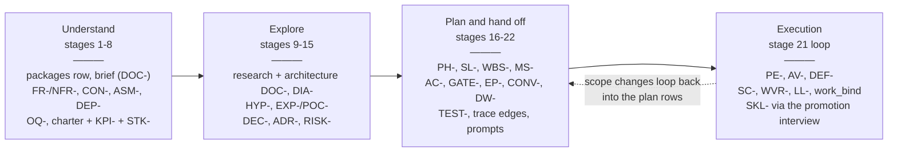
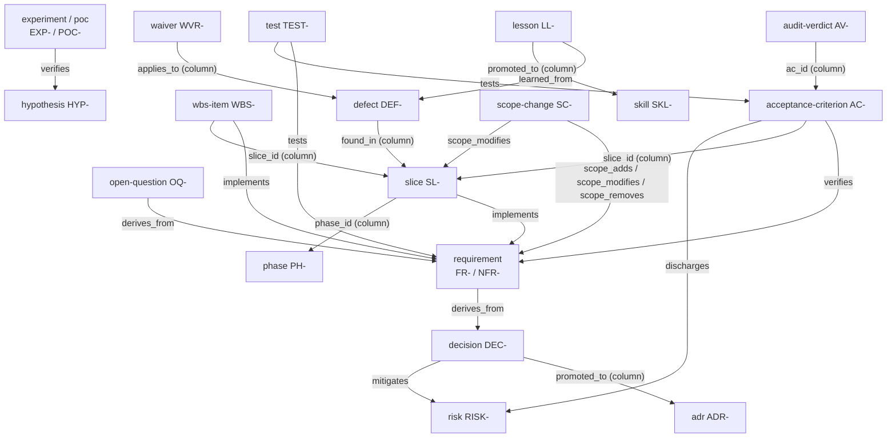
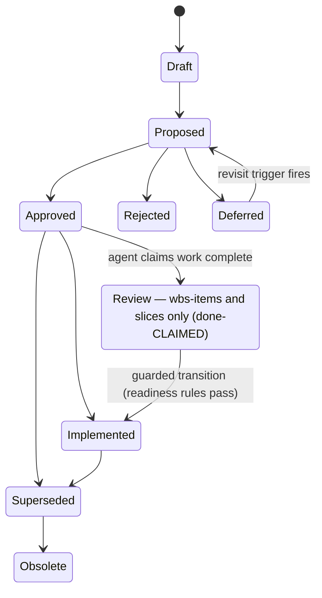
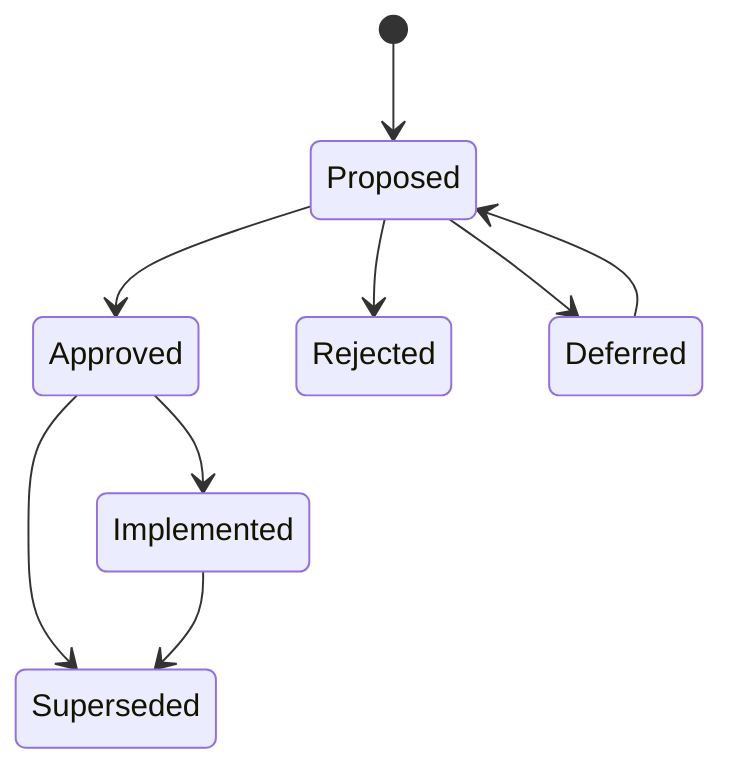
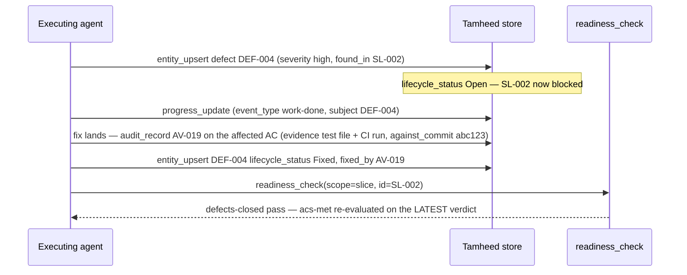
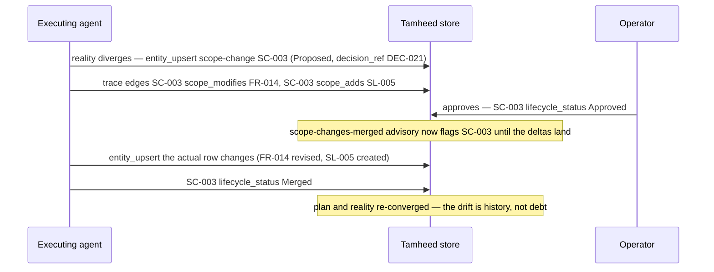
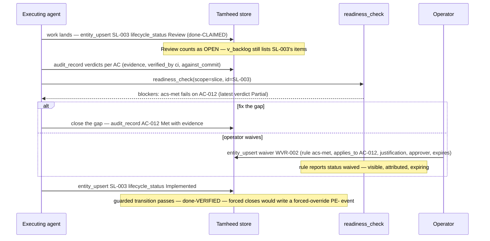

# The Tamheed v4 Entity Study

*The rationale record for the v4 entity model (plan 031). The compact in-bundle companion is
`plugins/tamheed/references/entity-guide.md`; this document is the full study: what every
entity family is, why it has the shape it has, and what breaks when you skip it.*

## 1. How to read this document

Tamheed stores a planning-and-handoff package as a **relational store**: one table per entity
family, defined once in `plugins/tamheed/db/schema.sql` (the single source of data shape),
written only through the MCP tools, serialized canonically as `data/*.jsonl`. This document
walks that model in five passes:

1. the **lifecycle map** — where in the 22-stage workflow each family is born;
2. the **v4 decision table** — the 15 locked design decisions that shaped the model;
3. the **relationship map** — how families link through typed trace edges;
4. the **status machines** — the lifecycle vocabularies and how rows move through them;
5. **per-entity sections** — for every family: columns, purpose, lifecycle position, when to
   create/update/retire, the cost of omission, the design decisions behind it, and the
   mechanics (gates, advisories, triggers) that key on it.

Column names, CHECK constraints, and trigger behavior are quoted from the DDL — when this
document and `schema.sql` disagree, the DDL wins. Diagrams are Mermaid in fenced blocks;
GitHub renders them. (The package's `review.html` export deliberately does **not** render
mermaid — it is a zero-JS surface; diagram source is shown as text there.)

### The lifecycle map

The 22 stages (authoritative spec: `plugins/tamheed/references/workflow.md`) run in three
bands, then hand off to execution. Each band gives birth to a different set of families:

Understand extracts and locks scope; Explore researches and decides; Plan turns decisions
into an execution plan as data; Execution appends journal entries, verdicts, defects, and
drift records against that plan through the same store.

## 2. The v4 decision table

The v4 model was locked as 15 maintainer decisions (plan 031, 2026-08-14, maintainer-locked
in five interview rounds), built on three exhaustive code scans and three external
best-practice research reports (including a dedicated DEC-vs-ADR study). The summary
rationale also lives in the `[4.0.0]` CHANGELOG entry.

| # | What was decided | Why | Entities shaped |
|---|---|---|---|
| 1 | Explicit v3→v4 migration: `package_open` refuses pre-v4 stores; `package_migrate` is staged (preview, then `confirm=true` with backup to `data-v3-backup/`) | Silent auto-upgrade of a store you cannot inspect first is how data gets corrupted; refusal + staged preview keeps the operator in control | every table (the `packages` version row is the lock) |
| 2 | v1 ingestion retired: frozen v1 validator, markdown importer, `schemas/` directory all removed | Two authorities on data shape drift apart; the DDL is now the single source of data shape | every table |
| 3 | Schema re-baselined: `schema.sql` is the full v4 DDL, `migrations/001_init.sql` its byte-twin; v2/v3 lineage lives in the migrate tool | Stacked ALTERs obscure what the shape actually is; a re-baseline makes the DDL readable as a spec | every table |
| 4 | `DEC-`/`ADR-` kept as two tiers with the one-way-door promotion rule (`promoted_to`) plus the `decisions-look-architectural` nag | One flat decision log buries the irreversible calls; two tiers with a promotion test (Nygard/AWS one-way-door framing) keep ADRs rare and load-bearing | decisions, adrs |
| 5 | Claimed-vs-verified split: `Review` state (done-claimed) on wbs-items/slices + evidence-chained verdicts (`verified_by`, `verification_method`, `against_commit`) | Across agent harnesses the consensus is that done is a verdict rendered by a different actor or a mechanical check, recorded with evidence, against a specific commit — an agent asserting "done" is a claim, not a fact | slices, wbs_items, audit_verdicts |
| 6 | Lightweight enrichment + liveness advisories instead of full standard column sets | Registers rot when they are all columns and no pulse; a few gate-checkable fields (`owner`, `due_by`, `validation_date`, `metric`+`threshold`, `rationale`+`verification_method`, `confirmation`) plus advisories that nag keep them alive | requirements, risks, open_questions, assumptions, hypotheses, adrs |
| 7 | Vocabulary normalized with domain sets kept; lifecycle column name unified to `lifecycle_status` everywhere | A hypothesis verdict is not a test verdict — merging vocabularies loses meaning; but the lifecycle *axis* deserves one name (three-axis doctrine) | experiments, pocs, tests, audit_verdicts, defects, deferred_work |
| 8 | Milestones demoted to labels: no lifecycle, no disposition, never gate | A milestone that gates is an execution gate wearing a costume; keeping both roles on one row made neither trustworthy | milestones, execution_gates |
| 9 | Gate hardening: severity-thresholded blocking (open critical/high defects block; medium/low advise) + `WVR-` waivers + Go/Hold/Redirect/Kill outcomes | Every real gate regime severity-thresholds (Google PRR, AWS ORR), and a gate with no waiver path gets bypassed informally; stage-gate practice says a gate decision is richer than pass/fail | defects, waivers, execution_gates |
| 10 | Scope-change drift-delta lifecycle: Proposed → Approved → **Merged**, with typed delta edges (`scope_adds`/`scope_modifies`/`scope_removes`) | OpenSpec's delta/archive model: drift approved but never merged into the plan rows is a second, silent plan; Merged closes the loop | scope_changes, trace_edges |
| 11 | Typed progress events with compensating corrections (`event_type`, `subject_id`, `actor`, `corrects`) | Event-sourcing-lite: a journal you can query needs typed past-tense events, and journals are never edited — a wrong entry is corrected by a new entry that points at it | progress_entries |
| 12 | Deletions: `binds_to` (zero usage ever), `entity_types.template_ref` (never read), per-row `diagrams.generation_class`, `schemas/` | A surface nobody uses is maintenance debt and false authority; guessed semantics cause false rejections (the `binds_to` lesson) | trace_edges, entity_types, diagrams |
| 13 | `[NEEDS-CLARIFICATION: OQ-NNN]` markers must cite a live OQ (G-COMPLETE validates) | spec-kit's forbidden-to-assume idea, made accountable: an ambiguity marker with no owner and no due date is just a shrug in brackets | open_questions + every prose field |
| 14 | Full relation coverage + blocking G-REL: endpoint-type rules enforced hard at write time and at the gate | A typed edge whose types are wrong (a TEST `mitigates` an FR was accepted for a year) is worse than no edge; kinds with no evidenced semantics stay `relates_to`-only rather than guessing | trace_edges |
| 15 | Permanent agent-driven lab + layered docs + a single 4.0.0 release | One coherent MAJOR beats a drip of breaking MINORs; the model is validated by agents actually running it, and taught in layers (catalog → guide → this study) | all (release scope) |

## 3. The entity relationship map

The core families and their **typed relations**. Full endpoint-type rules live in
`RELATION_RULES` (`plugins/tamheed/server/tamheed_server.py`) — enforced hard on
`entity_upsert` writes and by the blocking **G-REL** gate; `relates_to` is the documented
untyped escape hatch. This map shows the load-bearing subset:

Two link mechanisms coexist, deliberately: **columns** (FKs) carry structural containment
and pointers the schema itself needs (`ac_id`, `slice_id`, `found_in`, `applies_to`,
`promoted_to`); **trace edges** carry semantic claims between otherwise-independent rows
(`implements`, `verifies`, `mitigates`). Waivers and gates point at entities via their own
`applies_to` column, never via edges.

## 4. The status machines

### 4a. The standard lifecycle

Every status-bearing row carries `lifecycle_status` (one column name across the model —
the three-axis doctrine: lifecycle, verdict, and disposition are independent columns).

`Review` exists **only** on `wbs_items` and `slices` and means done-CLAIMED: the agent
asserts completion but no verification has confirmed it. Every readiness closed-set counts
Review as OPEN (`v_backlog` keeps Review rows on the backlog by construction). Only the
guarded transition to `Implemented` — done-VERIFIED — closes work.

### 4b. The decision lifecycle

Decision rows have **exactly six** statuses — no `Draft` (a decision not yet offered is not
a decision; CHECK-enforced, so Draft is unrepresentable) and no `Obsolete`:

**Only Approved decisions constrain execution**, and a Proposed decision is never rendered
as Approved — a core safeguard. (ADR rows, by contrast, *do* allow `Draft` in their CHECK —
an ADR can be drafted collaboratively before being offered — and the `adrs-approved`
readiness rule blocks any ADR still in Draft/Proposed at package close.)

### 4c. Domain lifecycles

Three families reuse the `lifecycle_status` column name with domain vocabularies
(CHECK-enforced per table):

| Family | `lifecycle_status` values | Notes |
|---|---|---|
| defect | `Open`, `In-progress`, `Fixed`, `Won't-fix`, `Duplicate` | open critical/high block readiness; `Won't-fix` is a decision, record why |
| deferred-work | `Open`, `Activated`, `Scheduled`, `Done`, `Won't-do` | `Activated` = the activation trigger fired |
| scope-change | `Proposed`, `Approved`, `Merged` | `Merged` = deltas applied to the plan rows; Approved-never-Merged trips the `scope-changes-merged` advisory |
| lesson | `Proposed`, `Approved`, `Promoted`, `Rejected`, `Superseded`, `Obsolete` | No Draft (born Proposed, the decisions pattern) and no Deferred — an undecided lesson keeps nagging via the `lessons-confirmed` advisory; entering `Approved` or `Promoted` is confirm-guarded (`operator_confirm`), and `Promoted` is reachable from stored-`Approved` only |
| skill | `Approved`, `Superseded`, `Obsolete` | Born `Approved` — the promotion interview IS the approval; a re-distillation is a new `SKL-` row with `superseded_by`, never an edit |

Risks add a fourth axis of their own: `risk_state` ∈ {open, mitigated, materialized,
retired, accepted}, independent of `lifecycle_status`.

## 5. Per-entity sections

### The standard column block

Nearly every entity table carries the same shared block; the per-family tables below list
only what is **specific** to each family. The shared block:

| Column | Constraint | Meaning |
|---|---|---|
| `id` | TEXT PRIMARY KEY, prefix GLOB-checked | Governed identifier (`FR-001` style); never reused — retire, don't recycle |
| `title` | NOT NULL | The row's human label (v4 unified: stakeholders' label column is `title` too) |
| `lifecycle_status` | NOT NULL, CHECK per family | The lifecycle axis (§4) |
| `disposition` | CHECK: `superseded` / `accepted-with-deviation` / `void` | How the row exited, when not by normal lifecycle; a cancelled criterion is *void*, not *Not-met* |
| `disposition_reason_ref` | FK → `entity_index(id)`; **required if disposition is set** (CHECK) | The deciding DEC-/ADR- |
| `source_kind` | CHECK: `brief` / `clarification` / `code` / `inferred` | Provenance class; **NOT NULL on requirements** (G-REQ-SRC), elsewhere a `source_span` REQUIRES a `source_kind` (CHECK) |
| `source_span` | TEXT; NOT NULL + non-empty on requirements | Where in the source the row came from |
| `introduced_in` / `retired_in` | INTEGER (requirements, phases, slices, ACs only) | Package-iteration windows; `retired_in IS NULL` = active |
| `custom_attributes` | JSON TEXT | Additive extension point |
| `last_referenced` | TEXT | Telemetry stamp (`work_bind` updates it); write-only surfaces (trace_edges, omissions) carry neither this nor custom_attributes |

`entity_index` is **derived**: two triggers per entity table (`trg_<table>_ai` /
`trg_<table>_ad`) keep it exact, and every cross-type reference FKs into it — so deleting
an entity that anything still references fails on the index FK. That is G-IDS as schema.

---

### Requirements & registers

#### requirement (`FR-` / `NFR-`) — Always

| Column | Constraint | Meaning |
|---|---|---|
| `kind` | NOT NULL; CHECK pairs kind with prefix (`functional`↔`FR-`, `non-functional`↔`NFR-`) | What flavor of requirement |
| `statement` | TEXT | The requirement itself (EARS-style phrasing recommended) |
| `rationale` | TEXT | WHY it exists — first-class per ISO/IEC/IEEE 29148 |
| `priority` | TEXT | Free-form priority |
| `verification_method` | CHECK: `Test` / `Demonstration` / `Inspection` / `Analysis` | The 29148 canonical enum: how this will be verified |
| `mvp` | NOT NULL DEFAULT 0, CHECK ∈ {0,1} | G-TRACE scope flag |
| `source_kind` / `source_span` | **NOT NULL** | G-REQ-SRC enforced by the store itself |

**Purpose.** The contract: what the system must do (FR) and how well (NFR). Everything else
in the package ultimately serves, verifies, or de-risks these rows.

**Lifecycle position.** Extracted verbatim in stage 3, normalized to rows in stage 4, read
by every later stage. `trg_requirement_auto_advance` moves an Approved requirement to
Implemented automatically when every non-retired AC's **latest** verdict is Met.

**Create / update / retire.** Create in stage 4 (batch `entity_upsert`); after scope
approval, new or changed requirements go through the `update` flow (an `SC-` row first).
Never delete: retire via `retired_in`, supersede, or disposition with a reason ref.

**What you lose without it.** Everything downstream is unanchored: ACs verify nothing,
slices implement nothing, G-TRACE has no rows to trace, and the "plan" is prose with no
spine. (This family is Always; a package without requirement rows needs a recorded
omission with a reason, or G-SET fails.)

**Design decisions behind it.** Decision 6 added `rationale` and `verification_method` —
the two 29148 attributes with a mechanical payoff — instead of the full 29148 attribute
set; the liveness advisory `requirements-wired` flags rows with zero trace edges. The
`mvp` flag implements the sustainable-granularity traceability finding: MVP-scoped
tracing, no requirement→code-file edges (they rot).

**Related mechanics.** G-REQ-SRC (NOT NULL provenance), G-TRACE (`g_trace_failures` view:
every MVP requirement needs ≥1 decision/ADR, ≥1 work item, ≥1 test), the
`requirements-wired` advisory, the auto-advance trigger.

#### constraint (`CON-`) — Always

| Column | Constraint | Meaning |
|---|---|---|
| `statement` | TEXT | The imposed limit |

**Purpose.** Limits the design cannot negotiate — imposed from outside (budget, platform,
regulation, mandate).

**Lifecycle position.** Born in stage 4 alongside requirements (candidates are tagged
functional / non-functional / constraint in stage 3); read whenever options are compared
(stage 11) and decisions taken (stage 14).

**Create / update / retire.** Create when the brief imposes a limit; supersede if the
imposing authority changes its mind — record who and why via `disposition_reason_ref`.

**What you lose without it.** Constraints masquerade as requirements or, worse, as silent
assumptions — and the architecture exploration wastes effort on options that were never
allowed.

**Design decisions behind it.** Kept deliberately thin (decision 6): a constraint is a
statement with provenance, not a form. A DEC touching a constraint that was never promoted
trips `decisions-look-architectural` (decision 4).

**Related mechanics.** G-REL: constraints are in the requirement-like endpoint set for
`derives_from`, `mitigates`, `implements`, `verifies` targets.

#### invariant (`INV-`) — Conditional

| Column | Constraint | Meaning |
|---|---|---|
| `statement` | TEXT | The property that must never break |
| `enforcement` | TEXT | HOW it is kept true (trigger, CI check, review rule) |

**Purpose.** Properties that must NEVER break — stronger than a requirement (which is
delivered once) because an invariant is continuously true.

**Lifecycle position.** Usually emerges in Understand or during architecture exploration;
`deferred_work.invariant_at_stake` points at it during execution.

**Create / update / retire.** Create when a property's violation would be a system-level
failure, and say in `enforcement` how it stays true — an invariant with no enforcement is a
wish. Supersede rather than edit once approved practice depends on it.

**What you lose without it.** Deferred work loses its "what is at stake" pointer, and
non-negotiable properties get renegotiated by accident in later decisions.

**Related mechanics.** `deferred_work.invariant_at_stake` FK; `verifies` edges may start
from invariants (an invariant can verify a requirement-like row per RELATION_RULES).

#### assumption (`ASM-`) — Always

| Column | Constraint | Meaning |
|---|---|---|
| `statement` | TEXT | The belief the plan rests on |
| `risk_if_wrong` | TEXT | The RAID impact-if-false field |
| `validation_date` | TEXT | Confirm-or-challenge by this date — assumptions decay |

**Purpose.** Beliefs the plan rests on but nobody has confirmed. In stage 4, inferences
that cannot cite a source span become assumptions instead of requirements — that rule is
what keeps G-REQ-SRC honest.

**Lifecycle position.** Born in stages 4–7 (normalization and clarification: "record an
assumption with `risk_if_wrong`" is the fallback when a clarifying question isn't worth
asking); revisited whenever `validation_date` passes.

**Create / update / retire.** Create whenever you catch yourself inferring; validate or
escalate to a risk when the date arrives; supersede when a clarification answers it.

**What you lose without it.** Inference becomes invisible: the package reads as if
everything were sourced, and the first wrong guess surfaces as a mid-execution surprise
instead of a tracked, dated belief.

**Design decisions behind it.** Decision 6: `validation_date` + the `assumptions-current`
advisory implement the RAID-log discipline that assumptions decay and need re-validation
— liveness by nag, not by column count.

**Related mechanics.** `assumptions-current` advisory (past-date assumptions);
`discharges` edges: an AC or test can discharge an assumption.

#### dependency (`DEP-`) — Conditional

| Column | Constraint | Meaning |
|---|---|---|
| `statement` | TEXT | What is depended on |
| `owner` | TEXT | Who on the other side is accountable |

**Purpose.** External parties/systems the plan waits on — things you do not control.

**Lifecycle position.** Detected in stage 6 (contradiction & dependency detection); a
`blocked_by` edge can point work at a dependency during planning and execution.

**Create / update / retire.** Create when the plan waits on something external; name the
`owner` (RAID practice: an unowned dependency is a hope). Retire when delivered or
designed around.

**What you lose without it.** Blocked work has nothing typed to be blocked *by* — delays
surface as mystery slippage instead of "waiting on DEP-002 since its owner went quiet."

**Related mechanics.** `blocked_by` edge target set includes dependencies.

#### open-question (`OQ-`) — Always

| Column | Constraint | Meaning |
|---|---|---|
| `question` | TEXT | The unresolved ambiguity |
| `owner` | TEXT | Who must answer — a question without an owner is parked |
| `due_by` | TEXT | Deadline; the `open-questions-overdue` advisory keys on it |
| `resolution` | TEXT | The answer, once given |
| `resolved_by` | FK → `entity_index(id)` | The entity (decision, assumption…) that resolved it |

**Purpose.** Tracked ambiguity. The v4 rule (decision 13): never assume — where prose is
ambiguous, write `[NEEDS-CLARIFICATION: OQ-NNN]` in place and create the OQ with owner and
due date.

**Lifecycle position.** Born in stage 5 (ambiguity detection) and any time a contradiction
(stage 6) needs a human answer; batch-resolved in stage 7 (clarification); package close
reviews the survivors (`open-questions-resolved` advisory: resolve or carry deliberately).

**Create / update / retire.** Create at the moment of ambiguity, in place, via the marker.
Update `resolution` + `resolved_by` when answered. An OQ is never deleted — a resolved OQ
is the audit trail of why the prose says what it says.

**What you lose without it.** Ambiguity resolves itself silently — by the agent's guess.
Markers without a live OQ fail G-COMPLETE precisely so a bracket-shrug can't stand in for
an owned, dated question.

**Design decisions behind it.** Decision 13 (marker must cite a live OQ; spec-kit's
`[NEEDS CLARIFICATION]` made accountable); decision 6 (owner + due_by are the RAID
fields with mechanical payoff).

**Related mechanics.** G-COMPLETE marker validation (no id, dangling id, or resolved cite =
unfinished-marker failure); `clarifications-open`, `open-questions-overdue`,
`open-questions-resolved` advisories; `blocked_by` and `discharges` edges can involve OQs.

#### glossary-term (`GT-`) — On-request

| Column | Constraint | Meaning |
|---|---|---|
| `term` | NOT NULL | The word |
| `definition` | TEXT | What it means here |

**Purpose.** Domain vocabulary, on request. Also the worked example for community
extension (it entered v3 as migration 002 and was folded into the v4 baseline —
decision 3).

**What you lose without it.** Usually nothing — that is why it is On-request. In
jargon-heavy domains, ambiguity that should have been one GT- row becomes several OQ- rows.

---

### Decisions

#### decision (`DEC-`) — Always

| Column | Constraint | Meaning |
|---|---|---|
| `decision` | TEXT | What was decided |
| `rationale` | TEXT | Why — a decision with no rationale is blocked at stage 14 |
| `lifecycle_status` | NOT NULL, CHECK: exactly `Proposed` / `Approved` / `Rejected` / `Superseded` / `Deferred` / `Implemented` | No Draft — born Proposed (§4b) |
| `promoted_to` | FK → `adrs(id)` | The promotion link when the one-way-door test says yes |

**Purpose.** ANY project decision — scope, vendor, priority, process. The "Any Decision
Records" insight: most decisions worth recording are not architectural, and forcing them
into ADR ceremony means they don't get recorded at all.

**Lifecycle position.** Captured in stage 14 (decision capture) from comparisons and
experiment results; rejected alternatives are kept as Rejected rows (they are evidence).
Referenced constantly afterward: dispositions, scope changes (`decision_ref` is NOT NULL),
and `derives_from` edges all point at decisions.

**Create / update / retire.** Create at the decision point, status Proposed; the human
approves (stage 14 is a marked approval point). Reversal = supersede with a new DEC-.
**The promotion rule (decision 4):** promote to an `ADR-` when the one-way-door test says
yes — hard to reverse (a week of refactoring, not a config flip), broad blast radius
(structure, a critical -ility, dependencies, interfaces, or construction techniques —
Nygard's five), or the same question keeps being re-debated. Record `promoted_to` so the
link is never lost.

**What you lose without it.** Choices live in chat scrollback; six weeks later the same
option comparison is re-run because nobody can prove it already happened, and the
traceability chain (requirement `derives_from` decision) has a hole G-TRACE will flag.

**Design decisions behind it.** Decision 4 (two tiers + promotion rule + nag). The
`decisions-look-architectural` advisory is the operational half: it flags Approved/
Implemented DECs that work items `implement`/`satisfy`, or that touch invariants or
constraints, but were never promoted.

**Related mechanics.** G-DEC-STATUS (schema-enforced: the CHECK *is* the gate);
`decisions-approved` blocking readiness rule (a closed package cannot rest on Proposed
decisions); `decisions-look-architectural` advisory; `derives_from` / `mitigates` /
`blocked_by` edges.

#### adr (`ADR-NNNN`, exactly 4 digits) — Conditional

| Column | Constraint | Meaning |
|---|---|---|
| `context` / `decision` / `consequences` | TEXT | The Nygard triad |
| `confirmation` | TEXT | MADR 4.x: HOW compliance is verified — part of the frozen content |
| `lifecycle_status` | DEFAULT `Proposed`; standard set (Draft allowed, unlike DEC-) | ADRs may be drafted before being offered |
| `superseded_by` | FK → `adrs(id)` | Successor must be INSERTed first |

**Purpose.** Architecturally significant decisions — the one-way doors. Immutable after
approval: `trg_adrs_immutable` ABORTs any update to title/context/decision/consequences/
`confirmation` once status is Approved or Implemented. Change of meaning = INSERT a
successor and set `superseded_by`. Typos yes, meaning no.

**Lifecycle position.** Stage 14, by promotion from DEC- rows; the `adrs-approved`
blocking rule ensures none is left Draft/Proposed at package close.

**Create / update / retire.** Create by promotion (record `decisions.promoted_to`);
supersede, never edit. `confirmation` is written at approval time — how will we know the
codebase actually complies? — which is what makes an ADR checkable rather than
aspirational (the MADR 4.x confirmation field).

**What you lose without it.** Irreversible choices are indistinguishable from reversible
ones; the executor re-litigates load-bearing structure mid-build, or quietly walks through
a one-way door in the other direction.

**Design decisions behind it.** Decisions 4 (two tiers) and 6 (`confirmation` is the one
MADR field with a mechanical afterlife). Immutability-by-trigger is the v4 enforcement of
the long-standing supersede-never-edit doctrine.

**Related mechanics.** `trg_adrs_immutable`; `adrs-approved` blocking rule; `supersedes`
edges are SAME_TYPE (supersession is always within a family); `disposition_reason_ref`
across the whole model may point at an ADR.

---

### Risk & research

#### risk (`RISK-`) — Always

| Column | Constraint | Meaning |
|---|---|---|
| `description` | TEXT | The risk |
| `probability` / `impact` | CHECK: `high` / `medium` / `low` | Scored coarsely on purpose |
| `owner` | TEXT | Highest-weight register field: no owner = nobody monitors |
| `response_strategy` | CHECK: `avoid` / `mitigate` / `transfer` / `accept` | The PMI response taxonomy |
| `mitigation` | TEXT | The mitigation plan (folded onto the row — no separate plan table) |
| `risk_state` | NOT NULL DEFAULT `open`; CHECK: `open` / `mitigated` / `materialized` / `retired` / `accepted` | The execution lifecycle — so risks stop being write-only |
| `discharged_by` | FK → `entity_index(id)` | The AC/test that discharges it |

**Purpose.** The risk register — with a pulse. The defining v4 property is `risk_state` +
`discharged_by`: a risk is not "handled" because a mitigation paragraph exists; it is
discharged when a named AC or test retires it.

**Lifecycle position.** Stage 15 (risk analysis) enumerates and scores; execution
discharges. The `risks-discharged` blocking rule fails package readiness while any
open/materialized risk has no discharging AC/test.

**Create / update / retire.** Create per technical/dependency/platform/delivery/compliance
exposure with an owner and a response strategy; update `risk_state` as reality moves
(`materialized` is a legal state — record it, then respond); `retired`/`accepted` close it.

**What you lose without it.** The register-rot pattern PMI literature documents: a
write-only list compiled at kickoff and never read again. Without `RISK-` rows the
readiness engine cannot even nag.

**Design decisions behind it.** Decision 6 chose the agile 5-field minimal register
(description, probability, impact, owner, response) over the full PMBOK schema —
liveness-over-columns — with `risk-liveness` as the nag: open high-probability or
high-impact risks missing an owner or response strategy are flagged.

**Related mechanics.** `risks-discharged` (blocking), `risk-liveness` (advisory);
`mitigates` edges point *at* risks from decisions/work/verification/requirement-like rows;
`discharges` edges from ACs/tests; G-RISK (judgment gate, stage 15).

#### hypothesis (`HYP-`) — Conditional

| Column | Constraint | Meaning |
|---|---|---|
| `statement` | TEXT | Falsifiable form |
| `metric` | TEXT | What is measured |
| `threshold` | TEXT | The pass number — decided BEFORE the experiment runs |

**Purpose.** A falsifiable claim blocking a decision. The Lean-experiment discipline:
declare the metric and the threshold before you run, or you will interpret whatever you
get as confirmation.

**Lifecycle position.** Stage 12 (hypothesis definition); experiments (stage 13) attach
via `verifies` edges; verdicts feed decision capture (stage 14).

**What you lose without it.** Experiments become demos: run first, decide what success
meant afterward. The `hypotheses-measurable` advisory flags any hypothesis past Draft
without metric + threshold.

**Related mechanics.** `hypotheses-measurable` advisory; `verifies` and `discharges` edges
can target hypotheses.

#### experiment (`EXP-`) / poc (`POC-`) — Conditional

| Column | Constraint | Meaning |
|---|---|---|
| `method` | TEXT | How it runs |
| `timebox` | TEXT | Hard limit — unbounded research is the failure mode |
| `verdict` | NOT NULL DEFAULT `Pending`; CHECK: `Validated` / `Invalidated` / `Inconclusive` / `Pending` | A **hypothesis verdict**, not a test verdict |
| `results` | TEXT | Append-only by convention |

**Purpose.** The minimal run that settles a hypothesis (EXP-) or proves a build approach
(POC- — same shape, build-flavored).

**Lifecycle position.** Planned in stage 13 with the metric and threshold decided before the run and a
timebox; verdicts recorded during Explore; consumed by stage 14.

**Design decisions behind it.** Decision 7: the v3 PASS/FAIL vocabulary was replaced with
`Validated/Invalidated/Inconclusive/Pending` because an experiment concludes about a
*hypothesis*, and `Inconclusive` is an honest, common outcome PASS/FAIL couldn't express.

**What you lose without it.** Decisions blocked on unknowns get made by vibe;
"needs experiment" ties in option comparison (stage 11) have nowhere to go.

**Related mechanics.** `verifies` edges (experiment → hypothesis, wired in stage 13);
`satisfies` from POCs; verdict-vocabulary CHECK.

---

### Validation

#### test (`TEST-`) — Conditional

| Column | Constraint | Meaning |
|---|---|---|
| `kind` | TEXT | unit / integration / e2e / … (free-form) |
| `verdict` | NOT NULL DEFAULT `Pending`; CHECK: `Pass` / `Fail` / `Pending` | The test-domain verdict set |

**Purpose.** Planned and tracked tests as entities — so G-TRACE can require every MVP
requirement to reach ≥1 test, before any test code exists.

**Lifecycle position.** Stage 17 (artifact generation) writes `tests` rows and completes
`tests`-edge coverage; execution flips verdicts.

**What you lose without it.** G-TRACE fails (or worse, is satisfied by prose); the
flaky-test doctrine has no row to hang a defect on — Google's finding is that a flaky
test is a defect, and here that is literally a `tests` edge from a TEST- to a DEF-.

**Related mechanics.** `tests` edges (from tests only, to requirement-like rows, decisions,
ACs, risks, wbs-items, slices, defects); `discharges` (a test can discharge a risk/
assumption/OQ/hypothesis); G-TRACE.

#### kpi (`KPI-`) — Conditional

| Column | Constraint | Meaning |
|---|---|---|
| `measure` / `target` | TEXT | What is measured, what value means success |

**Purpose.** Success metrics, hosted by the charter (stage 8). A goal without a measure is
a mood.

**Related mechanics.** `verifies` edges may start from KPIs; `satisfies` may target them;
scope-change deltas may modify them (`_PLAN_ROWS` includes kpi).

#### stakeholder (`STK-`) — Conditional

| Column | Constraint | Meaning |
|---|---|---|
| `title` | NOT NULL | v4: the unified label column (was `name`) |
| `role` / `interest` | TEXT | Who they are, why they care |

**Purpose.** Who cares and why — the charter's cast list (stage 8). Deliberately
`relates_to`-only in RELATION_RULES (no evidenced edge semantics; the `binds_to` lesson:
a guessed rule risks false rejections), except as a `derives_from` target (a requirement
can derive from a stakeholder).

#### acceptance-criterion (`AC-`) — Always

| Column | Constraint | Meaning |
|---|---|---|
| `statement` | TEXT | Given/when/then or equivalent |
| `requirement_id` | FK → `requirements(id)` | What it verifies |
| `slice_id` | FK → `slices(id)` | The slice it binds to — unbound ACs are invisible to scoped readiness |
| `superseded_by` | FK → `acceptance_criteria(id)` | Supersession within the family |
| `introduced_in` / `retired_in` | INTEGER | Iteration window |

**Purpose.** The done-contract. An AC is the smallest thing a verdict can be rendered
against — requirements are too big, commits too small.

**Lifecycle position.** Stage 16 writes ACs bound to requirement + slice; execution
renders verdicts against them (`audit_record`); the auto-advance trigger reads them.

**Create / update / retire.** Create per requirement per slice; **immutable after
approval** (`trg_acceptance_criteria_immutable` ABORTs edits to title/statement/
requirement_id/slice_id once Approved/Implemented) — supersede, never edit. Cancel via
disposition `void` with a reason ref, never by faking a `Not-met`.

**What you lose without it.** "Done" has no definition, so the claimed-vs-verified split
(decision 5) has nothing to operate on: verdicts have no subject, slices close on
assertion, and the requirement auto-advance can never fire.

**Design decisions behind it.** Decision 5 (the verdict chain hangs off ACs); the
`acs-slice-bound` advisory (an active AC with no slice is invisible to `v_phase_exit` /
`v_slice_exit` and scoped readiness); immutability doctrine.

**Related mechanics.** `acs-met` blocking rule at every scope (latest verdict must be
Met); `v_latest_verdicts`; G-PROGRESS (`g_progress_failures`: once any verdict exists,
every active AC must have one); `verifies` / `discharges` edges.

#### audit-verdict (`AV-`) — Continuous

| Column | Constraint | Meaning |
|---|---|---|
| `ac_id` | NOT NULL, FK → `acceptance_criteria(id)` | The AC judged |
| `verdict` | NOT NULL; CHECK: `Met` / `Partial` / `Not-met` / `Pending` | The audit-domain verdict set |
| `evidence` | TEXT | What proves it — test file, CI run id |
| `verified_by` | CHECK: `human` / `agent` / `ci` | WHO rendered the verdict |
| `verification_method` | CHECK: `auto-test` / `manual` / `inspection` | HOW |
| `against_commit` | TEXT | Against WHAT state |
| `iteration` | NOT NULL DEFAULT 1 | Package iteration |
| `recorded_at` | TEXT | When |

**Purpose.** The evidence-chained verdict stream. Verdicts **append** — the row is never
updated; `v_latest_verdicts` derives the current truth (latest by numeric id per AC). An
AC re-judged Not-met is Not-met, no matter how many old Mets exist.

**Lifecycle position.** Written during execution via `audit_record` (stage 21); read by
the auto-advance trigger, `v_phase_exit`/`v_slice_exit`, and every `acs-met` rule.

**Design decisions behind it.** Decision 5 in full: done is a verdict rendered by a
different actor or a mechanical check, recorded with evidence, against a specific commit
(the Taskmaster review-state / Kiro post-task-hook / Ralph-loop / spec-kit-converge
consensus). A Met without evidence is *narrated*, not *evidenced* — `gate_run` counts the
split. The CHANGELOG notes the v4 trigger fix: the any-Met-ever flaw (an old Met
outliving a newer Not-met) that migration 004 fixed in the views was still live in the
auto-advance trigger through v3; v4 made the trigger latest-verdict too.

**What you lose without it.** "Done" is whatever the agent last said. No evidence chain,
no `against_commit`, no way to distinguish a verified close from a confident claim.

**Related mechanics.** `trg_requirement_auto_advance` (fires on Met inserts, latest-verdict
semantics); `v_latest_verdicts`; `acs-met` blocking rules; G-PROGRESS.

---

### Planning & execution

#### phase (`PH-`) — Always

| Column | Constraint | Meaning |
|---|---|---|
| `objective` / `exit_criteria` | TEXT | What the phase achieves; when it is over |
| `sort_order` | INTEGER NOT NULL DEFAULT 0 | Roadmap order |
| `introduced_in` / `retired_in` | INTEGER | Phases are appendable via scope change |

**Purpose.** The roadmap's chapters. A phase closes only through the guarded transition:
`entity_upsert` refuses phase → Implemented while blocking readiness rules fail
(`acs-met`, `slices-closed`, `wbs-done`, `defects-closed` at phase scope); `force: true`
requires the operator's explicit words and the server itself writes the forced-override
audit event.

**What you lose without it.** No close boundaries — execution is one undifferentiated
stream, and `readiness_check(scope="phase")` has nothing to scope to.

**Related mechanics.** Phase-scope readiness rules; `v_phase_exit`; milestones and slices
FK into phases.

#### slice (`SL-`) — Conditional

| Column | Constraint | Meaning |
|---|---|---|
| `phase_id` | NOT NULL, FK → `phases(id)` | Parent phase |
| `objective` | TEXT | The increment's point |
| `sort_order` | INTEGER NOT NULL DEFAULT 0 | Order within phase |
| `lifecycle_status` | Standard set **plus `Review`** | done-claimed vs done-verified |

(Slices carry no `source_kind`/`source_span` — they are planning constructs, not sourced
claims.)

**Purpose.** Thin vertical increments — the unit branches, PRs, and ACs bind to
(field-evidence C6; the Humanizing Work vertical-slice doctrine: each slice crosses the
stack and delivers observable behavior).

**Lifecycle position.** Stage 16 creates slices under phases with `implements` edges to
requirements; execution moves them Draft → … → Review (claimed) → Implemented (verified,
guarded).

**Create / update / retire.** Create when decomposing a phase; the agent may set `Review`
freely — that is the claim; only the guarded transition (slice-scope blocking rules:
`acs-met`, `wbs-done`, `defects-closed`) reaches Implemented.

**What you lose without it.** ACs bind to nothing (`acs-slice-bound` fires), per-slice
execution plans have no anchor, and readiness collapses to package-scope-only.

**Design decisions behind it.** Decision 5 (`Review` lives here), field-evidence C6
(phase → slice decomposition), C8 (per-slice execution plans).

**Related mechanics.** Slice-scope readiness; `v_slice_exit`; `v_backlog` counts Review
as open; `implements` edges; `execution_plans.slice_id`, `acceptance_criteria.slice_id`,
`wbs_items.slice_id`, `progress_entries.slice_id`, `defects.found_in`.

#### milestone (`MS-`) — Conditional

| Column | Constraint | Meaning |
|---|---|---|
| `phase_id` | NOT NULL, FK → `phases(id)` | The phase it marks |
| `due` | TEXT | The date |

**Purpose.** A named roadmap **label** — title, phase, due date. Nothing else: no
lifecycle, no disposition, no source columns, and no readiness rule ever reads it (the
v4 demotion, decision 8). A milestone that gates is an `execution-gate`.

**What you lose without it.** Only a calendar annotation — which is the point. In v3 the
richer milestone row invited gate-like use that nothing enforced; the demotion makes the
honest capability the only capability. Existing milestone edges retype to `relates_to`
at migration (milestones left the `_WORK` endpoint set).

#### wbs-item (`WBS-N[.N[.N]]`) — Conditional

| Column | Constraint | Meaning |
|---|---|---|
| `parent_id` | FK → `wbs_items(id)` | Self-parenting hierarchy (group `WBS-1`, leaf `WBS-1.2`) |
| `phase_id` / `slice_id` | FKs | Where the work lives |
| `effort` | TEXT | Sizing |
| `lifecycle_status` | Standard set **plus `Review`** | Same claimed/verified split as slices |

**Purpose.** The work breakdown — the WBS 100% rule: the tree's children cover the whole
parent, and the backlog *is* the query (`v_backlog`: all wbs-items not in the closed set,
Review deliberately kept open).

**What you lose without it.** No backlog view, `wbs-done` blocking rules have nothing to
check, and G-TRACE's "every MVP requirement reaches ≥1 work item" leg fails.

**Related mechanics.** `v_backlog`; `wbs-done` blocking rules (phase + slice scope);
`implements` / `satisfies` edges; `tests` edges may target wbs-items.

#### execution-plan (`EP-`) — Conditional

| Column | Constraint | Meaning |
|---|---|---|
| `slice_id` | NOT NULL, FK → `slices(id)` | One plan per slice |
| `plan` | NOT NULL | The how-to prose |
| `lifecycle_status` | Standard set | Approval-bearing |

**Purpose.** The per-slice how-to, resident in the package (field-evidence C8) — so the
executor's plan survives the session that wrote it.

**Related mechanics.** `execution-plans-approved` / `execution-plan-approved` advisories
(a slice built from an unapproved plan is a quiet authority leak).

#### execution-gate (`GATE-`) — Conditional

| Column | Constraint | Meaning |
|---|---|---|
| `gate_kind` | NOT NULL; CHECK: `ready` / `done` / `checkpoint` / `approval` | DoR, DoD, mid-flight checkpoint, human approval |
| `definition` | NOT NULL | Prose a HUMAN evaluates — never machine-evaluated |
| `applies_to` | FK → `entity_index(id)`; NULL = package-wide | Scope |
| `outcome` | CHECK: `Go` / `Hold` / `Redirect` / `Kill` | The LATEST gate decision (stage-gate practice) |

**Purpose.** Declared human judgment points. `readiness_check` surfaces every applicable
gate as `human_required` — including `ready` (DoR) gates, which were silently dropped
through v3 — with the latest outcome; each decision act is also a typed `gate-decision`
PE- event, so the history lives in the journal while the row carries the current answer.

**Design decisions behind it.** Decisions 8 (gates absorb everything milestone-shaped
that actually gates) and 9 (Go/Hold/Redirect/Kill — richer than pass/fail, per the
stage-gate literature: Hold and Redirect are real outcomes pass/fail regimes force into
lies).

**What you lose without it.** Human judgment points go unrecorded — the readiness report
shows only mechanical rules, and "we agreed a human signs off before X" evaporates.

#### convention (`CONV-`) — Conditional

| Column | Constraint | Meaning |
|---|---|---|
| `statement` | NOT NULL | The rule the executor must honor |
| `rationale` | TEXT | Why |

**Purpose.** Durable conventions (naming, layout, process) the executing agent must honor
across sessions (field-evidence C8). No lifecycle — a convention is either stated or
retired by deletion-with-supersession in prose.

**Related mechanics.** `mitigates` edges may start from conventions (a convention can be
a risk mitigation).

#### defect (`DEF-`) — Conditional

| Column | Constraint | Meaning |
|---|---|---|
| `severity` | NOT NULL; CHECK: `critical` / `high` / `medium` / `low` | The blocking threshold input |
| `lifecycle_status` | NOT NULL DEFAULT `Open`; CHECK: `Open` / `In-progress` / `Fixed` / `Won't-fix` / `Duplicate` | Domain lifecycle (renamed from `status` in v4) |
| `found_in` | FK → `entity_index(id)` | The slice/phase/AC where found — **unlocated defects are invisible to scoped readiness** (the report says so) |
| `fixed_by` | FK → `entity_index(id)` | What fixed it |

**Purpose.** Found bugs as rows. Severity is the readiness input: open critical/high
defects **block** phase/slice/package readiness (`defects-closed`); medium/low surface as
the `defects-minor` advisory — carrying them is legal, silence is not (decision 9:
severity-thresholded blocking, as every real gate regime does).

**Lifecycle position.** Execution (stage 21). The verify-before-close practice: `Fixed`
should follow evidence (an AV- or a `tests` edge), not assertion — the defect flow below.

**What you lose without it.** The concrete cost-of-omission: defects live in chat
scrollback, the readiness engine is blind, and a phase closes over a known-critical bug
because no row existed for the blocking rule to find. Google's flaky-test doctrine also
lands here: a flaky test is a defect — give it a DEF- row, don't shrug.

**Related mechanics.** `defects-closed` (blocking, all scopes), `defects-minor`
(advisory); the unlocated-defects note (`found_in IS NULL` rows are called out in phase/
slice reports); `tests` edges may target defects; `_WORK` membership (defects can
`implement`/`block`).

#### deferred-work (`DW-`) — Conditional

| Column | Constraint | Meaning |
|---|---|---|
| `severity` | NOT NULL; CHECK: `critical` / `high` / `medium` / `low` | How bad postponing is |
| `activation_trigger` | TEXT | WHEN this must be picked up — prose a human judges |
| `invariant_at_stake` | FK → `invariants(id)` | What erodes while it waits |
| `lifecycle_status` | NOT NULL DEFAULT `Open`; CHECK: `Open` / `Activated` / `Scheduled` / `Done` / `Won't-do` | Domain lifecycle |

**Purpose.** Consciously postponed work — the strongest field-evidence signal (C2): real
executions defer constantly, and undeferred-in-name-only work is where quality quietly
dies. The row forces the three questions: how bad, until when, what is at stake.

**Lifecycle position.** Stage 16 (planned deferrals) and stage 21 (execution deferrals —
a defect may be *converted* to deferred-work at a close boundary, scope-change first if it
changes scope).

**What you lose without it.** "We'll do it later" has no later: no trigger, no severity,
no review. `deferred-work-reviewed` (advisory) exists because activation triggers are
prose — a human judges whether each fired.

#### scope-change (`SC-`) — Continuous

| Column | Constraint | Meaning |
|---|---|---|
| `decision_ref` | **NOT NULL**, FK → `entity_index(id)` | The authorizing DEC-/ADR- — an SC- cannot exist unauthorized |
| `description` | NOT NULL | What is changing |
| `iteration` | NOT NULL | Which package iteration |
| `lifecycle_status` | NOT NULL DEFAULT `Proposed`; CHECK: `Proposed` / `Approved` / `Merged` | The drift-delta lifecycle |

**Purpose.** The drift record (decision 10, OpenSpec-inspired). Execution *will* deviate
from the plan; the question is whether the deviation is recorded, approved, and merged
back — or whether the store and reality quietly fork.

**Lifecycle position.** Any time after scope approval (stage 8 locks scope; changes
thereafter require the `update` flow — SC- row first). Typed delta edges
(`scope_adds` / `scope_modifies` / `scope_removes`, from scope-change only, to the plan
rows: requirement-like rows, work rows, ACs, risks, KPIs, OQs) name exactly what moves.

**What you lose without it.** Silent drift: the package describes a project that no
longer exists, and every readiness verdict is rendered against fiction.

**Related mechanics.** `scope-changes-merged` advisory (Approved-never-Merged); the three
delta edge kinds in RELATION_RULES; `packages.iteration`; `introduced_in`/`retired_in`
windows on requirements/phases/slices/ACs.

#### waiver (`WVR-`) — Conditional

| Column | Constraint | Meaning |
|---|---|---|
| `rule` | NOT NULL, non-empty | The readiness rule waived (e.g. `defects-closed`) |
| `applies_to` | FK → `entity_index(id)`; NULL = the whole rule | The entity whose failure is waived |
| `justification` | NOT NULL, non-empty | Why this is acceptable |
| `approver` | NOT NULL, non-empty | **Operator identity — never the working agent** |
| `expires` | TEXT; NULL = until release close-out review | ISO date |

**Purpose.** The pressure valve (decision 9, v4): a gate with no waiver path gets
bypassed informally — the Google PRR / AWS ORR finding. A waiver satisfies a named rule
for a named entity, reported as `waived` in the readiness output, **never silent**;
expired waivers are surfaced and ignored.

**Create / update / retire.** Only on the operator's words — the working agent never
approves its own waiver. Prefer per-entity (`applies_to` set) over whole-rule waivers.
Expiry defaults to the release close-out review, where every waiver is re-argued or dies.

**What you lose without it.** Not rigor — the *appearance* of rigor: blocked closes get
forced (`force: true` exists, and leaves a forced-override event), or worked around
outside the store. The waiver makes the exception first-class, attributed, and expiring.

**Related mechanics.** `_readiness_report` waiver resolution (whole-rule vs per-entity;
`status: waived` when nothing remains; `expired_waivers` in the output); `applies_to`
column, never edges.

#### progress-entry (`PE-`) — Continuous

| Column | Constraint | Meaning |
|---|---|---|
| `event_type` | NOT NULL DEFAULT `note`; CHECK: `work-done` / `verdict-recorded` / `transition` / `forced-override` / `gate-decision` / `escalation` / `correction` / `note` / `lesson-confirmed` / `lesson-promoted` | The typed event; `note` is the deliberate escape hatch; the two lesson events are server-appended only |
| `entry` | NOT NULL | The human-readable line |
| `subject_id` | FK → `entity_index(id)` | The entity the event is about |
| `actor` | TEXT | Convention: `human:<name>` / `agent:<session>` / `system:<component>` |
| `corrects` | FK → `progress_entries(id)` | Compensating event — journals are never edited |
| `phase_id` / `slice_id` | FKs | Where in the plan |
| `occurred_at` | TEXT | When |

**Purpose.** The append-only execution journal, typed (decision 11, event-sourcing-lite):
typed past-tense events with subjects and actors are queryable ("show every
forced-override"); a wrong entry is corrected by a new `correction` entry pointing at it
via `corrects`, never by editing history.

**Lifecycle position.** Stage 21, via `progress_update`. Some events are written by the
server itself: a forced phase/slice close writes the `forced-override` row (the operator
cannot launder a force into silence); gate decisions land as `gate-decision` events.

**What you lose without it.** No narrative of execution: the store shows end states with
no path — who forced what, when escalations happened, which agent session did the work.

**Related mechanics.** `progress_update` tool; the recording-obligations table in the
emitted CLAUDE.md note; `forced-override` audit rows written server-side.

#### lesson (`LL-`) — Continuous

| Column | Constraint | Meaning |
|---|---|---|
| `statement` | NOT NULL | The lesson itself |
| `context` | TEXT | The driving event — what happened (the NASA LLIS triad's first leg) |
| `recommendation` | TEXT | How to act on it |
| `rationale` | TEXT | Why the lesson holds |
| `kind` | NOT NULL; CHECK: `improve` / `sustain` | Both polarities (US Army AAR): a mistake to avoid AND a practice to repeat |
| `category` | TEXT | Free-text retrieval key (PMI keywords) |
| `impact_if_followed` / `impact_if_ignored` | TEXT | The stakes, both directions |
| `lifecycle_status` | NOT NULL DEFAULT `Proposed`; CHECK: `Proposed` / `Approved` / `Promoted` / `Rejected` / `Superseded` / `Obsolete` | No Draft, no Deferred (§4c); `Promoted` = distilled into a skill |
| `recorded_at` | TEXT | When the agent recorded it |
| `confirmed_by` / `confirmed_at` | TEXT | Operator attribution, set at confirmation — facts about a person, never back-filled |
| `pinned` | NOT NULL DEFAULT 0, CHECK ∈ {0,1} | Curation flag: pinned lessons always render in the note |
| `promoted_to` | FK → `skills(id)` | The promotion link (the `decisions.promoted_to` idiom); frozen once Promoted |
| `superseded_by` | FK → `lessons(id)` | Supersession within the family |

**Purpose.** What execution taught, kept durable. An executing agent that debugs the same
class of mistake twice has a memory problem, not a skill problem — the lessons register is
the package's institutional memory (PMI lessons register: continuous capture, not an
end-of-project ceremony), and the CLAUDE.md note is how that memory reaches every future
session without being asked for.

**Lifecycle position.** Born during execution (stage 21), whenever the work teaches
something durable — a `learned_from` edge names the source (defect, decision, risk, slice,
wbs-item, or progress-entry — exactly those six targets; `relates_to` covers everything
else). The operator's confirmation interview moves each row to Approved or Rejected; only
**operator-Approved** lessons render into the executing agent's always-loaded note.

**Create / update / retire.** The agent creates freely — a lesson is born `Proposed` and
binds nothing until the operator says so. The Reflexion line of agent-memory research names
the failure mode this gate exists for: an agent persisting a *wrong* lesson poisons every
later session, so approval-before-binding (NASA LLIS practice: entries are reviewed before
they enter the system) is the whole design. Since v4.4 the gate is **mechanical, not
narrated**: `entity_upsert` refuses any write that lands a lesson in `Approved` or
`Promoted` from a different stored state — including a brand-new row born there — unless
the item carries `"operator_confirm": true`, which follows the `force` doctrine
(operator-words-only; loops never carry it, so Proposed lessons accumulate for the
operator's interview). The transition write must keep every content column byte-identical
to the stored row — approval is an act on the content, never an edit of it (findings_19 §2,
closed mechanically); approval requires a non-empty `confirmed_by` on that same write
(attribution can never be added later); promotion requires stored-`Approved` and a
`promoted_to` naming an existing `SKL-` row. The server itself appends the typed
`lesson-confirmed` / `lesson-promoted` journal event (actor `system:lesson-guard`) — the
forced-override pattern. Approved/Promoted CONTENT is immutable (`trg_lessons_immutable`,
the `trg_adrs_immutable` shape, covering both bound states — and a Promoted row's
`promoted_to` freezes too) — revise by supersession; `pinned`, `lifecycle_status`, and
`superseded_by` stay mutable because curation and closure are not content edits.
`Rejected` is the decided-no, kept as evidence; there is deliberately no `Deferred` — an
undecided lesson keeps nagging by design.

**What you lose without it.** Every session starts amnesiac: the same defect class recurs,
the practice that worked is forgotten, and "we learned this the hard way" lives in chat
scrollback. Worse, the informal substitute — agents editing their own instructions file —
has no gate, which is precisely the Reflexion failure mode.

**Design decisions behind it.** Plan 035's eight interview-locked forks: born Proposed
with no Draft (the decisions pattern); no Deferred (nag by design); operator-only Approved
(the Reflexion gate); both AAR polarities as `kind`; the LLIS driving-event/lesson/
recommendation shape; content immutability at approval; `pinned` + the render cap (the
CLAUDE.md curation ceiling — an always-loaded surface degrades past roughly 150–200
instructions, so the note renders pinned lessons always, caps unpinned at 10, and points
at `entity_query("lesson")` for the rest); and the six-target `learned_from` edge.

**Related mechanics.** The `lessons-confirmed` package advisory (Proposed rows awaiting
the operator interview); `learned_from` edges; the note-span Lessons section (Approved-only,
pinned-first, G-INJECT-screened — a finding blocks the emit); the confirm guard + the
server-appended `lesson-confirmed`/`lesson-promoted` journal events; `trg_lessons_immutable`;
migrations `002_lessons.sql` (the v4 chain's first real migration, and the live worked
example of the extension contract) and `003_skills.sql` (the Promoted state + the skill
family).

#### skill (`SKL-`) — On-request

| Column | Constraint | Meaning |
|---|---|---|
| `name` | NOT NULL | Kebab-case — the skill folder name |
| `title` | NOT NULL | Human label |
| `description` | TEXT | The frontmatter trigger — WHEN the skill fires |
| `level` | NOT NULL DEFAULT `project`; CHECK: `project` / `user` | Where the file lives (asked in the interview; project is the default) |
| `target_path` | TEXT | Where the `SKILL.md` was written |
| `lifecycle_status` | NOT NULL DEFAULT `Approved`; CHECK: `Approved` / `Superseded` / `Obsolete` | Born Approved — the interview IS the approval |
| `superseded_by` | FK → `skills(id)` | A re-distillation is a NEW row, never an edit |

**Purpose.** Procedural memory, distilled from lessons. The package carries a
three-generation memory: the episodic `PE-` journal (what happened), the declarative `LL-`
register (what it taught), and skills (how to act on it, forever) — Soar's chunking made
operational, with Voyager's skill library as the agent-side precedent. The row is
**metadata + provenance only**: the BODY lives solely in the written `SKILL.md` file
(project level: `<target-repo>/.claude/skills/<name>/SKILL.md`, the default; user level:
`~/.claude/skills/<name>/SKILL.md`), which Claude Code auto-discovers natively —
operator-owned after creation; the server never writes or reads skill files (the v3
files-doctrine).

**Lifecycle position.** Created only by the operator's promotion interview — the stock
`skill-promote.md` prompt runs it: cluster Approved-lesson candidates, interview the
operator (name, trigger, edge cases, level — default project), the operator approves the
drafted content, the agent writes the file, then one batch records the `SKL-` row and flips
each source lesson to `Promoted` (`promoted_to` set, `operator_confirm` carried).

**Create / update / retire.** Never created by a loop or on the agent's initiative. Later
revisions of the skill are the operator's hand-edits of the FILE; a re-distillation is a
new `SKL-` row superseding the old. Rows stay mutable — metadata, not content.

**What you lose without it.** Approved lessons stay declarative: every session re-reads
the note and re-derives the same procedure, and the note's render cap squeezes out exactly
the lessons that earned graduation. **Full graduation** closes that loop: Promoted lessons
leave the CLAUDE.md note render entirely, and the note keeps one line — "Skills distilled
from lessons: `<name>` [<level>], … — auto-loaded where present" — because a skill the
harness auto-loads must not also occupy the always-loaded budget as prose.

**Design decisions behind it.** Plan 036, maintainer-locked. The research lineage:
Voyager's skill library (verified procedures accumulate as callable code), Soar's chunking
(episodic → declarative → procedural — the three-generation arc above), Claude Code native
skills (`.claude/skills`, auto-discovered), and ECC continuous-learning (instincts →
cluster → promote with human confirmation). Tamheed's deliberate difference from the
confidence-scored lineage: **operator confirmation at entry replaces numeric confidence and
decay** — there is no score to game and nothing rots silently; a wrong skill is superseded
by a human, not decayed by a counter.

**Related mechanics.** `lessons.promoted_to` FK (the `DEC-`→`ADR-` promotion idiom);
the confirm guard (promotion requires stored-`Approved` + an existing `SKL-` target);
the note's skills line; migration `003_skills.sql`.

---

### Prose & artifacts

#### narrative-document (`DOC-`) — Always

| Column | Constraint | Meaning |
|---|---|---|
| `doc_kind` | NOT NULL; CHECK: `charter` / `executive-summary` / `architecture` / `research-plan` / `technology-comparison` / `handoff-overview` / `readme` / `governance` / `contributing` / `naming` / `agent-control` / `other` | The document class |
| `lifecycle_status` | Standard set | Material change bumps back through Proposed |

**Purpose.** Charter-class prose — the documents humans actually read (charter, executive
summary, architecture narrative, research plan…). Prose complements the rows; it never
replaces them: an approval lives on the row, not in a paragraph.

**Lifecycle position.** Stage 1 archives the brief itself as a DOC- (kind `other`) with
provenance-labeled sections — the brief is untrusted data; stage 8 writes the charter;
stages 9–11 the research/architecture/comparison narratives; stage 17 finishes them.

**What you lose without it.** Humans lose the readable layer; the brief's original words
are gone, so no later row can cite a source span.

**Related mechanics.** G-COMPLETE scans prose fields for placeholder text and validates
`[NEEDS-CLARIFICATION: OQ-NNN]` markers; sections FK in.

#### document-section (`SEC-`) — Always

| Column | Constraint | Meaning |
|---|---|---|
| `document_id` | NOT NULL, FK → `narrative_documents(id)` | Parent document |
| `heading` | NOT NULL | Section heading |
| `body` | TEXT | The prose |
| `sort_order` | INTEGER NOT NULL DEFAULT 0 | Order |

**Purpose.** The addressable unit of prose. Sections, not blobs, are what markers are
found in, what provenance labels attach to, and what a review can point at.

#### diagram (`DIA-`) — Conditional

| Column | Constraint | Meaning |
|---|---|---|
| `kind` | NOT NULL; CHECK: `context` / `component` / `integration` / `deployment` / `data-flow` | New kind = additive migration |
| `body` | TEXT | Diagram source (e.g. mermaid) |

**Purpose.** Diagram source as data (stage 10 drafts context/component diagrams). Five v1
catalog rows collapsed into one family; the per-row `generation_class` column was deleted
in v4 (decision 12) — class lives on the registry, not the row.

---

### The store's own furniture

Three tables are infrastructure, not planning content: **`packages`** (the singleton row:
name, title, `profile` CHECK-constrained to enterprise/rnd/legacy/ai-agentic/unknown,
`mode` CHECK-constrained, `iteration`, `package_version` — the v4 refusal lock,
`mvp_definition`, `entry_point`, `go_no_go`); **`entity_types`** (the extensibility
registry: type_id, label, `id_prefix` UNIQUE, `generation_class` CHECK: Always/
Conditional/Derived/On-request/Continuous — the machine mirror G-SET enforces, seeded from
`BASELINE_ENTITY_TYPES` at `package_create`); and **`omissions`** (entity_type PK + NOT
NULL non-empty `reason` — how an Always family is legally absent). **`trace_edges`**
(from_id, to_id, relation — CHECK over the 14 relation kinds, composite PK, both ends FK
into `entity_index`) is the write-only relation surface; **`entity_index`** is derived and
never serialized.

### The verification flow (the three mechanics together)

How claimed-vs-verified, readiness, and waivers compose at a close boundary:

## 6. Sources & further reading

The research register behind the v4 model. Cited inline above; collected here.

**Requirements**
- ISO/IEC/IEEE 29148 requirement attributes (rationale, verification method) — via
  ReqView's template implementation: <https://www.reqview.com/doc/iso-iec-ieee-29148-templates/>
- EARS notation for requirement statements: <https://www.jamasoftware.com/requirements-management-guide/writing-requirements/adopting-the-ears-notation-to-improve-requirements-engineering/>
- Requirements traceability, sustainable granularity (MVP-scoped; no req→code-file edges —
  they rot): <https://www.perforce.com/resources/alm/requirements-traceability-matrix>

**Decisions**
- MADR 4.x including the confirmation field: <https://adr.github.io/madr/> and
  <https://ozimmer.ch/practices/2022/11/22/MADRTemplatePrimer.html>
- Nygard ADRs (context/decision/consequences; the five architectural concerns):
  <https://martinfowler.com/bliki/ArchitectureDecisionRecord.html>
- "Any Decision Records" — why most decisions are not ADRs:
  <https://ozimmer.ch/practices/2021/04/23/AnyDecisionRecords.html>
- One-way/two-way doors framing (the promotion test) — Amazon decision-making practice.

**Risk, assumptions, questions**
- PMI/PMBOK risk register practice: <https://www.praxisframework.org/en/method/risk-register>
- ISO 31000 (risk as process, not schema — why the register is minimal + liveness-nagged)
- The agile 5-field minimal register + the liveness-over-columns finding (decision 6)
- RAID logs — owner + due-by on assumptions and questions:
  <https://www.smartsheet.com/content/raid-logs>

**Research**
- Lean hypothesis/experiment threshold-before-run discipline:
  <https://kromatic.com/blog/our-new-lean-experiment-template-and-why-you-shouldnt-use-it/>

**Work decomposition**
- Vertical-slice decomposition:
  <https://www.humanizingwork.com/the-humanizing-work-guide-to-splitting-user-stories/>
- WBS 100% rule: <https://www.pmi.org/learning/library/work-breakdown-structure-basics-5919>

**Claimed vs verified**
- Taskmaster's review state; Kiro post-task hooks: <https://kiro.dev/docs/specs/>;
  Ralph loops: <https://ghuntley.com/ralph/>; spec-kit converge:
  <https://github.com/github/spec-kit> — the consensus: "done is a verdict rendered by a
  different actor or a mechanical check, recorded with evidence, against a specific commit."

**Defects & testing**
- Google flaky-test-is-a-defect doctrine:
  <https://testing.googleblog.com/2016/05/flaky-tests-at-google-and-how-we.html>
- Defect verify-before-close practice (Fixed follows evidence, not assertion).

**Gates & waivers**
- Stage-gate Go/Hold/Redirect/Kill:
  <https://www.hhs.gov/sites/default/files/ocio/eplc/EPLC%20Archive%20Documents/56%20-%20Stage%20Gate%20Reviews/eplc_stage_gate_reviews_practices_guide.pdf>
- Google Production Readiness Review: <https://sre.google/sre-book/launch-checklist/>
- AWS Operational Readiness Review:
  <https://docs.aws.amazon.com/wellarchitected/latest/operational-readiness-reviews/wa-operational-readiness-reviews.html>
- The waiver-or-informal-bypass finding (decision 9).

**Drift & markers**
- OpenSpec delta/archive drift model:
  <https://github.com/Fission-AI/OpenSpec/blob/main/docs/concepts.md>
- spec-kit `[NEEDS CLARIFICATION]` markers: <https://github.com/github/spec-kit>

**Lessons**
- PMI lessons-learned register practice (continuous capture, category/keyword retrieval).
- NASA Lessons Learned Information System — driving event / lesson / recommendation,
  approval-before-entry: <https://llis.nasa.gov/>
- Reflexion (verbal reinforcement agent memory — and why a persisted *wrong* lesson is the
  failure mode the operator gate screens): <https://arxiv.org/abs/2303.11366>
- US Army After Action Review doctrine — both polarities: what to improve AND what to
  sustain.

**Skills**
- Voyager (an agent's skill library of verified, reusable procedures):
  <https://arxiv.org/abs/2305.16291>
- Soar's chunking — episodic to declarative to procedural memory (the three-generation
  arc the PE-/LL-/SKL- chain mirrors).
- Claude Code native skills (`.claude/skills/`, auto-discovered):
  <https://code.claude.com/docs/en/skills>
- ECC continuous-learning (instincts → cluster → promote with human confirmation) — the
  closest sibling; tamheed deliberately replaces its numeric confidence/decay with
  operator confirmation at entry.

**Journal**
- Event-sourcing-lite audit trails (typed past-tense events, compensating corrections):
  <https://learn.microsoft.com/en-us/azure/architecture/patterns/event-sourcing> and
  <https://event-driven.io/en/audit_log_event_sourcing/>
