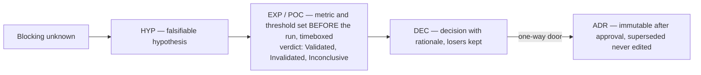

# Tamheed Methodology

This document is the human-facing rationale for *what* Tamheed does and *why*. It generalizes a single,
concrete inception → R&D → architecture-governance → execution-handoff effort into a reusable, vendor-neutral
methodology. The operational "how" lives in the skill's references. This file summarizes and links to them so
the two never drift apart or duplicate each other.

> **Reading map.** For the staged process see [`workflow.md`](workflow.md) and the authoritative per-stage
> spec [`../plugins/tamheed/references/workflow.md`](../plugins/tamheed/references/workflow.md). For every artifact's class, location,
> and lifecycle see [`../plugins/tamheed/references/artifact-catalog.md`](../plugins/tamheed/references/artifact-catalog.md). For the skill/command layering see
> [`architecture.md`](architecture.md). For identifiers, statuses, and versioning see
> [`../plugins/tamheed/references/governance.md`](../plugins/tamheed/references/governance.md).

## 1. What the methodology is

Tamheed is a repeatable way to turn a *project description* into a *validated, traceable, execution-ready
planning and handoff package*. **Another agent** can pick that package up and implement it with
discipline. It is not a
code generator and not a project tracker. It is the disciplined front half of a project. Understand
the problem, resolve the unknowns that block decisions, govern the significant choices, plan the work, and hand
it off cleanly. It leaves an auditable trail from every need to its evidence.

The methodology rests on one governing principle and a set of operating principles that make its output
trustworthy. The governing principle is architectural: **the skill owns the capability. Entry points
are thin wrappers.** The operating principles are epistemic. Never invent requirements. Separate facts from decisions
from proposals. Surface assumptions instead of burying them. No premature architecture. Preserve the
unresolved. Verify before you claim. Prefer operationally useful artifacts over ceremonial ones. The
full, enforced list is in [`../plugins/tamheed/skills/tamheed/SKILL.md`](../plugins/tamheed/skills/tamheed/SKILL.md) (operating principles) and
[`../plugins/tamheed/references/safeguards.md`](../plugins/tamheed/references/safeguards.md) (each anti-pattern paired with its
control).

### Neutrality

This methodology captures patterns that recur across disciplined research-and-design and execution-handoff
work, deliberately stripped of everything project-, vendor-, and stack-specific. **Tamheed is
project-neutral.** It is not tied to any particular project, repository provider, or technology stack.
Where this document needs an example, the example is anonymized and generic (for example "a CLI that syncs
notes to Markdown," "an enterprise data platform").

## 2. The separations the methodology enforces

Most of Tamheed's value is in keeping things that look similar from collapsing into each other. Three
separations matter most.

### 2.1 Project-specific content vs reusable methodology

| Project-specific (lives in a *generated package*) | Reusable methodology (lives in the *Tamheed source*) |
|---|---|
| The actual requirements, constraints, invariants, risks of one project | The registers and identifier scheme those facts are recorded in |
| The chosen architecture and technology decisions | The decision-capture process and ADR format |
| The phased roadmap and work breakdown for this build | The planning technique that yields gated, testable phases |
| The handoff prompt rows for this project's execution half | The Claude-Code-targeted prompt templates they are written from |
| The package data the operator commits | The canonical-JSONL store, its schema, and the single-writer write-back mechanism |

The rule of thumb: **a decision belongs in a package. The way decisions are made belongs in the
skill.** A
technology choice, a scope boundary, or a risk score is never baked into Tamheed. Those are outputs.
Stack-agnosticism is a safeguard, not a preference (safeguard 15).

### 2.2 Mandatory vs optional vs context-dependent artifacts

Tamheed generates **by need, not ceremony**. Every artifact carries a *generation class* that says when it
is written. The classes are **Always** (every package), **Conditional** (a trigger such as project
profile, size, risk, or regulatory context holds), and **On-request** (only when asked). Two more
are **Continuous** (created early, refreshed each update cycle) and **Derived** (computed from other artifacts, never hand-authored).
The selection logic is in [`../plugins/tamheed/references/artifact-rules.md`](../plugins/tamheed/references/artifact-rules.md). The
full per-artifact mapping is in [`../plugins/tamheed/references/artifact-catalog.md`](../plugins/tamheed/references/artifact-catalog.md). The anti-bloat rule is
explicit. If an artifact would only restate another, derive or link instead. If a section has no
project-specific content, omit it rather than emit a placeholder (safeguard 11).

### 2.3 Execution-half instructions vs skill-implementation concerns vs entry-point concerns

These three audiences are routinely confused, so Tamheed keeps them in separate places:

| Concern | Audience | Where it lives | Must NOT contain |
|---|---|---|---|
| **Execution-half instructions** | Claude Code (the agent in its execution half) | the package's Approved `prompt` rows + the artifacts they reference | Tamheed's internal process. Planner-only context |
| **Skill-implementation concerns** | Tamheed itself (the methodology author/runtime) | `../plugins/tamheed/skills/tamheed/SKILL.md` + `../plugins/tamheed/references/` | a specific project's content. Entry-point parsing |
| **Slash-command / entry-point concerns** | the wrapper that starts Tamheed (`/tamheed`, a CLI, an API, a UI) | external entry points (CLI/API/UI) | any methodology or planning logic (safeguard 12). The MCP server is not a wrapper but the capability's mechanical half |

The handoff prompts are written for **Claude Code** in its execution half, using its native affordances where they
help (safeguard 13). The *plan's* technology choices stay vendor-neutral (safeguard 15). The entry point
only normalizes input, picks a mode, invokes the skill, and routes output. It makes no planning decisions.
See [`../plugins/tamheed/references/handoff.md`](../plugins/tamheed/references/handoff.md) and
[`../plugins/tamheed/references/extension.md`](../plugins/tamheed/references/extension.md).

## 3. The extracted patterns

The methodology is a small set of patterns that recur across serious projects, made explicit and repeatable.

**Verbatim-then-normalize.** Requirements are first extracted *verbatim* with source spans, then normalized
into identified register rows. Meaning is never paraphrased away during extraction. Classification
(functional / non-functional / constraint / preference) and prioritization (MVP / Full) happen afterward.
This is what makes "never invent a requirement" enforceable: every `FR-`/`NFR-` traces to a source span or a
recorded clarification.

**Register-per-entity-family.** Each kind of fact has its own register with its own identifier prefix:
requirements, constraints, invariants, assumptions, dependencies, open questions, open decisions, risks,
hypotheses. Keeping them apart is what prevents a research finding from silently becoming a decision, or a
proposal from being read as approved.

**Status-bearing everything.** Every register row and standalone document carries a lifecycle status, so a
reader always knows whether something is offered, accepted, rejected, postponed, or replaced. Decisions in
particular are never rendered as approved until a human approves them.

**Decide-with-evidence, keep-the-losers.** Options are compared against *explicit, weighted criteria* stated
before scoring. The front-runner becomes a decision with rationale, alternatives, and consequences, and
rejected options stay on record as evidence. Significant, hard-to-reverse choices are promoted to ADRs.

**Uncertainty-proportional R&D.** Research and experimentation are sized to *genuine* uncertainty, not to a
fixed template. A blocking unknown receives a falsifiable hypothesis and a minimal experiment or
POC. The experiment has an explicit metric + threshold (decided before the run) and a timebox. A well-understood area receives none.

**Gated, testable planning.** The plan is a phased roadmap where each phase has a goal, scope, deliverables,
a check method, its risks, and explicit exit criteria. The work breakdown decomposes until leaf items
are independently actionable and testable. Abstract phases are decomposed, not shipped.

**End-to-end traceability.** A single matrix links requirement → decision → task → test → risk → acceptance
criterion. So an implementer can navigate from any need to its evidence and back. Unlinked MVP requirements
are a gate failure, not a silent omission. See [`../plugins/tamheed/references/traceability.md`](../plugins/tamheed/references/traceability.md).

**Clean handoff with bounded first step.** The agent, in the execution half, receives a self-contained orientation, the
invariants up front, and *one* bounded first task. That task ends at an approval gate, never "build
the whole thing". Prompts reference artifacts rather than restating them, keeping the package the single source of
truth.

**Nothing destroyed, everything previewable.** The store never removes meaning. Approval-bearing rows are
superseded rather than edited (trigger-enforced), retired rows carry `retired_in`, and scope changes are
typed and recorded *before* their mutations. The one removal a caller can make is a wrongly typed
trace edge (`retire: true`, v4.6). It is explicit, per triple, and journaled by the server in the same
transaction, so even that leaves its record.

## 4. Workflows

Tamheed runs as an **interactive, staged process, not a single prompt.** The 22 stages are grouped into
three phases. **Understand** covers intake, classification, requirement extraction and normalization,
ambiguity and contradiction detection, clarification, and scope. **Explore** covers research planning,
architecture exploration, option comparison, hypotheses, POC/experiment planning, decision capture, and
risk analysis. **Plan & hand off** covers execution planning, artifact generation, package storage
initialization, quality validation, handoff, update cycles, and final readiness. Each stage has entry/exit
criteria, a check, failure handling, and marked human-intervention points. Returning to an earlier stage is
normal discipline, not failure. The reason is recorded so the trail stays intact.

The methodology supports several **invocation modes** that change only where the workflow starts and stops,
never the methodology itself. They are `full` (end to end), `intake` (understand + surface gaps), `plan`
(full plan, no handoff emission), `resume`, `stage:<id>`, and `update`. `update` is diff-aware
re-derivation, execution-progress sync and typed scope changes (D-UPDATE). Also `migrate` (convert a v2/v3 store to v4 in
place, while v1 trees take the two-step escape route), and `adopt` (brownfield onboarding). See
[`../plugins/tamheed/references/modes.md`](../plugins/tamheed/references/modes.md). There is no separate
state file. **The package is the state**: `resume`/`update` are `package_open` + targeted queries. See
[`../plugins/tamheed/references/state.md`](../plugins/tamheed/references/state.md).

The why-it-is-interactive argument and the compact stage table are in [`workflow.md`](workflow.md). The
authoritative per-stage spec is [`../plugins/tamheed/references/workflow.md`](../plugins/tamheed/references/workflow.md). This document
does not repeat either.

## 5. Decision processes

Decisions are first-class and tracked through an explicit, narrow status set: **Proposed, Approved, Rejected,
Superseded, Deferred, Implemented** (decision statuses are exactly these six, never more). Anything Tamheed
authors on its own initiative defaults to *Proposed*. It may not be rendered as *Approved* until a human or
an authorized gate accepts it. Only Approved items constrain execution.

Two tiers exist. A lightweight decision (`DEC-`) lives in the open-decision register. When a decision is
*architecturally significant* (hard to reverse, with a broad blast radius) it is **promoted** to an
Architecture Decision Record (`ADR-NNNN`). The promotion link (`DEC-007 → ADR-0003`) is recorded so it is
never lost. ADRs are immutable after approval. To change one, supersede it with a new ADR rather than editing
its meaning. The decision-capture activity (stage 14) records status, rationale, alternatives, and
consequences, and refuses to record a decision with no rationale. Full identifier, status, and supersession
rules: [`../plugins/tamheed/references/governance.md`](../plugins/tamheed/references/governance.md).

## 6. Validation steps

Validation is gate-based. Gates verify the package is complete, consistent, traceable, and executable before
handoff. **Critical** gates block readiness. **Warn** gates surface issues without blocking. A package is
*execution-ready* only when every Critical gate passes and every Warn gate is passing or carries a recorded,
accepted exception. The gate set is defined in
[`../plugins/tamheed/references/quality-gates.md`](../plugins/tamheed/references/quality-gates.md). It covers
requirement-has-source, identifier integrity, decision-has-status, full traceability, completeness/no-stubs,
no unresolved hard contradiction, executable plan, clean Claude-Code-targeted handoff, and no
silently-unanswered blocking question. Mechanical gates live in three tiers (ADR-0001). **Referential**
gates are schema constraints enforced at write time. **Coverage** gates are SQL views executed by
`gate_run`. The **content/judgment** tier is `gate_run`'s scan plus recorded human judgment. The gate philosophy
(critical vs warn, and loops as discipline rather than failure) is explained in [`workflow.md`](workflow.md).
Tamheed never reports "ready" while a Critical gate fails.

## 7. Planning techniques

Planning yields a **phased roadmap** (`PH-`) whose phases decompose into **slices** (`SL-`). Slices
are the delivery-sized units that branches, PRs, and acceptance criteria bind to. It yields a **work breakdown**
(`WBS-`) decomposed until leaf items are independently actionable and testable. It yields
**milestones** (`MS-`), roadmap labels since v4 with no lifecycle of their own, because gates gate. It
yields the execution scaffolding as data. That is **execution gates** (`GATE-`: ready/done/checkpoint/approval definitions), per-slice
**execution plans** (`EP-`), and durable **conventions** (`CONV-`). The backlog is a *view* over work items,
never a second list to reconcile. The MVP path is sequenced explicitly and gated, so the agent always
knows the minimal coherent deliverable and where each phase ends. Abstract phases are decomposed before the
plan is accepted (safeguard 10 / gate G-EXEC).

## 8. Architecture-governance mechanisms

Architecture is explored *before* it is locked. Candidate architectures and components are drafted, and
decision points are named. Diagrams (context, component, deployment, data-flow, integration) are written
*only where a diagram adds understanding a paragraph cannot*. Options at each decision point are compared on
explicit weighted criteria with cited or `unverified`-tagged claims. The recommended architecture must cover
every MVP requirement. A requirement no architecture satisfies raises a risk and an open question rather than
being quietly dropped. Significant choices become ADRs. **No premature architecture** is a hard rule. No
technology or design is Approved while its deciding open question is open and no covering assumption exists
(safeguard 3). The recommended architecture, component model, contracts, and comparison verdicts are recorded
as narrative documents and `diagram` rows in the package store. They are governed by the same status and
versioning rules as everything else.

## 9. R&D practices

Research is planned in proportion to risk ([`../plugins/tamheed/references/research-depth.md`](../plugins/tamheed/references/research-depth.md)).
It targets the riskiest unknowns first and timeboxes to avoid unbounded investigation. The chain is
deliberate. An unknown that blocks a decision becomes a **falsifiable hypothesis** (`HYP-`) with the signal
that would confirm or refute it. That hypothesis receives a **minimal experiment or POC** (`EXP-`/`POC-`)
with an explicit metric + threshold and a timebox. The Validated/Invalidated/Inconclusive verdict feeds
**decision capture**. Findings live in `research/` and never silently become decisions. A finding becomes a
decision only through an explicit decision row (safeguard 6). An evaluation/comparison framework with
weighted criteria governs how options and experiment outcomes are judged.

## 10. Handoff mechanisms, to the execution half

The handoff package is the contract between the planning half and the execution half. Since v6 its
prompts are `prompt` rows (`PRT-`) the operator approves. The **kickoff** row is the one the header's
`entry_point` names. It carries a self-contained orientation, the invariants up front, and one bounded
first task ending at an approval gate. **Phase** rows follow, one per phase gate. **Situational** rows
accompany the scenario skill that reads them (`plugin_skill`): a fresh-session refresher, an invariant
audit. The package row carries the absorbed handoff fields (entry point, MVP definition, go/no-go).
`handoff_emit` refuses until the kickoff is Approved, screens the Approved rows, and wires the target
project (`.mcp.json` + the `CLAUDE.md` note). It writes no prompt copies. So the agent records progress
through the same governed write path. The principles (Claude-Code-targeted, reference don't restate, bounded steps with gates,
invariants and prerequisites explicit) are in
[`../plugins/tamheed/references/handoff.md`](../plugins/tamheed/references/handoff.md), with prompt forms in
[`../plugins/tamheed/references/prompt-templates.md`](../plugins/tamheed/references/prompt-templates.md). The handoff is what lets
**Claude Code**, with no access to the planning conversation, start implementing with no missing context.

The handoff loop also *learns*. When execution teaches something durable, the agent records a
**lesson** (`LL-`, kind *improve* or *sustain*) born *Proposed*. It is linked via `learned_from` to whatever
taught it: a defect, decision, risk, slice, work item, or progress entry. The operator interviews the
pending set (the `lessons-confirmed` advisory nags until every lesson is decided) and approves, rejects,
or pins each one. **Only operator-Approved lessons bind.** The execution half's always-loaded `CLAUDE.md`
note renders a roster of them, every pinned one and the 10 highest-numbered unpinned ones. The rest bind
too and are read by query (two words since v5.5: a status *binds*, the roster is what is *rendered*). The
gate is the design. An agent persisting an unvetted, possibly wrong, lesson is the known failure
mode of agent memory. So a lesson binds future sessions only after a human says it should. And mechanically so: the
write that lands a lesson in Approved (or Promoted) is refused without the operator's explicit confirmation
carried on it. The always-loaded note is a scarce surface, so the register's growth is watched too. Past a
curation ceiling the `lessons-note-budget` advisory names the lessons rendering beyond it as candidates for
the `skill-promote` interview. That is the point at which a declarative lesson becomes a procedural skill
the harness loads natively, and leaves the note.

Lessons that keep proving themselves can graduate further, into a **skill**. The stock `skill-promote`
interview clusters Approved lessons, and asks the operator for the skill's name, trigger, edge cases, and
level (project, the default, or user). The operator approves the drafted content. The agent then writes the
`SKILL.md` file to the chosen level's skills directory, where the executing harness auto-loads it. It records
the promotion in the package (an `SKL-` metadata row, and each source lesson flips to Promoted with its
`promoted_to` link). Graduation is full. Promoted lessons leave the always-loaded note, which instead carries
one line naming the skills distilled from lessons. The procedure now travels as a skill, not as note prose.

## 11. Package storage practices *(v2 — replaces v1 repository initialization)*

v1 bootstrapped a target repository. v2 removed that capability (ASM-B). Stage 18 is now **package
storage initialization**. The package materializes as canonical JSONL under `data/` (written back on
every mutation, single-writer locked), and the **operator** commits it to whichever repository they
choose. No entity row is ever destroyed. Approval-bearing rows are superseded rather than edited,
and retired rows carry `retired_in`. A wrongly typed trace edge is retired only explicitly and with
a journal row (v4.6) (safeguard 16). Operational detail: `../plugins/tamheed/db/CANONICAL.md`.

## 12. Extraction traceability

Each reusable Tamheed mechanism generalizes a concrete practice that recurs in disciplined R&D → handoff
work. The table below maps the practice (in generic phrasing) to the mechanism it becomes. The right column
is what ships, and the left column is the recurring practice it generalizes.

| Observed practice (generic phrasing) | Generalized Tamheed mechanism |
|---|---|
| A design mission that resolved numbered open decisions before any building began | Stage-gated workflow with an explicit **open-decision register** (`DEC-`) and a scope-lock gate. Nothing is built while a blocking question is open |
| Numbered open *questions* tracked separately from decisions and answers | **Open-question register** (`OQ-`) distinct from decisions, surfaced in the readiness report and never silently closed |
| Recording "we are assuming X because the answer isn't available yet" | **Assumption register** (`ASM-`) with `risk_if_wrong`. The control for proceeding without an answer (safeguard 2) |
| ADRs written for the significant, hard-to-reverse choices | **ADR mechanism** (`ADR-NNNN`), immutable-after-approval, with `DEC-`→ADR promotion recorded |
| Comparing tools/approaches in a weighted table before choosing | **Technology-comparison matrices** with explicit weighted criteria stated before scoring. Losers retained |
| Spiking risky unknowns with small throwaway experiments | **Hypothesis → experiment/POC** chain (`HYP-`/`EXP-`/`POC-`) with threshold-before-run + timebox, sized to genuine uncertainty |
| A phased plan where each phase had to "finish" before the next | **Phased roadmap** (`PH-`) with per-phase exit criteria + gated **work breakdown** (`WBS-`) |
| A risk list with impact, likelihood, and what we'd do about it | **Risk register** (`RISK-`) with impact·likelihood scoring, mitigations, triggers, and MVP/Full tagging |
| A spreadsheet linking requirements to where they were satisfied and tested | **Typed trace edges** queried live (`trace_query`). The matrix is a derived view in `review.html`, never a stored snapshot |
| A handoff with kickoff prompts for the agent that builds | **Handoff emission** (`handoff_emit`): kickoff / phase / situational prompt rows, Claude-Code-targeted, injection-screened, plus the target-side MCP config |
| A script that set up the repo skeleton, license, and first commit | *(removed in v2, ASM-B)* The package is data the operator commits to any repository. Storage initialization is `package_create` on the MCP server |
| "Definition of done" agreed up front so quality wasn't argued later | **Execution gates** (`GATE-` rows: ready / done / checkpoint / approval), bound package-wide or per entity |
| A final "are we actually ready to build?" review | **Readiness verdict** (stage 22): `gate_run`'s report + open items + residual risk. Never "ready" with a Critical gate failing |
| The capability invoked the same way regardless of who triggered it | **Skill-owns-capability** principle: thin entry points normalize input and invoke the one skill (safeguard 12) |

## 13. Where this document stops

This file is rationale and generalization. It intentionally does **not** restate the per-stage operational
spec, the full identifier tables, the gate definitions, or the artifact catalog rows. Those are single
sources of truth elsewhere, linked above. When the methodology evolves, the additive extension contract in
[`../plugins/tamheed/references/extension.md`](../plugins/tamheed/references/extension.md) governs
how new pieces are added without editing core logic. Those pieces are artifact types, templates,
schemas, gates, profiles, diagram kinds, and entry points.
