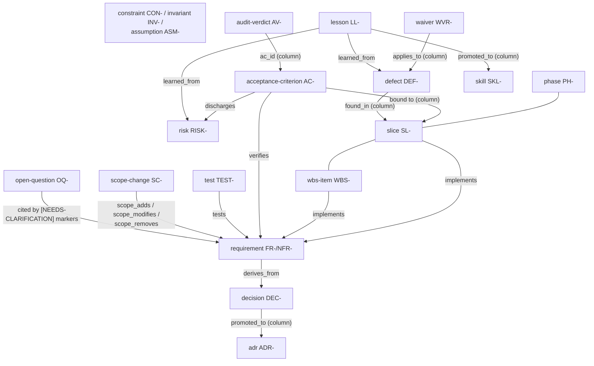
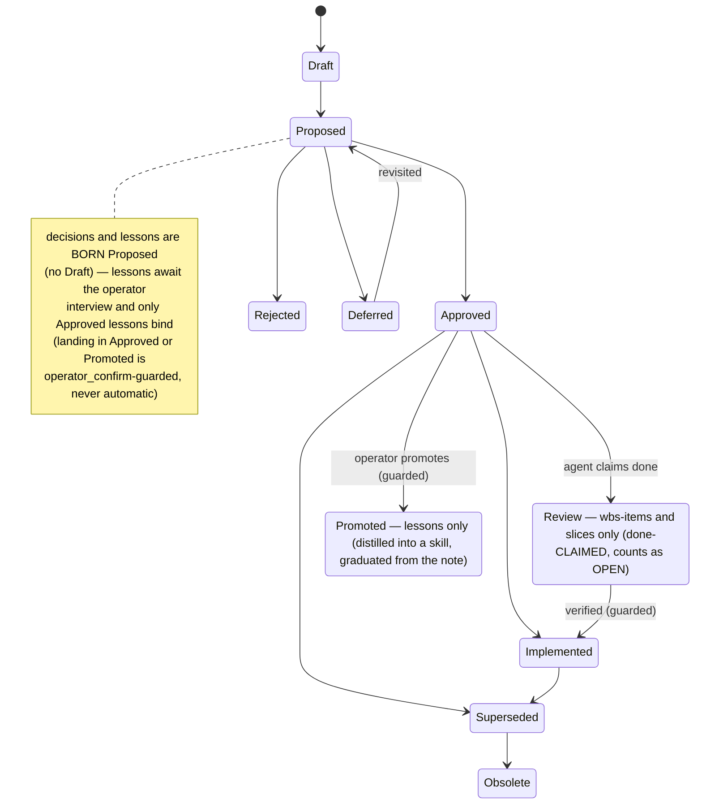

# Artifact Catalog — the entity families and their rules (tamheed v4.4.0)

The authoritative, human-facing list of every artifact a Tamheed package carries. Since v2
the package **is a relational store** (`data/*.jsonl`, one file per entity family — see
`../db/CANONICAL.md`); since v3 the handoff prompts are **files** under `<package>/prompts/`;
v4 (plan 031) re-baselined the schema, added waivers, typed the progress journal, and made
this catalog the teaching mirror of the live registry. The machine mirror of the generation
classes is `BASELINE_ENTITY_TYPES` (`../server/tamheed_server.py`), seeded into the
`entity_types` table at `package_create` — **G-SET enforces the Always class from the
registry, and `check.py` lints that every Always type is named here** (the enforcing surface
and the teaching surface move together).

The **decision logic** for optional artifacts is in [`artifact-rules.md`](artifact-rules.md);
the **package layout** in [`generated-structure.md`](generated-structure.md); **identifiers,
statuses, versioning** in [`governance.md`](governance.md). The full per-entity study —
columns, design rationale, research sources, use-case diagrams — lives in the repo's
`docs/entities.md` (not shipped in this bundle).

## The entity map

## The standard lifecycle

## Generation classes

- **Always** — every package gets rows (or a recorded `omission` with reason — G-SET).
- **Conditional** — created when a trigger holds (profile, size, risk, handoff — see
  `artifact-rules.md`).
- **On-request** — only when the user asks.
- **Continuous** — created early, appended throughout execution (stage 21).
- **Derived** — computed views; never hand-authored.

## Entity families (the store)

One `data/<table>.jsonl` file per non-empty family. Class = the registry's generation class.

### Requirements & registers

| Family (type id) | Prefix | Class | Purpose |
|---|---|---|---|
| requirement | `FR-`/`NFR-` | Always | What the system must do / how well; NOT NULL provenance (G-REQ-SRC), `rationale`, `verification_method` (Test/Demonstration/Inspection/Analysis), `mvp` flag (G-TRACE scope) |
| constraint | `CON-` | Always | Imposed limits the design cannot negotiate |
| invariant | `INV-` | Conditional | Properties that must NEVER break; `enforcement` says how |
| assumption | `ASM-` | Always | Beliefs the plan rests on; `risk_if_wrong` + `validation_date` (assumptions decay — the assumptions-current advisory) |
| dependency | `DEP-` | Conditional | External parties/systems the plan waits on; `owner` |
| open-question | `OQ-` | Always | Unresolved ambiguity; `owner` + `due_by` (open-questions-overdue advisory); citable in prose via `[NEEDS-CLARIFICATION: OQ-NNN]` markers (G-COMPLETE-validated) |
| glossary-term | `GT-` | On-request | Domain vocabulary (also the community-extension worked example) |
| lesson | `LL-` | Continuous | What execution taught (kind improve/sustain; statement + context + recommendation + rationale + both impacts — the LLIS shape). Born Proposed by the agent; **landing in Approved/Promoted needs the operator's words, mechanically** (`operator_confirm` — the guard refuses auto-confirmation, content drift on the transition, and missing attribution; the server records the typed audit event); ONLY Approved lessons render into the CLAUDE.md note (pinned first, G-INJECT-screened); Approved/Promoted content immutable — supersede, never edit; `learned_from` edges name the source; **Promoted** = distilled into a skill (`promoted_to` → the SKL- row, frozen) and graduated OUT of the note (the skill file carries it); the lessons-confirmed advisory nags Proposed rows |
| skill | `SKL-` | On-request | Procedural memory distilled from lessons in the operator's skill-promote interview (Voyager/Soar lineage). METADATA only: kebab `name`, `description` (the trigger), `level` project\|user (default project), `target_path` — the BODY lives solely in the written `SKILL.md` (project: `.claude/skills/<name>/`; user: `~/.claude/skills/<name>/`), operator-owned; the server never writes or reads skill files. Born Approved (the interview IS the approval); a re-distillation supersedes (`superseded_by`) |

### Decisions

| Family | Prefix | Class | Purpose |
|---|---|---|---|
| decision | `DEC-` | Always | Any project decision (scope, vendor, priority, process); statuses have no Draft — born Proposed; **only Approved decisions constrain execution**; `promoted_to` links to an ADR when the one-way-door test says so |
| adr | `ADR-` (4 digits) | Conditional | Architecturally significant decisions: context/decision/consequences + `confirmation` (HOW compliance is verified); **immutable after approval** (trigger-enforced) — supersede, never edit |

### Risk & research

| Family | Prefix | Class | Purpose |
|---|---|---|---|
| risk | `RISK-` | Always | probability/impact (high/medium/low), `owner` + `response_strategy` (avoid/mitigate/transfer/accept — risk-liveness advisory), `risk_state` execution lifecycle, `discharged_by` |
| hypothesis | `HYP-` | Conditional | Falsifiable statement + `metric` + `threshold` (decided BEFORE the experiment — hypotheses-measurable advisory) |
| experiment | `EXP-` | Conditional | Method/timebox; verdict Validated/Invalidated/Inconclusive/Pending |
| poc | `POC-` | Conditional | Same shape as experiment, build-flavored |

### Validation

| Family | Prefix | Class | Purpose |
|---|---|---|---|
| test | `TEST-` | Conditional | Planned/tracked tests; verdict Pass/Fail/Pending |
| kpi | `KPI-` | Conditional | Success metrics (measure + target); hosted by the charter |
| stakeholder | `STK-` | Conditional | Who cares and why (title/role/interest) |
| acceptance-criterion | `AC-` | Always | The done-contract; binds to a requirement and a slice (acs-slice-bound advisory); **immutable after approval** |
| audit-verdict | `AV-` | Continuous | Append-only AC verdicts (Met/Partial/Not-met/Pending) with `evidence`, `verified_by` (human/agent/ci), `verification_method` (auto-test/manual/inspection), `against_commit` — the LATEST verdict is the truth (v_latest_verdicts) |

### Planning & execution

| Family | Prefix | Class | Purpose |
|---|---|---|---|
| phase | `PH-` | Always | The roadmap's chapters; exit_criteria; readiness-guarded transition to Implemented |
| slice | `SL-` | Conditional | Thin vertical increments — the unit branches/PRs/ACs bind to; lifecycle includes **Review** (done-claimed) distinct from Implemented (done-verified); guarded transition |
| milestone | `MS-` | Conditional | A named roadmap **label** (title/phase/due) — no lifecycle, never gates (v4 demotion); a milestone that gates is an execution-gate |
| wbs-item | `WBS-` | Conditional | Work breakdown (self-parenting hierarchy); lifecycle includes Review |
| execution-plan | `EP-` | Conditional | Per-slice how-to, package-resident |
| execution-gate | `GATE-` | Conditional | DoR/DoD/checkpoint/approval definitions (prose a HUMAN evaluates — surfaced as human_required); `outcome` records the latest Go/Hold/Redirect/Kill decision |
| convention | `CONV-` | Conditional | Durable conventions the executor must honor |
| defect | `DEF-` | Conditional | Found bugs; severity critical/high/medium/low — **open critical/high block readiness, medium/low advise**; `found_in` locates it |
| deferred-work | `DW-` | Conditional | Postponed work with severity + activation trigger + invariant at stake |
| scope-change | `SC-` | Continuous | Drift record: Proposed → Approved → **Merged** (deltas applied to plan rows via scope_adds/scope_modifies/scope_removes edges; scope-changes-merged advisory flags Approved-never-Merged) |
| waiver | `WVR-` | Conditional | A named readiness rule satisfied for a named entity: justification + approver + expiry; reported as `waived`, never silent (v4 — the alternative is informal bypass) |
| progress-entry | `PE-` | Continuous | Append-only TYPED journal: event_type (work-done/verdict-recorded/transition/forced-override/gate-decision/escalation/correction/note) + subject + actor + `corrects` compensation pointer |

### Prose & artifacts

| Family | Prefix | Class | Purpose |
|---|---|---|---|
| narrative-document | `DOC-` | Always | Charter-class prose (charter, executive summary, architecture, research plan, …) |
| document-section | `SEC-` | Always | The sections of narrative documents (heading/body/order) |
| diagram | `DIA-` | Conditional | Diagram source (mermaid) by kind: context/component/integration/deployment/data-flow |

## File artifacts (outside the store)

| Artifact | Location | Class | Notes |
|---|---|---|---|
| Prompt library | `<package>/prompts/*.md` | Always | 15 stock scenario prompts + README (managed emission: emitted/unchanged/diverged, diverged classified stale-stock vs customized against the bundled stock history; refresh_stock safely updates stale-stock) + operator-authored project prompts |
| Review surface | `<package>/review.html` (+ `csv/`) | Derived | `export_html` — deterministic, zero-JS, committed |
| Agent-control note | executor repo `CLAUDE.md` (tool-owned marker span) | Derived | `handoff_emit` — carries the recording-obligations table |
| Executor MCP config | executor repo `.mcp.json` | Derived | `handoff_emit` |

## Derived views (never stored, never hand-edited)

`v_backlog` (open work), `v_status_report` (per-family status counts),
`v_latest_verdicts` (AC → latest verdict), `v_phase_exit` / `v_slice_exit`
(readiness substrates), `v_artifact_membership` (G-SET), `v_identifier_counts`,
`g_trace_failures` / `g_set_failures` / `g_progress_failures` (gate substrates),
`v_readiness` (gate rollup).

## The four operating rules (from the retired operator card, merged here in v4.2)

- **Claimed vs verified**: work an agent believes done is `Review` (claimed);
  `Implemented` means VERIFIED — the phase/slice transition is guarded by the blocking
  readiness rules, `force` is operator-words-only and self-audited, and every verdict
  carries its evidence chain (`evidence`, `verified_by`, `verification_method`,
  `against_commit`).
- **Drift**: deviating from the approved plan starts with an `SC-` row (Proposed) plus
  `scope_adds`/`scope_modifies`/`scope_removes` edges naming the affected rows; after
  operator approval the agent applies the changes and sets the `SC-` to `Merged` — the
  `scope-changes-merged` advisory flags anything approved but never reconciled.
- **Waivers**: an operator-approved `WVR-` row (rule + entity + justification +
  approver + expiry) satisfies a named readiness rule for a named entity, reported as
  `waived`, never silent. Agents may ASK for one; they never author one.
- **Markers**: genuine ambiguity is recorded in place as
  `[NEEDS-CLARIFICATION: OQ-NNN]` citing a live open question — the full rule is in
  `governance.md` (never restated here; one owner per fact).
- **Repair doctrine**: when a field may be damaged, repair from `data/*.jsonl` (or the
  backup), never from `entity_query` output — a full-row upsert rebuilt from a
  truncated query round-trip re-commits the damage (field-evidence C38). Two more
  halves (field-evidence C39): a generated payload is PASTED into the tool call,
  never re-typed — the hand is the untrusted transport, and re-typing correct bytes
  reintroduces exactly the risk the generator removed; and every multi-row repair
  ends with an independent verifier — re-read the JSONL after the write and
  re-derive each expected value from its source, because care does not catch a
  one-character transcription error and a re-read does.
