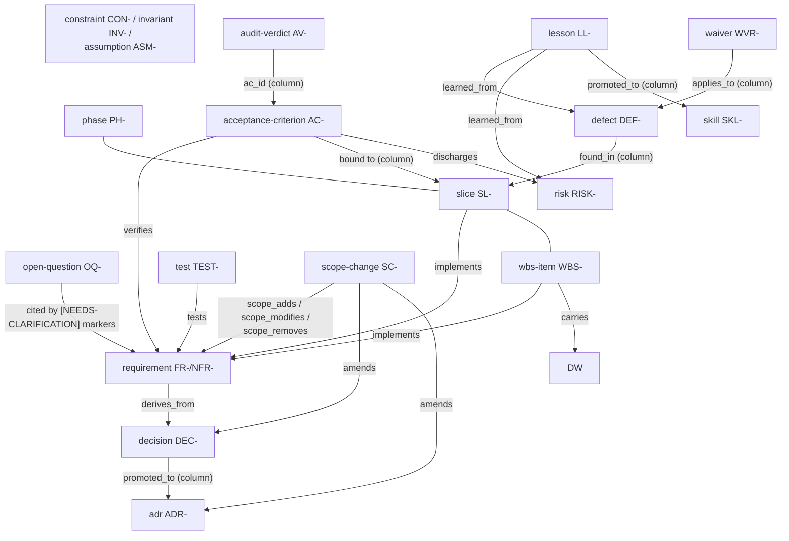
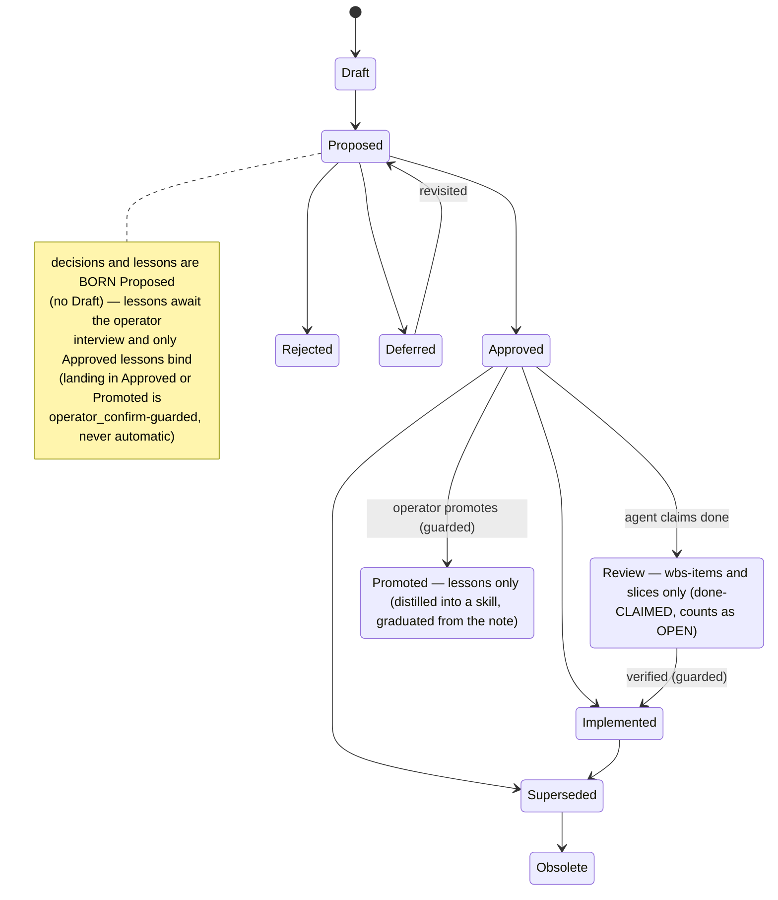

# Artifact Catalog — the entity families and their rules (tamheed v6.3.0)

The authoritative, human-facing list of every artifact a Tamheed package carries. Since v2
the package **is a relational store** (`data/*.jsonl`, one file per entity family, see
`../db/CANONICAL.md`). Since v6 the handoff prompts are **rows** again (`prompt`, `PRT-`), approved
by the operator. The stock scenarios are the plugin's `/tamheed:<name>` skills since v5. v4 (plan 031) re-baselined the schema, added waivers, typed the progress journal, and
made this catalog the teaching mirror of the live registry. The machine mirror of the generation
classes is `BASELINE_ENTITY_TYPES` (`../server/tamheed_server.py`), seeded into the
`entity_types` table at `package_create`. **G-SET enforces the Always class from the
registry, and `check.py` lints that every Always type is named here.** The enforcing surface
and the teaching surface move together.

The **decision logic** for optional artifacts is in [`artifact-rules.md`](artifact-rules.md),
the **package layout** in [`generated-structure.md`](generated-structure.md), and **identifiers,
statuses, versioning** in [`governance.md`](governance.md). The full per-entity study
(columns, design rationale, research sources, use-case diagrams) lives in the repo's
`docs/entities.md` (not shipped in this bundle).

## The entity map

```mermaid
flowchart TB
    REQ["requirement FR-/NFR-"]
    CON["constraint CON- / invariant INV- /<br/>assumption ASM-"]
    OQ["open-question OQ-"]
    DEC["decision DEC-"]
    ADR["adr ADR-"]
    RISK["risk RISK-"]
    PH["phase PH-"]
    SL["slice SL-"]
    WBS["wbs-item WBS-"]
    AC["acceptance-criterion AC-"]
    TEST["test TEST-"]
    AV["audit-verdict AV-"]
    DEF["defect DEF-"]
    SC["scope-change SC-"]
    WVR["waiver WVR-"]
    LL["lesson LL-"]
    SKL["skill SKL-"]

    REQ -- "derives_from" --> DEC
    DEC -- "promoted_to (column)" --> ADR
    SL -- "implements" --> REQ
    WBS -- "implements" --> REQ
    PH --- SL
    SL --- WBS
    AC -- "verifies" --> REQ
    AC -- "bound to (column)" --> SL
    TEST -- "tests" --> REQ
    AV -- "ac_id (column)" --> AC
    AC -- "discharges" --> RISK
    DEF -- "found_in (column)" --> SL
    SC -- "scope_adds / scope_modifies /<br/>scope_removes" --> REQ
    SC -- "amends" --> DEC
    SC -- "amends" --> ADR
    WBS -- "carries" --> DW
    WVR -- "applies_to (column)" --> DEF
    OQ -- "cited by [NEEDS-CLARIFICATION] markers" --> REQ
    LL -- "learned_from" --> DEF
    LL -- "learned_from" --> RISK
    LL -- "promoted_to (column)" --> SKL
```

## The standard lifecycle

```mermaid
stateDiagram-v2
    [*] --> Draft
    Draft --> Proposed
    Proposed --> Approved
    Proposed --> Rejected
    Proposed --> Deferred
    Deferred --> Proposed : revisited
    Approved --> Implemented
    Approved --> Superseded
    Implemented --> Superseded
    Superseded --> Obsolete
    state "Review — wbs-items and slices only (done-CLAIMED, counts as OPEN)" as Review
    Approved --> Review : agent claims done
    Review --> Implemented : verified (guarded)
    state "Promoted — lessons only (distilled into a skill, graduated from the note)" as Promoted
    Approved --> Promoted : operator promotes (guarded)
    note right of Proposed
        decisions and lessons are BORN Proposed
        (no Draft) — lessons await the operator
        interview and only Approved lessons bind
        (landing in Approved or Promoted is
        operator_confirm-guarded, never automatic)
    end note
```

## Generation classes

- **Always**: every package has rows (or a recorded `omission` with reason, G-SET).
- **Conditional**: created when a trigger holds (profile, size, risk, handoff, see
  `artifact-rules.md`).
- **On-request**: only when the user asks.
- **Continuous**: created early, appended throughout execution (stage 21).
- **Derived**: computed views, never hand-authored.

## Entity families (the store)

One `data/<table>.jsonl` file per non-empty family. Class = the registry's generation class.

### Requirements & registers

| Family (type id) | Prefix | Class | Purpose |
|---|---|---|---|
| requirement | `FR-`/`NFR-` | Always | What the system must do / how well. NOT NULL provenance (G-REQ-SRC), `rationale`, `verification_method` (Test/Demonstration/Inspection/Analysis), `mvp` flag (G-TRACE scope) |
| constraint | `CON-` | Always | Imposed limits the design cannot negotiate |
| invariant | `INV-` | Conditional | Properties that must NEVER break. `enforcement` says how |
| assumption | `ASM-` | Always | Beliefs the plan rests on. `risk_if_wrong` + `validation_date` (assumptions decay, the assumptions-current advisory) |
| dependency | `DEP-` | Conditional | External parties/systems the plan waits on. `owner` |
| open-question | `OQ-` | Always | Unresolved ambiguity. `owner` + `due_by` (open-questions-overdue advisory). Citable in prose via `[NEEDS-CLARIFICATION: OQ-NNN]` markers (G-COMPLETE-checked) |
| glossary-term | `GT-` | On-request | Domain vocabulary (also the community-extension worked example) |
| lesson | `LL-` | Continuous | What execution taught (kind improve/sustain). The statement + context + recommendation + rationale + both impacts form the LLIS shape. Born Proposed by the agent. **Landing in Approved/Promoted needs the operator's words, mechanically** (`operator_confirm`). The guard refuses auto-confirmation, content drift on the transition, and missing attribution, and the server records the typed audit event. ONLY Approved lessons bind. The CLAUDE.md note renders every pinned one and the 10 highest-numbered unpinned ones (G-INJECT-screened). The rest bind too and are read by query. The statement opens with its rule, because the note prints its opening only. Approved/Promoted content is immutable: supersede, never edit. `learned_from` edges name the source. **Promoted** = distilled into a skill (`promoted_to` → the SKL- row, frozen) and graduated OUT of the note (the skill file carries it). The lessons-confirmed advisory nags Proposed rows |
| skill | `SKL-` | On-request | Procedural memory distilled from lessons in the operator's skill-promote interview (Voyager/Soar lineage). METADATA only: kebab `name`, `description` (the trigger), `level` project\|user (default project), `target_path`. The BODY lives solely in the written `SKILL.md` (project: `.claude/skills/<name>/`, user: `~/.claude/skills/<name>/`), operator-owned. The server never writes or reads skill files (it scans them for stale sentences at `handoff_emit`, report-only, v5.1). Born Approved (the interview IS the approval). A re-distillation supersedes (`superseded_by`). A retirement behind a plugin skill sets `Obsolete` + `upstreamed_to` (v5.1) so the Promoted lessons it carries stay reachable (`lessons-stranded` names the rest) |
| feedback | `FB-` | Continuous | Upstream feedback and local tools, on the operator's word (v4.11, plan 087). `kind` missing-capability\|defect\|doc-error\|question\|local-tool. Columns: `detail` (what was needed), `workaround` (what the agent did instead, the column that catches side tools), `tool_or_rule`, `plugin_version`. A `local-tool` row names its `tool_path` and has no draft stage. It is refused at INSERT (or at a later `kind` change) without `operator_confirm`, and born Confirmed. It obeys a two-clause rule: it writes nothing tool-owned, and if it reads the STORE, it reads `exports/` only. Lifecycle Proposed → Confirmed → Reported → Resolved / Rejected. Confirmed takes `operator_confirm` + `confirmed_by`, and the server journals the typed event. Reported means it left the package via `entity_export("feedback")`, into the project's findings. Resolved carries `resolved_in`. Withdrawing a Confirmed row needs the word too. `handoff_emit` names Proposed and unexported Confirmed rows every emission. No row text reaches an emitted file. Exempt from `prose-ids-resolve` (feedback quotes broken ids by nature) |

### Decisions

| Family | Prefix | Class | Purpose |
|---|---|---|---|
| decision | `DEC-` | Always | Any project decision (scope, vendor, priority, process). Statuses have no Draft: born Proposed. **Only Approved decisions constrain execution.** `promoted_to` links to an ADR when the one-way-door test says so |
| adr | `ADR-` (4 digits) | Conditional | Architecturally significant decisions: context/decision/consequences + `confirmation` (HOW compliance is verified). **Immutable after approval** (trigger-enforced): supersede, never edit |

### Risk & research

| Family | Prefix | Class | Purpose |
|---|---|---|---|
| risk | `RISK-` | Always | probability/impact (high/medium/low), `owner` + `response_strategy` (avoid/mitigate/transfer/accept, the risk-liveness advisory), `risk_state` execution lifecycle, `discharged_by` |
| hypothesis | `HYP-` | Conditional | Falsifiable statement + `metric` + `threshold` (decided BEFORE the experiment, the hypotheses-measurable advisory) |
| experiment | `EXP-` | Conditional | Method/timebox. Verdict Validated/Invalidated/Inconclusive/Pending |
| poc | `POC-` | Conditional | Same shape as experiment, build-flavored |

### Validation

| Family | Prefix | Class | Purpose |
|---|---|---|---|
| test | `TEST-` | Conditional | Planned/tracked tests. Verdict Pass/Fail/Pending |
| kpi | `KPI-` | Conditional | Success metrics (measure + target), hosted by the charter |
| stakeholder | `STK-` | Conditional | Who cares and why (title/role/interest) |
| acceptance-criterion | `AC-` | Always | The done-contract. It binds to a requirement and a slice (acs-slice-bound advisory). **Immutable after approval** |
| audit-verdict | `AV-` | Continuous | Append-only AC verdicts (Met/Partial/Not-met/Pending) with `evidence`, `verified_by` (human/agent/ci), `verification_method` (auto-test/manual/inspection), `against_commit`. The LATEST verdict is the truth (v_latest_verdicts) |

### Planning & execution

| Family | Prefix | Class | Purpose |
|---|---|---|---|
| phase | `PH-` | Always | The roadmap's chapters. exit_criteria. Readiness-guarded transition to Implemented |
| slice | `SL-` | Conditional | Thin vertical increments, the unit branches/PRs/ACs bind to. The lifecycle includes **Review** (done-claimed) distinct from Implemented (done-verified). Guarded transition |
| milestone | `MS-` | Conditional | A named roadmap **label** (title/phase/due) with no lifecycle, never gates (v4 demotion). A milestone that gates is an execution-gate |
| wbs-item | `WBS-` | Conditional | Work breakdown (self-parenting hierarchy). The lifecycle includes Review |
| execution-plan | `EP-` | Conditional | Per-slice how-to, package-resident |
| execution-gate | `GATE-` | Conditional | DoR/DoD/checkpoint/approval definitions (prose a HUMAN evaluates, surfaced as human_required). `outcome` records the latest Go/Hold/Redirect/Kill decision |
| convention | `CONV-` | Conditional | Durable conventions the agent must honor during execution |
| defect | `DEF-` | Conditional | Found bugs. Severity critical/high/medium/low. **Open critical/high block readiness, medium/low advise.** `found_in` locates it |
| deferred-work | `DW-` | Conditional | Postponed work with severity + activation trigger + invariant at stake. Once Activated, the wbs-item that carries it says so with a `carries` edge (v5). `deferred-work-carried` lists Activated rows no open item carries |
| scope-change | `SC-` | Continuous | Drift record: Proposed → Approved → **Merged**. Merged means the deltas are applied to plan rows via scope_adds/scope_modifies/scope_removes edges. A RULING it touches takes an `amends` edge (a `DEC-` merges by full-row upsert, an `ADR-` by supersession). Merged is set LAST, after every target is applied and re-read. The scope-changes-merged advisory flags Approved-never-Merged |
| waiver | `WVR-` | Conditional | A named readiness rule satisfied for a named entity: justification + approver + expiry. Reported as `waived`, never silent (v4, because the alternative is informal bypass) |
| progress-entry | `PE-` | Continuous | Append-only TYPED journal: event_type + subject + actor + `corrects` compensation pointer. Caller kinds: work-done/verdict-recorded/transition/gate-decision/escalation/correction/note/handoff. `handoff` (v5.1) is where a session stopped, returned as the `resume` block. forced-override/lesson-confirmed/lesson-promoted/integrity-verified are SERVER-appended only and refused from `progress_update` |

### Prose & artifacts

| Family | Prefix | Class | Purpose |
|---|---|---|---|
| narrative-document | `DOC-` | Always | Charter-class prose (charter, executive summary, architecture, research plan, …) |
| document-section | `SEC-` | Always | The sections of narrative documents (heading/body/order) |
| diagram | `DIA-` | Conditional | Diagram source (mermaid) by kind: context/component/integration/deployment/data-flow |
| prompt | `PRT-` | Always | The prompts the agent starts from in the execution half, as rows since v6 (plan 192). `kickoff` is the row `packages.entry_point` names, and `handoff_emit` demands it Approved. `phase` is one per phase gate, with `phase_id` set. `situational` accompanies one scenario skill. `plugin_skill` binds a row to the bundled scenario skill that reads its rows, and the server refuses any other name (the brake `loop-guard` reads none). Approved rows are edited in place. The project's own package README is not a prompt: that is a `narrative-document` of kind `readme`. The stock operator guide is a file (below) |

## File artifacts (outside the store)

| Artifact | Location | Class | Notes |
|---|---|---|---|
| Operator guide | `<package>/README.md` | Always | The one stock file since v5, at the package root since v6. Managed emission: emitted/unchanged/diverged, with diverged classified stale-stock vs customized against the bundled stock history. refresh_stock safely updates stale-stock and removes retired 4.x scenario leftovers byte-equal to shipped stock. The project's own prompts are `prompt` rows (above). The seventeen scenarios are the plugin's `/tamheed:<name>` skills |
| Review surface | `<package>/review.html` (+ `csv/`) | Derived | `export_html`: deterministic, zero-JS, committed |
| Agent-control note | executor repo `CLAUDE.md` (tool-owned marker span) | Derived | `handoff_emit`: carries the recording-obligations table |
| Executor MCP config | executor repo `.mcp.json` | Derived | `handoff_emit` |

## Derived views (never stored, never hand-edited)

`v_backlog` (open work), `v_status_report` (per-family status counts),
`v_latest_verdicts` (AC → latest verdict). `v_phase_exit` / `v_slice_exit`
(readiness substrates), `v_artifact_membership` (G-SET), `v_identifier_counts`.
`g_trace_failures` / `g_set_failures` / `g_progress_failures` (gate substrates),
`v_readiness` (gate rollup).

## The four operating rules (from the retired operator card, merged here in v4.2)

- **Claimed vs verified**: work an agent believes done is `Review` (claimed).
  `Implemented` means VERIFIED. The phase/slice transition is guarded by the blocking
  readiness rules, and `force` is operator-words-only and self-audited. Every verdict
  carries its evidence chain (`evidence`, `verified_by`, `verification_method`,
  `against_commit`).
- **Drift**: deviating from the approved plan starts with an `SC-` row (Proposed) plus
  `scope_adds`/`scope_modifies`/`scope_removes` edges naming the affected plan rows. Add
  `amends` when it carves an exception out of a `DEC-`/`ADR-` ruling (DEC- merges by
  full-row upsert, ADR- by supersession). After operator approval the agent applies the
  changes, re-reads them, and sets the `SC-` to `Merged` LAST. The
  `scope-changes-merged` advisory flags anything approved but never reconciled. A wrongly
  typed edge is retired (`retire: true` on the trace-edge item, journaled) and the correct
  one written in the same batch. A new relation never replaces an old one by itself (v4.6).
- **Waivers**: an operator-approved `WVR-` row (rule + entity + justification +
  approver + expiry) satisfies a named readiness rule for a named entity. It is reported as
  `waived`, never silent. Agents may ASK for one. They never author one.
- **Markers**: genuine ambiguity is recorded in place as
  `[NEEDS-CLARIFICATION: OQ-NNN]` citing a live open question. The full rule is in
  `governance.md` (never restated here, one owner per fact).
- **Fix doctrine**: when a field may be damaged, fix it from `data/*.jsonl` (or the
  backup), never from `entity_query` output. A full-row upsert rebuilt from a
  truncated query round-trip re-commits the damage (field-evidence C38). Two more
  halves (field-evidence C39). A generated payload is PASTED into the tool call,
  never re-typed. The hand is the untrusted transport, and re-typing correct bytes
  reintroduces exactly the risk the generator removed. And every multi-row fix
  ends with an independent verifier: re-read the JSONL after the write and
  re-derive each expected value from its source. Care does not catch a
  one-character transcription error, and a re-read does.
